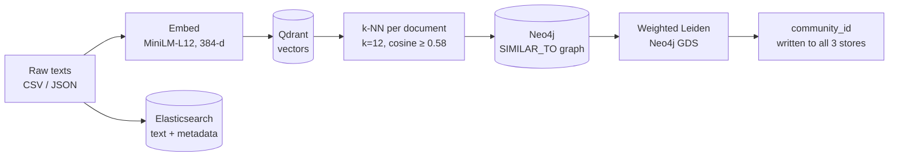
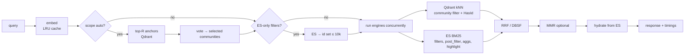
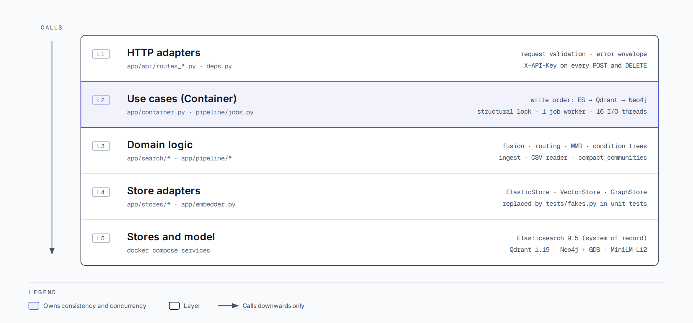

# Semantic Leiden — Specification (v0.4.0)

This is the **specification** of the system: what it does, the exact contracts, the limits, how to
reuse the Nucleus template, how it is built (architecture, §14–§30), how to operate it, the build
plan and the acceptance checklist. Together with [ui.md](ui.md) it is meant to be enough for an
engineer (or an AI agent) to rebuild the system from scratch and end up with the same behaviour,
API and look.

| Document | Answers |
|---|---|
| **`docs/specs.md`** (this file) | What it must do and how it is built: requirements, API contracts, limits, Nucleus reuse, operations, plan, acceptance tests, architecture |
| [`docs/ui.md`](ui.md) | How it looks and behaves: shell, pages, routes, layouts, components, states, copy |

**Diagrams** (`docs/diagrams/`, each as PNG and SVG):

| # | Diagram | Section |
|---|---|---|
| 1 | [System context and containers](diagrams/01-system-context.png) | §14 |
| 2 | [Backend layers](diagrams/02-backend-layers.png) | §16 |
| 3 | [Frontend architecture](diagrams/03-frontend.png) | §17 |
| 4 | [Data model across the three stores](diagrams/04-data-model.png) | §18 |
| 5 | [CSV import pipeline](diagrams/05-import-pipeline.png) | §21.1 |
| 6 | [Hybrid search request](diagrams/06-search-sequence.png) | §21.5 |

**Conventions.** "MUST", "SHOULD", "MAY" are used as in RFC 2119. Requirement IDs are stable:
`FR-<area>-nn` (functional), `API-nn` (endpoints), `NFR-nn` (non-functional), `NUC-nn`
(template reuse), `M<n>` (milestones), `AT-nn` (acceptance tests), `ADR-nnn` (decisions). Numbers in
`code` are the values the current build ships with; when a value is configurable the environment
variable is named. Paths are relative to the project root
`/home/user/workspace/tests/semantic-leiden-poc-v0.3/semantic-leiden-poc` unless stated. Where this
document and the code disagree, the code wins and the document should be corrected.

The UI template is the **Nucleus dashboard platform template** at
**`/home/user/workspace/templates/nucleus-dashboard-platform-template`** (its React app is in
`frontend/`, its Flask backend in `backend/`). §9 lists exactly what to copy from it and how to adapt it.

---

## Contents

**Part I — Product and requirements**
1. [Product overview](#1-product-overview) — purpose, core idea, personas, scope, non-goals, glossary, constraints, evolution
2. [Use cases and scenarios](#2-use-cases-and-scenarios)
3. [Technology stack](#3-technology-stack) — pinned versions, why React 18 + antd 5
4. [Functional requirements](#4-functional-requirements) — FR-* with acceptance criteria

**Part II — Contracts**
5. [API specification](#5-api-specification) — every endpoint, request, response, errors
6. [Search and retrieval specification](#6-search-and-retrieval-specification)
7. [CSV import specification](#7-csv-import-specification)
8. [Non-functional requirements](#8-non-functional-requirements) — measured numbers

**Part III — Building and operating**
9. [Reusing the Nucleus template](#9-reusing-the-nucleus-template) — what to copy, where, how to adapt
10. [Operations and operator procedures](#10-operations-and-operator-procedures) — start, jobs, troubleshooting, backups
11. [Implementation plan](#11-implementation-plan) — milestones and definition of done
12. [Test strategy](#12-test-strategy) — test files, fakes, how to run
13. [Acceptance test checklist](#13-acceptance-test-checklist)

**Part IV — Architecture**
14. [System context](#14-system-context)
15. [Containers (docker compose)](#15-containers-docker-compose) — images, nginx, development mode
16. [Backend components](#16-backend-components) — modules and layering rules
17. [Frontend architecture](#17-frontend-architecture) — layers, state, polling, code splitting
18. [Data model](#18-data-model) — ids, Elasticsearch, Qdrant, Neo4j, community states, jobs, browser storage
19. [Consistency model](#19-consistency-model)
20. [Process and concurrency model](#20-process-and-concurrency-model)
21. [Runtime flows](#21-runtime-flows) — import, ingest, search, explore, conditions, graph, clustering, jobs
22. [Algorithms at a glance](#22-algorithms-at-a-glance) — k-NN graph, Leiden, tuning
23. [Configuration](#23-configuration) — every environment variable
24. [Security architecture](#24-security-architecture) — controls, gaps, OIDC
25. [Performance and scaling](#25-performance-and-scaling)
26. [Observability](#26-observability)
27. [Code map](#27-code-map)
28. [Key decisions](#28-key-decisions) — ADRs
29. [From PoC to production](#29-from-poc-to-production)
30. [References](#30-references)
- [Appendix A — Client examples](#appendix-a--client-examples)

---

## Part I — Product and requirements

What the system is for, who uses it, and every functional requirement.

---

## 1. Product overview

### 1.1 Purpose

Semantic Leiden organises an unlabelled collection of short texts (news items, tickets,
comments, product reviews — any language the embedding model covers) into **topic communities**
without anyone writing labels, rules or prompts, and gives people precise tools to search,
filter, browse, visualise and maintain that collection.

### 1.2 Core idea



1. Every document is embedded once with a multilingual sentence-transformer.
2. Each document is linked to its `k` most similar documents whose cosine similarity is at
   least `min_similarity` (the **graph policy**). The edges form a weighted, undirected graph.
3. Weighted Leiden partitions that graph; each group of at least `min_community_size`
   documents (never less than 2) becomes a **community** with a dense integer id.
4. Search, filters, dashboards and the graph view all read those communities; nothing else
   (no labels, keywords, LLM summaries, enrichment) is derived from the text.

### 1.3 Personas

| Persona | Goal | Main pages / endpoints |
|---|---|---|
| **Analyst** | Find documents about something, understand which topics exist and how they connect | `/documents`, `/graph`, `/communities`, `/` |
| **Data steward** | Load CSV files, remove a bad import, re-cluster with other parameters, repair drift | `/import`, `/operations` |
| **Integrator** | Call search and ingestion from another service (e.g. a Spring Boot app) | REST API (§5), Swagger at `/docs` |
| **Operator** | Run the stack, watch health and consistency, size resources | `docker compose`, `/ready`, `/stats`, consoles menu |

### 1.4 Scope (in)

- Ingestion: single JSON document, JSON batch (≤ 5,000), upload of **any delimited text file**
  (≤ 1 GiB, ≤ 10,000,000 rows; any separator, encoding, header names or no header row) where the
  user sees the header and **chooses the column to analyse**; idempotent re-import, change
  detection by text hash.
- Storage in three stores with one owner per concern: Elasticsearch (system of record),
  Qdrant (vectors), Neo4j (graph and communities).
- k-NN similarity graph, weighted Leiden, minimum community size, cluster-run history.
- Retrieval: semantic, keyword (BM25), hybrid (RRF / DBSF), community routing, MMR, facets,
  highlights, explanations, per-stage timings.
- Structured exploration: a condition tree (react-awesome-query-builder JSON) compiled to one
  Elasticsearch filter and shared by browse, search, graph seeding and insights.
- Graph visualisation (top edges, communities, 1–2 hop neighbourhood, search-seeded subgraph).
- Community metrics (size, internal/boundary edges, cohesion, density, conductance), detail.
- Background jobs: import, cluster, rebuild, reconcile, delete-source; progress, cancel.
- Web UI in the Nucleus style: dashboard, explore, graph, communities, import, operations.
- Optional API key for writes, CORS, security headers, WCAG 2.1 AA.

### 1.5 Non-goals

| Not in scope | Reason / what to do instead |
|---|---|
| User accounts, roles, SSO (Keycloak), impersonation | One optional shared `API_KEY` protects writes; reads are open. Put an authenticating proxy in front for multi-user deployments. |
| Labels, keywords, LLM summaries or any text enrichment of communities | The product idea is "communities from similarity only"; communities are identified by `C<id>` and explored through their central documents. |
| Chunking long documents | One document = one vector. Texts longer than `TEXT_MAX_CHARS` (20,000) are rejected or truncated. |
| Editing a document in the UI | Re-ingest with the same `id`; change detection updates it. |
| Horizontal scaling of the API or several job workers | One uvicorn process, one job worker thread, a structural lock. See §20 and §29. |
| Persistent job history | Jobs live in memory (last 50). Cluster runs are persisted in Neo4j. |
| Incremental Leiden | Every clustering is a full run over the whole graph; new documents stay "unclustered" until the next run. |
| Live push (websockets, SSE) | The UI polls jobs every second while one runs. |
| Internationalised UI | English UI; documents may be in any language. |
| Multi-tenant corpora | One Elasticsearch alias, one Qdrant collection, one Neo4j database. |

### 1.6 Glossary

| Term | Meaning |
|---|---|
| **Document** | One text plus optional `metadata` (flat key → scalar) and `source` label. |
| **External id** | The business id (`id` in the API/CSV, ≤ 256 chars, NFC-normalised and trimmed). When omitted it is generated: `sha1:` + first 20 hex chars of SHA-1 over the normalised text. |
| **Internal id** (`id` in responses) | `uuid5(DOCUMENT_NAMESPACE, external_id)` with `DOCUMENT_NAMESPACE = 0b8a4c5e-6a3f-5d0e-9d7c-2f1e8b6a4c10`. The same in all three stores. Document routes take the internal id. |
| **Normalised text** | NFC, every whitespace run collapsed to one space, trimmed. Stored text is the normalised text. |
| **Text hash** | SHA-256 of the normalised text, stored in ES (`text_hash`, not indexed) to detect changes. |
| **Source** | Where a document came from: `csv:<filename>` for uploads (or the form value), `seed` for the demo seed, any label ≤ 128 chars for API batches, or `null`. |
| **Graph policy** | `(neighbor_k, min_similarity)`; persisted as `(:GraphPolicy {key:'active'})`. Defaults `12`, `0.58`. |
| **SIMILAR_TO edge** | `(:Document)-[:SIMILAR_TO {score}]->(:Document)`, `score` = cosine similarity, one edge per unordered pair, treated as undirected. |
| **Community** | A Leiden group with at least `min_community_size` members, id `0..N-1`, largest first. Shown as `C<id>`. |
| **Community version** | The clustering run number (`ClusterRun.version`) that last assigned the document; shown as "run v<n>" / "Clustering run". |
| **Unclustered** | `community_version` is missing: the document arrived after the last clustering run. |
| **Outside communities / "No community"** | `community_version` is set but `community_id` is null: the last run put it in a group smaller than the minimum size (mostly singletons). |
| **Unassigned** | Either of the two above (`community_id` null). |
| **Condition tree** | A react-awesome-query-builder (RAQB) JSON tree of groups and rules, compiled server-side to an Elasticsearch `bool` filter. |
| **Anchor** | One of the top-`R` semantic hits used to vote for communities in routing. |
| **Routing** | Choosing which communities to search (`scope.type = auto`) from the anchors' votes. |
| **RRF / DBSF** | Reciprocal Rank Fusion / Distribution-Based Score Fusion of the semantic and keyword lists. |
| **MMR** | Maximal Marginal Relevance re-ranking for diversity. |
| **Seed** (graph query) | A document chosen by a search or a condition tree to start a subgraph from. |
| **Ego graph** | The 1–2 hop neighbourhood of one document. |
| **Job** | A background task (`import`, `cluster`, `rebuild`, `reconcile`, `delete`) with status, phase and progress. |
| **Structural lock** | The lock that serialises jobs and the synchronous `/cluster` and `/graph/rebuild` endpoints. |
| **Consistent** | ES document count = Qdrant point count = Neo4j node count (reported by `/stats`). |

### 1.7 Constraints that shaped the design

| Constraint | Consequence |
|---|---|
| No enrichment: no labels, no LLM, no entity extraction | Communities are described by structure (size, cohesion, density, conductance) and by their most central documents |
| Mixed languages (Romanian and English in the seed data) | Multilingual embedding model; ES `asciifolding` sub-field so `cai ferate` matches `căi ferate` |
| Laptop-sized deployment (docker compose, CPU only) | One API process, CPU torch wheel, in-process job queue, stores bound to 127.0.0.1 |
| Three stores and no distributed transactions | One authoritative store, a fixed write order, deterministic ids and a reconcile job |
| Imports up to 1 GiB / 10 million rows | Streaming upload to disk, streaming CSV reader, constant memory, a background job with progress |
| Analysts share views | Every page keeps its whole question in the URL |

### 1.8 Evolution

| Version | Change |
|---|---|
| v0.2 | Qdrant + Neo4j only, text in the Qdrant payload, SVG graph, synchronous endpoints |
| v0.3 | Elasticsearch as system of record, hybrid search (RRF/DBSF), routing strategies, MMR, background jobs, CSV import with mapping, canvas graph, React 19 + antd 6 UI with tabs |
| **v0.4** | UI rebuilt on the **Nucleus** template (React 18.3 + antd 5.29, required by react-awesome-query-builder); path routes instead of tabs; search moved into Explore; RAQB **condition trees** compiled to Elasticsearch (Explore, Search, Graph) or evaluated in the browser (graph highlight, community metrics); `/explore/*`, `/graph/query`, `/sources`, delete-source job; **minimum community size**; 1 GiB CSV support with long-cell recovery and truncation; **any delimited file** (encoding, separator and header detected) with the **column to analyse** chosen in the UI; graph similarity band and custom edge count; tabs that reload themselves after a deploy; WCAG 2.1 AA audit; page documentation footers |

---

## 2. Use cases and scenarios

Each scenario names the features it exercises; together they are the product's reason to
exist and a good manual test script. Sample data: `data/sample.csv` (72 seed rows, English and
Romanian) and `docs/sample.csv` (30,000 rows, a dozen topics, about one in eight in Romanian).

| # | Scenario | Persona | Features exercised |
|---|---|---|---|
| UC-1 | Story clustering for media monitoring | Analyst | import with metadata, Leiden, Communities (size, cohesion, conductance, central docs), graph |
| UC-2 | Cross-lingual monitoring (Romanian + English) | Analyst | semantic search, `text.folded` asciifolding, metadata filter |
| UC-3 | Near-duplicate and re-publication detection | Analyst / steward | rebuild with high threshold, drawer engine tabs, community size |
| UC-4 | Investigating one entity or event | Analyst | advanced keyword syntax, hybrid, facets, ego graph, PNG export |
| UC-5 | Support ticket / incident triage | Integrator | auto routing (`sum`), central documents, metadata filter |
| UC-6 | Research corpus exploration | Analyst / steward | gamma sweep, `community_version`, cluster history |
| UC-7 | Search quality lab | Integrator | `explain`, `timings`, RRF vs DBSF, alpha, MMR |
| UC-8 | Remove a bad import | Steward | Data sources table, delete-source job, re-cluster |
| UC-9 | Load a very large file | Steward | 1 GiB upload, progress that survives navigation, cancel, truncation |

**UC-1 Story clustering (OSINT).** Thousands of articles arrive daily; analysts want "what are
the stories" without keyword taxonomies.
1. Export the feed as CSV `id,text,source_feed,lang,published`; the extra columns become metadata.
   Import with "Run Leiden clustering" on.
2. Communities: sort by size, then check cohesion. Large cohesive communities are the main
   stories; high conductance marks stories that bleed into others ("rail strike" vs "transport
   budget").
3. Expand a community: central documents read like a summary; neighbouring communities show
   related threads.
4. Graph filtered to that community, or the neighbourhood of a central article, shows the
   structure.
*Tuning:* duplicated wire stories form very tight mini-communities — raise `min_similarity`
slightly and use MMR in search so one wire copy does not hide other angles.

**UC-2 Cross-lingual monitoring.** The multilingual model puts "căi ferate" next to "railway",
so one community holds both languages. Semantic search with an English query returns Romanian
documents; keyword search `cai ferate` (no diacritics) matches `căi ferate` through the
`text.folded` analyzer; a condition `metadata.lang = ro` shows one side.

**UC-3 Near-duplicates.** Rebuild with `min_similarity ≥ 0.85` (Operations → Rebuild): edges then
mean "almost the same text" and communities are duplicate families. In the drawer the Semantic tab
shows near-copies and the Keyword tab (more-like-this) verbatim reuse; disagreement usually means a
paraphrase or translation. Community size ranks the most amplified narratives.

**UC-4 One entity or event.** (1) Keyword, advanced syntax `"Metro Rex" | "metrorex"`; (2) switch to
hybrid — semantic neighbours bring documents that describe the event without naming it; (3) facets
show which communities contain matches, click one to scope, repeat; (4) *Show in graph* on a key
document, 2 hops, export PNG.

**UC-5 Ticket triage.** CSV `id,text,product,priority`. Leiden groups recurring problems. A new
ticket's text sent with `scope: auto`, `routing.strategy: sum` lands in the matching problem
community; its central documents are the best existing answers; a `metadata.product` condition
narrows per team.

**UC-6 Research corpus.** Load abstracts and sweep gamma (§10.2): low gamma gives fields, high
gamma sub-topics; `community_version` and the clustering history compare runs.

**UC-7 Search quality lab.** Every hit explains its semantic and keyword ranks and `timings`
breaks down latency, so fusion settings (alpha, RRF vs DBSF, MMR λ) can be compared on real
queries before committing to one in a product.

**UC-8 Remove a bad import.** Operations → Data sources shows `csv:<file>` with its document count;
*Delete…* → confirm (type the name when > 1,000 documents) → the delete job removes the documents
from ES, Qdrant and Neo4j and re-clusters; the source disappears from the table and from the
Explore source choices.

**UC-9 Very large file.** Drop a 1 GB CSV: the preview is instant (only the head is parsed), a
notice estimates rows and duration, the upload streams with a progress bar, the job counts rows
(~10 s) and indexes at ~250 rows/s. The steward can leave the page and come back (or reload with
`?job=`) and still see the Processing card; cancelling keeps the rows imported so far, which
*Delete source* can remove.

---

## 3. Technology stack

### 3.1 Backend

| Concern | Choice (pinned in the current build) | Notes |
|---|---|---|
| Language / runtime | Python **3.13** (`python:3.13-slim` image) | Tests also run on 3.12 locally. |
| Web framework | **FastAPI 0.141.1** on Starlette 1.7.0, uvicorn | `--proxy-headers --timeout-graceful-shutdown 20`. |
| Multipart | python-multipart 0.0.32 | Streamed upload to a temp file in 8 MiB chunks. |
| Settings | pydantic-settings | `.env` + environment, case-insensitive; empty secrets become `None`. |
| Embeddings | sentence-transformers ≥ 5, torch **CPU** wheel | Model `sentence-transformers/paraphrase-multilingual-MiniLM-L12-v2`, 384 dimensions, normalised, cosine. |
| Elasticsearch client | `elasticsearch>=9` | Server **9.5.1**, security on, basic auth or API key. |
| Qdrant client | `qdrant-client>=1.15` | Server **v1.19.1**, gRPC preferred in Compose. |
| Neo4j driver | `neo4j>=5.26` | Server **2026.09.0** with the **Graph Data Science** plugin (Leiden). |
| CLI | `python -m app.cli` | `ingest`, `ingest-csv`, `rebuild-graph`, `cluster`, `communities`, `stats`, `reconcile`, `search`. |
| Tests | pytest (`pytest.ini`), in-memory fakes (`tests/fakes.py`) | 99 passed, 6 skipped (integration tests need live stores). |

### 3.2 Frontend

| Package | Version | Why |
|---|---|---|
| react / react-dom | **18.3.1** | See §3.4. |
| antd | **5.29.3** | Component library of the Nucleus template. |
| @ant-design/icons | 5.6.1 (`^5.5.2`) | Icons (outlined set only). |
| @react-awesome-query-builder/antd | **6.6.15** | The condition builder (RAQB). Lazy-loaded. |
| echarts / echarts-for-react | 5.6.0 / ^3.0.2 | Charts, **core build** (Bar, Line, Pie, Scatter + Aria, DataZoom, Grid, Legend, MarkLine, Tooltip, Canvas renderer). |
| react-router-dom | 6.30.6 (`^6.28.0`) | Routes, URL state, legacy redirects. v7 future flags enabled. |
| @tanstack/react-query | ^5.90 | Server state, caching, polling, cancellation. |
| d3-force / d3-zoom / d3-drag / d3-selection | ^3 | Canvas force-directed graph. |
| papaparse | ^5.5.3 | CSV preview in the browser (head of the file only). |
| dayjs | ^1.11.13 | Dates (also required by RAQB's antd widgets). |
| @fontsource-variable/inter | ^5.2.8 | Self-hosted Inter Variable (CSP `font-src 'self'`). |
| vite / @vitejs/plugin-react | **7.3.6** / ^5 | Build and dev server with `/api` proxy. |
| typescript | **5.9.3** | `strict`. |
| vitest | ^3.2 | Unit tests (`src/lib/lib.test.ts`, 16 tests). |
| @playwright/test + @axe-core/playwright | ^1.48 (installed 1.63.0) + ^4.10.0 | Accessibility audit (`scripts/a11y-audit.mjs`). |

Served in production by **unprivileged nginx** on port 8080 (Compose maps `3000 → 8080`).

### 3.3 Infrastructure

Docker Compose (`docker-compose.yml`): `elasticsearch` (9.5.1, single node, security on,
1 GB heap, 2 GB memory limit), `qdrant` (v1.19.1), `neo4j` (2026.09.0 + GDS, 1 GB heap), `app`
(image `semantic-leiden-api:0.4.0`), `seed` (one-shot, posts `data/sample.csv` then clusters),
`ui` (nginx). All store and API ports bind to `127.0.0.1`; only the UI port is public.

### 3.4 Why React 18 and antd 5 (not React 19 / antd 6)

1. **RAQB compatibility.** `@react-awesome-query-builder/antd` 6.6.x declares peer
   dependencies `antd ^4.17 || ^5` and `@ant-design/icons ^4 || ^5`. antd 6 is outside the
   supported range; the builder is the core of the advanced search on three pages.
2. **Template parity.** The Nucleus template is on React 18.3.1 and antd 5 (`^5.22.2`), so its
   theme, shell and components copy over without a migration. Keeping one major version means
   later template fixes can be ported mechanically.
3. **antd 5 + React 18 is the officially supported pairing**; React 19 needs the
   `@ant-design/v5-patch-for-react-19` shim.
4. Nothing in the product needs React 19 features.

> An earlier revision (v0.3) was on React 19 + antd 6 with no
> router. v0.4 deliberately moved to the template's stack; do not "upgrade" back without
> checking RAQB's peer dependencies first.

---

## 4. Functional requirements

Each requirement has an ID, the rule, and **Accept** — the observable criteria a test checks.
Contracts (field names, types, limits) are in §5; search and CSV details in §6 and §7; the UI
details are in [ui.md](ui.md); store-level flows are in §21.

### 4.1 Ingestion (FR-ING)

**FR-ING-01 Normalisation and identity.** Every incoming text MUST be normalised (NFC,
whitespace collapsed, trimmed). A blank text is rejected. The external id is the given `id`
(NFC, trimmed) or, when absent/blank, `content_id(text)` = `sha1:` + 20 hex chars. The
internal id is `uuid5(DOCUMENT_NAMESPACE, external_id)`.
*Accept:* posting `{"text": "  Hello   world "}` twice creates one document with text
`Hello world` and external id `sha1:…` (same both times); `{"text": "   "}` → 422.

**FR-ING-02 Limits per document.** Text ≤ `TEXT_MAX_CHARS` (20,000) characters; metadata ≤
`METADATA_MAX_KEYS` (20) keys, keys normalised (`lower`, non `[a-z0-9_]` runs → `_`, trimmed of
`_`, ≤ 64 chars), values string/int/float/bool; `source` ≤ 128 chars; `id` ≤ 256 chars.
*Accept:* a 20,001-character text via the API → 422 `text has 20001 characters (limit 20000)` (prefixed `documents[i]: ` in batches).

**FR-ING-03 Change detection.** Per chunk (256 documents, `INGEST_CHUNK_SIZE`), duplicates in
the chunk are collapsed (last one wins), existing documents are fetched by internal id and
compared by text hash:

| Case | ES | Qdrant | Neo4j | Report |
|---|---|---|---|---|
| New | create (OCC `op_type=create`) | upsert vector, payload `community_id: null` | MERGE node | `created` |
| Text changed | index with `if_seq_no`/`if_primary_term` | re-embed + upsert | MERGE, delete its edges, re-link | `updated` |
| Only metadata/source changed | index (OCC) | nothing | nothing | `updated` |
| Identical | nothing | nothing | nothing | `unchanged` |

Only new and changed texts are embedded. *Accept:* re-importing the same CSV reports
`unchanged = rows`, `created = updated = 0`, and no embedding time.

**FR-ING-04 Write order.** Within a chunk: Elasticsearch first (authority), then Qdrant, then
Neo4j. After all chunks: ES refresh; if ≥ `LINK_WAIT_FOR_INDEX_MIN_DOCS` (2,000) documents were
touched, wait up to `QDRANT_INDEX_WAIT_SECONDS` (180) for the HNSW index; then link.

**FR-ING-05 Linking.** For every new or changed document, query Qdrant by id for the top
`neighbor_k` neighbours with score ≥ `min_similarity` (batches of `NEIGHBOR_QUERY_BATCH` = 64) and
MERGE `SIMILAR_TO {score}` edges in transactions of `GRAPH_WRITE_BATCH` (5,000) rows, one edge
per unordered pair. The count is reported as `edges_upserted`.
*Accept:* after the seed import, `/stats.edges > 0` and every edge score ≥ 0.58.

**FR-ING-06 Single document (`POST /documents`).** Ingests one `TextInput`, returns the ingest
report plus the v0.2 fields `id`, `text`, `semantic_edges_created`.

**FR-ING-07 JSON batch (`POST /documents/batch`).** Accepts `documents` (v0.3) or `texts`
(v0.2), one required; at most `BATCH_MAX_DOCUMENTS` (5,000) → otherwise **413**
`Batch has N documents; limit is 5000. Use CSV upload for bulk loads.` Batch-level `source`
applies to documents without one. `cluster: true` runs Leiden after the ingest and adds
`clustering` to the report.

**FR-ING-08 CSV upload (`POST /documents/upload`).** Multipart form: `file` (any name — the content
decides, see FR-ING-09), `run_cluster` (default true), `rebuild` (default false), `source` (default
`csv:<filename>`), `text_column` (**the column to analyse**), `id_column`, `metadata_columns` (JSON
array), `generate_ids`, `truncate_long_texts`, `delimiter`, `encoding`, `has_header` (default true).
The body is streamed to a temp file in 8 MiB chunks; beyond `UPLOAD_MAX_BYTES` (1 GiB =
1,073,741,824 bytes) → **413** `File exceeds 1024 MiB upload limit.` The format and mapping are
resolved from the first 256 KiB before the job starts (422 on error); then the endpoint returns
**202** with the job (`kind: import`).
*Accept:* a 1 GB file is accepted through nginx (`client_max_body_size 1100m`) and the job
appears in `/jobs` within seconds.

**FR-ING-09 Any delimited text file.** `detect_layout` reads the first `SNIFF_BYTES` (256 KiB):

| Aspect | Rule |
|---|---|
| Binary files | refused by signature with a message naming them: `This file is an Excel workbook or a ZIP archive (.xlsx, .zip), not delimited text. Save or export it as CSV and upload that instead.` (also legacy `.xls`, gzip, PDF, PNG, JPEG, SQLite); NUL bytes without a UTF-16 pattern → `This file contains binary data (NUL bytes), not delimited text.` |
| Encoding (`encoding` absent or `auto`) | a BOM wins (UTF-8 → `utf-8-sig`, UTF-16, UTF-32); a UTF-16 NUL pattern without BOM → `utf-16-le`/`utf-16-be`; else UTF-8 if the head decodes as UTF-8; else **Windows-1252** (decoded with `errors=replace`). An auto-detected UTF-8 file that proves not to be UTF-8 further down is switched to Windows-1252 **during the counting pass**, before any write (FR-ING-13). |
| Encoding (named) | any Python text codec or alias (`utf-8`, `utf-16`, `utf-16le`, `windows-1252`, `windows-1250`, `iso-8859-2`, …), decoded strictly; `utf-8` is read as `utf-8-sig`. Unknown → `Unknown encoding 'x'.`; a bytes codec (`base64`) → `'base64' is not a text encoding.` |
| Excel `sep=` line | a first line `sep=<c>` sets the delimiter and is skipped. |
| Delimiter (`delimiter` absent) | the candidate among `,` `;` TAB `\|` whose split of the first 50 non-blank records has the most frequent cell count (ties: more cells; one cell for every candidate → `,`). Unparseable records are skipped while sniffing. |
| Delimiter (named) | one character, or `comma`/`semicolon`/`tab`/`pipe`; a quote or line break → `The delimiter must be one character (not a quote or a line break), or one of comma, semicolon, tab, pipe.` |
| Header row | `has_header=true`: the first non-blank record (after a `sep=` line). `false`: columns `column_1 … column_n`, n = widest of the first 50 records. |
| Column names | `unique_headers`: whitespace collapsed, BOM removed, blank → `column_<position>`, repeats (case-insensitive) → `name_2`, `name_3`… The browser applies the same rule (`uniqueHeaders` in `lib/csv.ts`), so a mapping chosen there resolves on the server. Requested names match exactly, then case- and whitespace-insensitively. |
| Cell size | `CELL_LIMIT_CHARS = 64 × 1024 × 1024` characters (`csv.field_size_limit`) for sniffing, counting and reading. |

**FR-ING-10 Column mapping.** `text_column` is the column whose text is embedded, linked and
clustered; no other column is ever embedded. Defaults: a column named `text`, else **422**. Ids:
`id_column`, else a column named `id`, else **generated from the text** (`content_id`, so re-imports
stay idempotent and identical texts are one document); `generate_ids: true` forces generated ids.
Metadata: `metadata_columns` (at most `METADATA_MAX_KEYS`, else 422), or by default every other
column up to that limit — the rest are recorded in `params.metadata_dropped`. Keys are normalised
(`Source Feed` → `source_feed`); a key that collides with an earlier one is dropped the same way.
Mapping errors (all 422 before any row is read):

| Situation | Message |
|---|---|
| No column to analyse | `Choose the column to analyse (text_column). Found: a, b, c.` (`details.found` lists the columns) |
| Mapped column not in file | `The <role> column 'X' is not in the file. Found: a, b, c.` |
| `generate_ids` with `id_column` | `Choose either an id column or generate_ids, not both.` |
| Same column for id and text | `The id column and the column to analyse must be different columns.` |
| Metadata column = id/text | `'X' is already the id or analysed column; it cannot also be metadata.` |
| Too many metadata columns | `At most 20 metadata columns can be kept; 25 were chosen.` |
| `metadata_columns` not a JSON array | `metadata_columns must be a JSON array of column names` |
| Empty file / no rows | `File is empty.` / `File has no rows.` |
| Undecodable start with a named encoding | `The start of the file is not valid WINDOWS-1250 (…). Choose another encoding.` |

**FR-ING-11 Row-level errors never fail the job.** Each bad row is skipped, counted in
`failed` and — for the first `ERRORS_KEPT` = 200 — listed in `errors` as
`{row, external_id|null, reason}` — `row` counts records from 1, the `sep=` line and header
included (with a header the first data row is 2, without one it is 1); numbers in messages use
thousands separators; missing trailing cells read as empty:

| Cause | Message |
|---|---|
| Empty text | `Empty text.` |
| Empty id (when ids are not generated) | `Empty id.` |
| Id too long | `id longer than 256 characters.` |
| More cells than columns | `Row has 5 cells but the file has 4 columns; usually a separator inside an unquoted value.` |
| Text too long, truncation off | `Text has 150,000 characters (limit 20,000). Enable 'truncate long texts' to import the beginning instead.` |
| Unterminated quote swallowing the file | `A cell is longer than 67 million characters; usually a quote that was opened and never closed.` (limit // 1,000,000) |
| Other csv parser error | `Unreadable CSV row: <reason>.` |
| Row cap reached | `Row limit of 10,000,000 exceeded; remaining rows ignored.` (`UPLOAD_MAX_ROWS`) |

The reader recovers after a `csv.Error` and continues with the next row.
*Accept:* a CSV with one 150,000-character cell imports every other row and reports that row
as failed (regression: v0.3 failed the whole job with `field larger than field limit (131072)`).

**FR-ING-12 Truncation.** With `truncate_long_texts: true`, a text longer than the limit is cut
at the last space within 200 characters before the limit (else at the limit), imported, and
counted in `truncated`.

**FR-ING-13 Encoding surprises.** An auto-detected UTF-8 file with a non-UTF-8 byte further down
is re-read as Windows-1252 while counting (nothing written yet) and imported; the result's
`format.encoding` says `windows-1252`. With a **named** encoding a bad byte fails the job during
counting, before any write: `The file is not valid UTF-8 near line N (<reason>). Choose its
encoding (for example Windows-1252 or Windows-1250) and import again; nothing was imported.`

**FR-ING-14 Import job.** Phases: `counting` → `indexing` (processed/total rows) →
`waiting for vector index` (≥ 2,000 touched documents) → `linking` (processed/total ids) →
with `rebuild: true` the rebuild phases (`deleting edges`, `waiting for vector index`,
`linking`) → with `run_cluster: true` `leiden` → `syncing communities` → `done`.
`params` records `filename, source, delimiter, id_column, text_column, generate_ids,
metadata_columns, mapped_columns, run_cluster, rebuild, truncate_long_texts, bytes, encoding,
has_header, columns (≤ 200), metadata_dropped`. `result`: `rows, received, created, updated,
unchanged, failed, truncated, format {encoding, delimiter, has_header, text_column, id_column},
edges_upserted, errors[≤200], ingest_ms, total_ms, rebuild?, clustering?`. Encodings are reported
as web labels (`utf-8`, `utf-16le`, `windows-1252`, `windows-1250`, `iso-8859-2` …).

**FR-ING-15 Seed.** The Compose `seed` service posts `data/sample.csv` (72 documents, source
`seed`) in batches of `SEED_BATCH` (1,000) to `/documents/batch`, then runs clustering once. It is
idempotent; `SEED_FORCE=true` forces a run when data exists.

**FR-ING-16 Test data.** `docs/sample.csv` holds 30,000 generated rows (`id,text`, header +
30,000 lines; ids like `food-000001`, `weat-000002`; mixed English/Romanian news-like texts),
generated by `docs/generate_sample.py` with Faker. Test files MUST use their own id prefixes so
they never overwrite the sample's documents.

### 4.2 Documents (FR-DOC)

**FR-DOC-01 Get.** `GET /documents/{id}` returns `DocumentOut` by internal id; 404
`Document <id> not found`.

**FR-DOC-02 Browse.** `GET /documents` with cursor paging (`search_after`, sort
`updated_at desc, external_id asc`), filters `q` (simple query), `community_id`, `unassigned`,
`source`, `external_id`; `limit` 1–200 (default 25). Response `{items, total, next_cursor}`;
a tampered cursor → 422 `Invalid pagination cursor`.

**FR-DOC-03 Delete.** `DELETE /documents/{id}` deletes from ES, then Qdrant, then Neo4j
(`DETACH DELETE`); returns `{id, deleted: true}`; 404 if it did not exist in ES (the derived stores
are still cleaned).

**FR-DOC-04 Similar documents.** `GET /documents/{id}/similar?method=` with
`semantic` (Qdrant query-by-id), `keyword` (ES more-like-this), `graph` (Neo4j SIMILAR_TO
neighbours by score); `limit` 1–100 (default 10). Results are hydrated from ES and carry `score`.
404 if the document does not exist (checked first, so Qdrant's 404 never surfaces as 500).

**FR-DOC-05 Neighbours (v0.2).** `GET /documents/{id}/neighbors?limit=` (1–200, default 20) =
`similar?method=graph`, response `{results}`.

### 4.3 Search (FR-SRCH)

**FR-SRCH-01 Modes.** `semantic` (Qdrant cosine), `keyword` (ES BM25), `hybrid` (both,
concurrently, fused). The API default is `semantic`; the UI always sends a mode explicitly and
its default is `hybrid`.

**FR-SRCH-02 Scope.** `global` (all documents), `communities` (only `community_ids`; empty list →
422 `scope.type=communities requires scope.community_ids`), `auto` (route first, then search the
selected communities). `exclude_community_ids` applies in every scope, including routing anchors.
Legacy `community_id: 7` ≡ `scope: {type: communities, community_ids: [7]}`.

**FR-SRCH-03 Routing.** In `auto` scope: take the top `routing.anchors` (default 20, 1–200)
semantic hits; anchors with no community are ignored; if none is assigned → **409**
`not_clustered` `No community assignments found yet. Run clustering (POST /jobs/cluster).`
Support per community:

| Strategy | Support |
|---|---|
| `top1` | 1 for the community of the best assigned anchor, 0 otherwise |
| `sum` (default) | Σ anchor scores |
| `max` | max anchor score |
| `mean` | mean anchor score |
| `softmax` | Σ exp((score − best) / temperature), temperature default 0.05 (0, 5] |

`share = max(support,0) / Σ max(support,0)`. Candidates are sorted by support desc, best score
desc, id asc. Selected = the first `routing.communities` (1–10, default 1) with
`share ≥ min_share`; if none qualifies, the top one. The response carries `routing` with
`strategy, selected, candidates[{community_id, support, share, anchors, best_score}],
anchor_document_id, anchor_score`.

**FR-SRCH-04 Candidate depth.** Each engine returns `fusion.candidates` hits when > 0, else
`min(max(3 × top_k, 50), 500)`.

**FR-SRCH-05 Lexical query.** `plain` syntax: `multi_match` `best_fields` over `text^1` and
`text.folded^0.7` with `lexical.operator` (or/and), optional `minimum_should_match`
(`^-?\d{1,3}%?$`), `fuzziness AUTO` + `prefix_length 1` when `fuzzy`, and with `phrase_boost`
(default on) a `match_phrase` should-clause (`slop 2`, `boost 2`). `advanced` syntax:
`simple_query_string` with `flags ALL` (quotes, `-`, `|`, `*`, `~`).

**FR-SRCH-06 Fusion.** Hybrid combines the two lists:
- **RRF** (default): `score = alpha / (k + rank_sem) + (1 − alpha) / (k + rank_kw)`, a missing
  rank contributes 0; `k = rrf_k` (60), `alpha` 0.5.
- **DBSF**: each list normalised as `(s − (μ − 3σ)) / (6σ)` clipped to [0, 1], then
  `alpha · sem + (1 − alpha) · kw`.

**FR-SRCH-07 MMR.** When `mmr.enabled`, re-rank the first `mmr.candidates` (default 50) with
`λ · rel − (1 − λ) · max_sim_to_selected` (`lambda` default 0.7; relevance min-max normalised;
similarity = cosine of the stored vectors). `explain.mmr_rank` is set.

**FR-SRCH-08 Filters.** `filters` = `must_text`, `exclude_text` (simple query strings ≤ 1,000),
`length_min/max`, `sources` (≤ 50), `metadata` (≤ 20 exact key/value), `updated_after/before`,
`unassigned_only`, `condition_tree`. The community restriction goes to Qdrant as a payload
filter; every other predicate lives only in ES. For semantic/hybrid with ES-only predicates, ES
first returns the matching ids (at most `SEARCH_PREFILTER_LIMIT` = 10,000) and Qdrant searches only
those. If more match: warning `Filters matched N+ documents; semantic ranking was restricted to
the first 10000. Narrow the filters for exact results.`

**FR-SRCH-09 `min_score`.** Optional cosine floor [-1, 1] applied to the semantic list.

**FR-SRCH-10 Highlights.** With `highlight` (default true), keyword/hybrid hits carry ES
fragments in `highlights[]`, marked with U+0002 (start) and U+0003 (end). Clients MUST parse
these markers into elements (never `innerHTML`) and MUST tolerate a fragment whose opening
marker was trimmed by ES (a close marker before any open marker = the fragment starts inside
a highlight). Semantic-only hits are highlighted too: hydration runs the lexical query as a
non-scoring `should`.

**FR-SRCH-11 Facets.** With `facets` (default true): when the keyword engine ran, buckets
come from ES aggregations over the whole lexical match set using `post_filter` so the facets
ignore the community selection (`facet_source: keyword`, keys `communities`, `sources`); otherwise
community counts over the semantic candidates (`facet_source: candidates`, top 50); else `none`.

**FR-SRCH-12 Explain and timings.** With `explain` (default true) each hit carries
`semantic_rank/score, keyword_rank/score, fused_score, mmr_rank` as applicable. `timings` holds
milliseconds per stage — `embed_ms, route_ms, prefilter_ms, vector_ms, keyword_ms, fusion_ms,
mmr_ms, hydrate_ms, total_ms` (only the stages that ran) — and the same values are sent as a
`Server-Timing` header. `total_lexical` is the ES hit count.

**FR-SRCH-13 Hydration.** Qdrant stores no text; hits are hydrated from ES by id. Vector hits
missing in ES are dropped with warning `N vector hit(s) have no content in Elasticsearch; run a
reconcile/re-import.`

**FR-SRCH-14 Query embedding cache.** Query vectors are cached (LRU, `QUERY_CACHE_SIZE` 2,048);
hits/misses are reported in `/stats.query_cache`.

**FR-SRCH-15 `/search/community` (v0.2).** Same body; scope forced to `auto`; unless the caller
sends `routing`, routing is `top1` with `anchors = 1`. The response also carries top-level
`community_id`, `anchor_document_id`, `anchor_score`.

### 4.4 Explore (FR-EXP)

**FR-EXP-01 Field catalogue.** `GET /explore/fields` returns one entry per queryable field
(`name, label, kind, operators, choices, sortable, group, description`), plus `total`,
`unassigned` and `sort_fields`. Community choices are `C<id>` with counts, sorted by count;
source choices are the top 100 sources; metadata keys are discovered from the 500 newest
documents that have metadata (top 20 keys, top 50 values each).
*Accept:* after importing a CSV with a `desk` column, `metadata.desk` appears in the catalogue
and in the builder on the next page load.

**FR-EXP-02 Query.** `POST /explore/query` = optional `query_text` (≤ 500; `simple_query_string`,
default operator AND, over `text`, `text.folded`, `external_id`) + optional `condition_tree`,
sorted by `sort` (`updated_at` default, `created_at`, `length`, `external_id`, `community_id`,
`source`, `_score`) and `order`; ties break on `external_id asc`. `_score` without `query_text`
falls back to `updated_at desc` and the response's `sort`/`order` report what was used. Items carry
`highlights` and `score` when `query_text` is set.

**FR-EXP-03 Offset paging window.** `page ≥ 1`, `page_size` 1–200 (25). `page × page_size >
10,000` → 422 `Offset paging stops at 10,000 results; narrow the question or sort the other way.`
`total_relation` is `eq` or `gte`; `pages` is capped at `10000 / page_size`.

**FR-EXP-04 Read-back.** Responses include `condition_text` (the tree described in words) and
`rule_count`; with `facets: true` also `facets.community_id` and `facets.source`; always
`took_ms`.

### 4.5 Condition trees (FR-COND)

**FR-COND-01 Format.** The tree is RAQB's JSON (`{type: "group", properties: {conjunction:
"AND"|"OR", not?: bool}, children1: [...]}`, rules `{type: "rule", properties: {field, operator,
value: [...], valueSrc}}`). Limits: depth ≤ `MAX_DEPTH` 12, rules ≤ `MAX_RULES` 200 (the builder
enforces the same: `maxNesting 12`, `maxNumberOfRules 200`).

**FR-COND-02 One compiler, four consumers.** `app/search/conditions.py` compiles a tree into one
ES `bool` clause, used identically by `/explore/query`, `/explore/insights`, the keyword filter
and the semantic pre-filter of `/search`, and graph seeding in `/graph/query`.

**FR-COND-03 Fields and operators (exact).** The operator names are RAQB's; each MUST compile.

| Field | Kind | Operators offered | Sortable | Group |
|---|---|---|---|---|
| `text` | fulltext | `like` (contains all words), `not_like`, `any_words`, `phrase`, `query_syntax` | no | content |
| `external_id` | keyword | `equal`, `not_equal`, `like`, `not_like`, `starts_with`, `ends_with` | yes | — |
| `source` | enum | `select_equals`, `select_not_equals`, `select_any_in`, `select_not_any_in`, `is_null`, `is_not_null`, `like`, `not_like` | yes | — |
| `community_id` | community | `select_equals`, `select_not_equals`, `select_any_in`, `select_not_any_in`, `equal`, `not_equal`, `is_null`, `is_not_null` | yes | graph |
| `community_version` ("Clustering run") | number | `equal`, `not_equal`, `less`, `less_or_equal`, `greater`, `greater_or_equal`, `between`, `not_between`, `is_null`, `is_not_null` — description "Empty = not clustered yet" | no | graph |
| `length` | number | `equal`, `not_equal`, `less`, `less_or_equal`, `greater`, `greater_or_equal`, `between`, `not_between` | yes | — |
| `created_at`, `updated_at` | datetime | `less`, `less_or_equal`, `greater`, `greater_or_equal`, `between`, `not_between` | yes | time |
| `metadata.<key>` | metadata | `select_equals`, `select_not_equals`, `select_any_in`, `select_not_any_in`, `starts_with`, `is_null`, `is_not_null` | no | metadata |

**FR-COND-04 Operator aliases → canonical.** `equal`/`select_equals`→`eq`;
`not_equal`/`select_not_equals`→`ne`; `like`→`contains`; `not_like`→`not`; `any_words`→`any`;
`query_syntax`→`query`; `starts_with`→`starts`; `ends_with`→`ends`; `less`→`lt`;
`less_or_equal`→`lte`; `greater`→`gt`; `greater_or_equal`→`gte`;
`select_any_in`/`multiselect_equals`→`in`; `select_not_any_in`→`not_in`;
`is_null`/`is_empty`→`empty`; `is_not_null`/`is_not_empty`→`not_empty`. Canonical names
(`eq, ne, contains, not, any, phrase, query, starts, ends, gt, gte, lt, lte, between,
not_between, in, not_in, empty, not_empty`) are accepted too. Unknown → 422
`Unknown operator 'x'`.

**FR-COND-05 Compilation.**

| Canonical | Fulltext (`text`) | Other fields |
|---|---|---|
| `contains` | `multi_match` over `text`, `text.folded`, operator AND | `wildcard *v*`, `case_insensitive` |
| `not` | negated `contains` | negated wildcard |
| `any` | `multi_match` operator OR | — |
| `phrase` | `bool.should` of `match_phrase` on both fields, `minimum_should_match 1` | — |
| `query` | `simple_query_string`, default AND, `flags ALL`, `lenient` | — |
| `eq` / `ne` | — | `term` / negated `term` |
| `in` / `not_in` | — | `terms` / negated |
| `starts` / `ends` | — | `prefix` (`case_insensitive`) / `wildcard *v` |
| `gt gte lt lte` | — | `range` |
| `between` / `not_between` | — | `range {gte, lte}` / negated; needs 2 values |
| `empty` / `not_empty` | — | `must_not exists` / `exists` |

Wildcards escape `\`, `*`, `?`. Groups: AND → `bool.filter`, OR → `bool.should` with
`minimum_should_match 1`, a single child passes through, `not: true` wraps in `bool.must_not`.
Incomplete rules (no field, no operator, missing value) are skipped, and an empty tree compiles to
nothing (match all). Values are coerced: community/number floats that are integral → int
(booleans rejected); datetimes must match an ISO-8601 pattern and a space between date and time
becomes `T`. Unknown field → 422; an invalid metadata key → 422
`metadata.x is not a valid metadata field`, with the hint that metadata is matched exactly
(use `=` or `starts with`).

**FR-COND-06 Description.** `describe_tree` renders the tree as indented lines (`AND` / `OR`
between siblings, `NOT (…)`), with friendly phrases: `Community is none` / `Community is set`,
`community_version` empty → `Not clustered yet`, not empty → `Clustered`. The UI shows it as
"What this asks" and the local evaluator (`describeTreeLocally`) mirrors it for browser-side
trees.

### 4.6 Insights (FR-INS)

**FR-INS-01** `POST /explore/insights` takes the explore body (paging ignored) and returns, for
the matching set: `total`; `metrics {documents, communities, unassigned, unclustered,
outside_communities, avg_length, min_length, max_length, sources}`; `communities` (top 30 buckets,
`value: null` = in no community); `sources` (top 20); `length_buckets` with fixed edges
`0–50, 50–100, 100–200, 200–400, 400–800, 800–1600, 1600–3200, 3200+` (`{label, from, to|null,
count}`); `timeline` (`auto_date_histogram` on `created_at`, about 30 buckets) and
`timeline_interval`; `condition_text`, `rule_count`.
*Accept:* with a tree `source = seed`, `total = metrics.documents = 72` and the length buckets
sum to 72.

### 4.7 Graph (FR-GRAPH)

**FR-GRAPH-00 Similarity band.** Every graph view takes a similarity band `min_score ≤ score ≤
max_score` (both −1..1; defaults 0 and 1) and draws only the edges inside it. Raising the minimum keeps
strong links; lowering the maximum hides near-duplicates and exposes the weaker links between topics.
`max_score < min_score` is a **422** `validation_failed` ("max_score must be greater than or equal to
min_score"). Edges exist only at or above the graph's build threshold (`GraphPolicy.min_similarity`),
so a band entirely below it is empty.

**FR-GRAPH-01 Strongest edges.** `GET /graph?limit=&community_id=&min_score=&max_score=` returns the
strongest `limit` (1–10,000, default 500) edges inside the band, optionally only edges with
both ends in the given communities (repeatable `community_id`), as `{nodes, links}`; nodes carry
`id, community_id, external_id, text` (320-character snippet).

**FR-GRAPH-02 Ego graph.** `GET /graph/ego/{id}?hops=1|2&node_limit=&min_score=&max_score=`: the centre is
always included; the node budget (`node_limit` 2–1,000, default 150) is filled nearest-first (1-hop
before 2-hop), so a limit never drops the centre; links are all edges inside the node set and the
band. `hops` is a literal in the Cypher pattern, never interpolated from input.

**FR-GRAPH-03 Query-seeded subgraph.** `POST /graph/query`:
- With `query`: seeds = `/search` hits (`mode`, `top_k = min(limit, 200)`, the tree as
  `filters.condition_tree`, no highlight/facets/explain); if `limit > 200` add warning
  `Ranked search returns at most 200 seed documents.`
- Without `query`: seeds = the newest `limit` documents matching the tree (ES, `updated_at desc`).
- Every existing seed is a node, even when isolated. `expand: true` adds 1-hop neighbours ordered
  by their best edge inside the band to any seed (`max(score) desc, id`), up to `neighbor_limit`
  (0–2,000, default 300). Links: every edge inside the node set and the band, strongest first.
- Response adds `seeds [{id, rank, score|null}]`, `matched` (keyword/hybrid: `total_lexical`;
  semantic: number of seeds; conditions only: ES total), `condition_text`, `warnings`.

### 4.8 Communities (FR-COMM)

**FR-COMM-01 List.** `GET /communities` → `{communities: [{community_id, size, internal_edges,
boundary_edges, avg_similarity, density, conductance}]}`, largest first. Definitions (computed in
Neo4j from edges only):
- `avg_similarity` = internal edge weight / internal edge count (0 if none);
- `density` = internal edges / (size · (size − 1) / 2);
- `conductance` = boundary weight / (2 · internal weight + boundary weight) — 0 = perfectly
  separated, 1 = no internal cohesion. Edges to documents in no community count as boundary.

**FR-COMM-02 Detail.** `GET /communities/{cid}?limit=` (1–50, default 8) → `{community_id,
central: [{id, strength, degree, external_id, text, …}], neighbouring_communities: [{community_id,
edges, avg_score}] (top 10)}`. Central = members by internal strength (sum of internal edge
scores). 404 `Community N not found` when it has no members.

**FR-COMM-03 History.** `GET /cluster/runs?limit=` (1–200, default 20) → `{runs: [ClusterRun]}`
newest first (fields in FR-CLU-05).

### 4.9 Clustering (FR-CLU)

**FR-CLU-01 Algorithm.** Project `(:Document)` and `SIMILAR_TO` as an UNDIRECTED graph with
`score` as weight; run `gds.leiden.write` with `writeProperty: communityId`,
`relationshipWeightProperty: score`, `gamma` (`LEIDEN_GAMMA` 1.0, request (0, 50]), `randomSeed`
(`LEIDEN_RANDOM_SEED` 42); drop the projection. Deterministic for the same graph and seed.

**FR-CLU-02 Minimum community size.** Groups smaller than `min_community_size` (request 2–100,000;
values below 2 are raised to 2) are **not** communities: their members get `community_id = null` with
the run's `community_version` in all three stores. A run that is given no size uses the **last run's**
(read back from the newest `ClusterRun` at startup), else `LEIDEN_MIN_COMMUNITY_SIZE` (default **2**) —
so an import clustered at 10 is not re-clustered at 2 by the next Operations run, delete-source
re-cluster or rebuild. `/config.leiden_min_community_size` and `/stats.min_community_size` report the
size the next run will use. The Import page offers its own default of **10**. *Accept:* after clustering, no community in `/communities` has `size < 2`.
(Regression: at similarity 0.75 v0.3 reported 2,131 communities with median size 1.)

**FR-CLU-03 Renumbering.** Kept groups are renumbered `0..N-1` by size desc, then raw Leiden id
asc (`compact_communities`), so `C0` is always the largest and ids are dense.

**FR-CLU-04 Propagation.** Write the compact ids to Neo4j (`UNWIND … SET d.communityId`), then in
parallel: Qdrant payload `community_id` + `community_version` (grouped `SetPayload`, 100 operations
per call) and ES `community_id` + `community_version` (bulk update, `retry_on_conflict 3`, refresh).
Report `qdrant_payloads_updated`, `es_documents_updated`.

**FR-CLU-05 Run record.** Persist `(:ClusterRun)` with `version` (previous + 1), Leiden output
(`community_count`, `node_properties_written`, `modularity`, …), partition
(`community_count` after compaction, `raw_community_count`, `outside_documents`,
`min_community_size`), `gamma`, `random_seed`, `neighbor_k`, `min_similarity`, `sync_ms`,
`total_ms`. An empty corpus returns `{community_count: 0, …}` without a run.
*Accept (live reference, 30k sample, rebuilt at `min_similarity` 0.75):* 2,129 raw groups →
**177 communities** (sizes: min 2, median 4, max 704; ids 0–176), **1,952 outside**, modularity
0.977.

**FR-CLU-06 Entry points.** `POST /jobs/cluster` (202, background, preferred) and
`POST /cluster` (synchronous v0.2; 409 `busy` if a job holds the lock). Import, batch
(`cluster: true`), rebuild (`cluster: true`) and delete-source (`cluster: true`) can chain it.

### 4.10 Rebuild (FR-RB)

**FR-RB-01** `POST /jobs/rebuild {neighbor_k?, min_similarity?, cluster=true}`: save the new policy
(`GraphPolicy`), delete all edges, MERGE a node for every vector, wait for the vector index, re-link
every document, then optionally cluster. Phases `deleting edges` → `waiting for vector index` →
`linking` → (`leiden` → `syncing communities`). Result `{documents_processed, edges_deleted,
edge_upserts, neighbor_k, min_similarity, rebuild_ms, clustering?}`. `POST /graph/rebuild` is the
synchronous v0.2 form (409 when busy). *Accept:* rebuilding with `min_similarity 0.75` makes
`/config.policy.min_similarity = 0.75` and every edge score ≥ 0.75.

### 4.11 Reconcile (FR-REC)

**FR-REC-01** `POST /jobs/reconcile`: compare ES ids with Qdrant ids; delete vectors (and nodes)
that have no ES document; re-embed and upsert ES documents that have no vector (chunks of 256,
phase `re-embedding`); delete graph nodes with no ES document; MERGE a node for every ES id; link the
re-embedded documents. Result `{es_documents, vector_points, reembedded, orphans_removed,
orphan_nodes_removed, edges_upserted}`. *Accept:* after deleting a Qdrant point by hand,
`/stats.consistent = false`; after reconcile it is `true` and `reembedded = 1`.

### 4.12 Delete a data source (FR-DEL)

**FR-DEL-01** `POST /jobs/delete-source {source: "<label>" | null, cluster: false}` removes every
document of one source (`null` = documents without a source). Blank string → 422 `source must be a
non-empty label, or null for documents without a source`; no matching document → 404
`No documents with source 'x'` / `No documents without a source`. Job kind `delete`, params
`{source, cluster}`. Phases `scanning` → `deleting` (processed/total; batches of 1,000: ES bulk
delete, then Qdrant delete, then Neo4j `DETACH DELETE` with counts) → optional `leiden` /
`syncing communities`. Result `{source, deleted, vectors_deleted, nodes_deleted, clustering|null,
total_ms}`. *Accept:* deleting `csv:sample.csv` leaves only the 72 `seed` documents, `/sources`
no longer lists it, `/stats.consistent = true`.

### 4.13 Jobs (FR-JOB)

**FR-JOB-01 Manager.** One worker thread runs jobs FIFO; `queued → running → succeeded | failed |
cancelled`. Each job has `phase`, `processed`, `total|null`, `message`, `params`, `result`,
`error`, timestamps. The last `JOB_HISTORY` (50) are kept in memory, listed newest first.

**FR-JOB-02 Structural lock.** Import, rebuild, cluster, reconcile and delete-source hold the
structural lock; synchronous `/cluster` and `/graph/rebuild` try it without blocking and return 409
`busy` `Another graph operation (import, rebuild or clustering) is running. Retry when it finishes.`

**FR-JOB-03 Cancel.** `DELETE /jobs/{id}` sets a cooperative flag (message `Cancellation
requested`); the job stops at its next progress checkpoint with status `cancelled`. Finished job →
409 `Job is already succeeded|failed|cancelled`; unknown id → 404.

**FR-JOB-04 Phases shown in the UI.** `JobProgress` maps backend phases to stepper steps; a
succeeded job shows every step done, an unknown phase maps through an alias table or to step 0;
the bar shows `processed/total` as a percentage when `total` is known:

| Kind | Steps (backend phase → title) |
|---|---|
| `import` | `counting` Read → `indexing` Index → `linking` Link → `leiden` Cluster → `done` Done |
| `rebuild` | `deleting edges` Reset → `linking` Link → `leiden` Cluster → `done` Done |
| `cluster` | `leiden` Leiden → `syncing communities` Sync → `done` Done |
| `reconcile` | `scanning` Scan → `re-embedding` Repair → `linking` Link → `done` Done |
| `delete` | `scanning` Find → `deleting` Delete → `leiden` Cluster → `done` Done |

### 4.14 System endpoints (FR-SYS)

**FR-SYS-01** `GET /health` → `{"status": "ok"}` (liveness; used by the Docker healthcheck).
**FR-SYS-02** `GET /ready` pings the three stores concurrently → 200 `{status: "ready", checks}` or
503 `{status: "degraded", checks: {elasticsearch, qdrant, neo4j}}`.
**FR-SYS-03** `GET /stats` returns the counters listed in API-04, including `consistent`,
`unassigned`, `unclustered`, `outside_communities`, `min_community_size`, `last_cluster_run`,
`jobs_active`, `query_cache`.
**FR-SYS-04** `GET /config` returns public configuration only (no secrets): model, dimension,
policy, Leiden defaults, limits, `auth_required`, store names.
**FR-SYS-05 Startup.** The API waits for each store (`STARTUP_ATTEMPTS` 60 × `STARTUP_DELAY_SECONDS`
2.0), creates the ES index `documents-v1` behind alias `documents`, the Qdrant collection
`document_vectors` (384-d, COSINE, `indexing_threshold` 1,000 KB, payload index `community_id`
INTEGER, optional int8 quantization) and the Neo4j constraints/indexes (`document_id_unique`,
`document_community`, `cluster_run_version`, `graph_policy_key`). A collection with the wrong
dimension or distance → 500 `schema_mismatch`.

### 4.15 Sources (FR-SRC)

**FR-SRC-01** `GET /sources` → `{sources: [{source|null, documents, unassigned, unclustered,
outside_communities, first_created, last_updated}], total}`, largest first. Drives the Operations
"Data sources" table and the source filter choices.

### 4.16 Security (FR-SEC)

**FR-SEC-01 API key.** When `API_KEY` is set, every POST/DELETE that changes data
(`/documents*` writes, `/jobs*` writes, `/cluster`, `/graph/rebuild`) requires `X-API-Key`,
compared with `hmac.compare_digest`; otherwise 401 `Missing or invalid X-API-Key` with
`WWW-Authenticate: ApiKey`. Read endpoints and `POST /search`, `/explore/*`, `/graph/query` stay
open. `/config.auth_required` tells the UI.
**FR-SEC-02 CORS.** `CORS_ORIGINS` (default `http://localhost:3000,http://localhost:5173`),
credentials off, methods GET/POST/DELETE, headers Content-Type/X-API-Key/X-Request-ID, exposed
Server-Timing/X-Request-ID/X-Response-Time.
**FR-SEC-03 Headers.** API: `X-Content-Type-Options: nosniff`, `X-Request-ID` (echoed or
generated), `X-Response-Time`. nginx: the CSP in §8.4, `frame-ancestors 'none'`, nosniff,
referrer policy, permissions policy.
**FR-SEC-04 Cypher safety.** No user input is ever interpolated into Cypher (parameters only;
`hops` is mapped to the literal 1 or 2).

### 4.17 Global UI (FR-UI)

Details, measurements and copy are in [ui.md](ui.md); these are the testable rules.

**FR-UI-01 Shell.** Nucleus-style layout: dark sider (width 248, collapsed 56, collapse state
persisted), header, full-width content. Sider groups: **Overview** (Dashboard `/`), **Explore**
(Documents `/documents`, Similarity graph `/graph`, Communities `/communities`), **Data** (Import
`/import`, Operations `/operations`); a corpus summary at the sider foot. Below `lg` the sider is a
drawer.

**FR-UI-02 Header.** Skip link (first tab stop, "Skip to content"), breadcrumb, running-job pill
(links to the job), readiness indicator (`/ready`), Consoles menu (Swagger `:8000/docs`, Qdrant
`:6333/dashboard`, Neo4j Browser `:7474`, Elasticsearch `:9200`), theme toggle, Settings menu
(Appearance Light/Dark/System, Density Compact/Standard/Comfortable, API key…; the API key item shows
a danger badge dot when `auth_required` and no key is stored). A consistency band (`role="status"`) appears under the
header when `/stats.consistent` is false and no job is running: "Stores disagree on the document
count — Elasticsearch N, Qdrant N, Neo4j N." with a button "Reconcile under Operations".

**FR-UI-03 Routes.**

| Path | Page |
|---|---|
| `/` | Dashboard (Overview) — or a legacy `?tab=` redirect |
| `/documents` | Explore documents (search + browse) |
| `/graph` | Similarity graph |
| `/communities` | Communities |
| `/import` | Import |
| `/operations` | Operations |
| `/explore`, `/search` | redirect (replace) to `/documents`; the query string is not carried over |
| `*` | Not found page with a link home |

**FR-UI-04 Legacy redirects.** `/?tab=search|documents` → `/documents` (`tab=search` with `q` and
no `mode` adds `mode=hybrid`); `?tab=graph` → `/graph` (with `focus` → adds `view=focus`);
`?tab=communities|import|operations` → that page. `tab` is removed, other parameters are kept,
the navigation replaces the history entry.

**FR-UI-05 URL state.** Every page keeps its question in the URL (shareable, Back/Forward work):
Explore `q, mode (browse|hybrid|semantic|keyword), tree, communities, view (table|list|cards), page,
size (≤200), sort, order, record`; Graph `view (top|communities|focus|query), limit, min,
communities, focus, hops, q, mode, tree, seeds, expand, hl, hlmode`; Communities `q, mode, tree,
selected`; Import `job`. Parsers ignore invalid values (positive ints, JSON trees, id lists
without empty segments — `parseIds('')` MUST return `[]`, not `[0]`).

**FR-UI-06 Document drawer.** One global, stackable drawer (width 600, full width on phones) with
Back when stacked: full text (copyable), actions **Show in graph** (`/graph?focus=<id>`), **Find
similar** (semantic search with the first 300 characters), **Community C<n>**, **Delete**
(Popconfirm: "Removes it from Elasticsearch, Qdrant and Neo4j."), descriptions (external id,
internal id, community + run version, source, length, updated, metadata), and tabs "Neighbours by
engine": Semantic (Qdrant), Keyword (ES more-like-this), Graph (Neo4j).

**FR-UI-07 Saved and recent searches.** Saved searches (name + full URL state) in localStorage
`semantic-leiden.saved-searches`; recent searches (max 10 per scope) in
`semantic-leiden.search.recent.<scope>`.

**FR-UI-08 Export.** Explore exports the current question (up to `EXPORT_LIMIT` 5,000 rows) as CSV
(RFC 4180 quoting; cells starting with `=`, `+`, `-`, `@`, TAB or CR are prefixed with `'`) or JSON.

**FR-UI-09 Page documentation footer.** Every page ends with a footer of five items — **What**,
**Flow**, **Tech**, **Why**, **How** — 3–4 words each, the full sentence in a tooltip
(`src/app/pageDocs.ts`):

| Page | What | Flow | Tech | Why | How |
|---|---|---|---|---|---|
| Dashboard | Corpus health at a glance | Stats → KPIs → drill-down | ECharts, Elasticsearch, Neo4j | Spot problems early | Click any tile or bar |
| Documents | Search and filter documents | Query → ES + Qdrant → fuse | Elasticsearch, Qdrant, RAQB | Precise, explainable retrieval | Type, refine, open |
| Graph | See similarity neighbourhoods | Neo4j edges → d3 layout | Neo4j, d3-force, Canvas | See how topics connect | Choose source, highlight, drag |
| Communities | Inspect Leiden topic clusters | Graph metrics → table, charts | Neo4j GDS Leiden | Judge cluster quality | Search a topic, filter metrics |
| Import | Load CSV documents | Upload → embed → link → cluster | FastAPI, ES, Qdrant, Neo4j | Bulk, idempotent ingestion | Drop, map columns, import |
| Operations | Run maintenance jobs | Job queue → three stores | Background jobs, Leiden | Keep stores consistent | Pick a job, confirm, watch |

**FR-UI-10 Notifications and errors.** antd `App` notifications (max 3, bottom right). A 401 shows
"This action needs an API key. Add it with the key button in the header."; 502/504 "The API is
not reachable. Check that the app container is running." A route-level ErrorBoundary shows a
recoverable error card. react-query: `staleTime` 15 s, no retry on 4xx.

**FR-UI-11 API key dialog.** Stores the key in `sessionStorage` (`semantic-leiden.api-key`, tab
scoped); every write request and the upload XHR send it as `X-API-Key`.

### 4.18 Page requirements (FR-PAGE)

**FR-PAGE-OV Dashboard (`/`).** KPI tiles (documents, edges, communities, unassigned, isolated,
modularity, mean degree, sources), a "Needs attention" strip (each item links to the page that fixes
it: "Stores disagree on the document count" when inconsistent and no job runs; "N documents not
clustered yet"; "Clustering has never run"; "<Job> running/queued"), charts: community sizes, clustering history,
cohesion vs conductance, documents by source, length distribution, documents over time, store
consistency, recent jobs. Every tile and bar drills into the matching Explore/Communities view
(`links.explore({tree: rule.…})`).

**FR-PAGE-EXP Explore documents (`/documents`).** One page for browse and search:
- Mode segmented control: *Browse* (exact ES question, true totals, any sort, numbered pages;
  implicit when `q` is empty) and *Hybrid* / *Semantic* / *Keyword* (ranked top matches; hybrid is
  implicit when `q` is set).
- Search box with live search (debounced, reacting only to typed input so an external `q` change
  is never cleared), recent searches and example chips.
- Community quick filter, **Advanced** conditions drawer (RAQB, compiled server-side),
  **Ranking** drawer (fusion, routing incl. auto-route and excluded communities, MMR, keyword
  syntax, min score; badge = number of changed options) — all apply in every mode.
- Active conditions shown as FilterChips; "What this asks" read-back.
- Insights above the list: browse → 4 StatCards + community and length charts
  (`/explore/insights`); ranked → engine timings, routing card, facet card, warnings.
- Views table / list / cards (list default on phones), sort and pagination (browse), `record`
  opens the drawer; saved searches; export.

**FR-PAGE-GR Similarity graph (`/graph`).** "What to draw" source: *Strongest links* (`limit`:
presets 250/500/1000/2000/5000, default 1000, or **Custom…** — any count from 1 to 10,000 typed in a
number box that applies on Enter, on blur or 700 ms after typing stops; values above 10,000 are
clamped; above 5,000 the box shows a warning because the layout takes seconds; a custom `?limit=`
reopens as Custom), *Communities* (chosen ids, same edge count control), *Neighbourhood* (`focus`,
`hops` 1–2), *Search results* (`q`, `mode`, `tree`, `seeds` 25/50/100/150/200/500/1000 default 150,
`expand`); every source has the **similarity band** (`min`, `max`; a two-handle range slider
whose handles stop one step apart; FR-GRAPH-00). **Highlight** conditions evaluated in the browser over nodes on screen (fields `text`,
`external_id`, `community_id`, `degree`, `strength`, `best_link`, `seed`, `seed_rank`; presets
Hubs (degree ≥ 8), Loosely attached (≤ 1), Near-duplicates (best link ≥ 0.95), In no community,
Search results only), dimming or hiding (`hlmode=hide`) the rest. The selected node and a
neighbourhood's centre MUST be drawn distinctly: accent halo, contrasting body (`#0f172a` light /
`#ffffff` dark) with an inner community-coloured dot, bold label; seeds get a ring. Canvas + d3-force
renderer with fit, pause, PNG export, legend toggles, node finder (keyboard accessible); the view
re-fits when the layout settles unless the reader moved the camera.

**FR-PAGE-COM Communities (`/communities`).** Topic search ("which communities discuss…") =
`/search` with the chosen mode (default hybrid), `top_k 100`, scope `auto`, routing `sum`,
`anchors 100`, `communities 10`, facets on → vote share (`topic_share`) and hits per community
(`topic_hits`). `q` matching `^\s*c?(\d+)\s*$` jumps to that community instead. Metric conditions
(size, cohesion, density, conductance, internal/boundary edges, topic vote) evaluated in the
browser; KPI tiles; size and quality charts; a table (page size 25, controlled sort and
pagination) whose expanded row shows central documents, neighbouring communities, jumps to Explore
and the graph, and a "Fully separated" state when there are no neighbours. `?selected=<id>` MUST
turn to the page containing that row, expand it and scroll to it (regression: rows beyond page 1).

**FR-PAGE-IMP Import (`/import`).** Steps **File → Columns → Import → Done**. Any file can be
dropped (no extension filter); a workbook, archive or other binary file is refused with a message
naming it. The browser reads only the first 256 KiB and shows: file name, size, column count and row
count (exact, or an estimate for larger files). **File card** — *Separator* (`Detect — Semicolon (;)`
by default, or comma/semicolon/tab/pipe/*Other character…*), *Encoding* (`Detect — <detected>` or
UTF-8, UTF-16 LE/BE, Windows-1252, Windows-1250, ISO-8859-2, ISO-8859-1) and *First row is the
header*; changing any of them re-parses the preview at once. Notices: Excel `sep=` line used and
skipped; single column; characters the encoding could not decode (with the advice to try
Windows-1252/1250); rows with more cells than columns. **Columns card** — *Column to analyse*
(required; each option shows the name, the average length and a sample; the likeliest prose column
is preselected and tagged *suggested*), *Row id* (*Generated from the text* by default, or any
other column; unique-looking columns say so), **columns to keep are chosen in the preview table**: clicking any
cell or header of a column toggles it between *kept* (filterable metadata, tinted green with a green top
edge and a checked box) and *not imported*; each header also holds a checkbox `Keep column <name>` for
the keyboard; the analysed and id columns are not toggles; beyond `limits.metadata_max_keys` (20) a
message says to leave another column out first; *Keep all* / *Keep none* and a live "K of M kept"
counter sit above the table. Advisory checks (empty texts, mostly numbers, very short values, empty or
repeated ids). The preview table shows **every header** of the file, each tagged *analysed* (indigo),
*id*, *kept* (green) or *not imported*. Options (source, cluster after import with **Minimum community
size** — default 10, disabled when clustering is off — rebuild, truncate long texts); notice above
100 MB with the estimated row count. The primary button reads `Import and analyse “<column>”`. Upload
progress (XHR), then the **Processing** card with the phase stepper and progress bar, then the
summary (analysed column, ids, how the file was read, created, updated, unchanged, failed,
truncated, edges, clustering, first errors). The upload and job state live in a module-level store
(`lib/importSession.ts`) and the page re-attaches to an active import job, so leaving the page (or
reloading, via `?job=`) never loses the progress. Earlier imports (jobs of kind `import`) are
listed and reopenable.

**FR-PAGE-OPS Operations (`/operations`).** Cards for **Cluster** (gamma, random seed, minimum
community size ≥ 2), **Rebuild graph** (neighbour k, min similarity, cluster after; Popconfirm) and
**Reconcile**, each showing its running job's progress; **Data sources** table from `/sources`
(source, documents, unassigned/unclustered/outside, first created, last updated) with *Explore*
and *Delete…* per row — the delete modal names the source and count, has "Re-cluster afterwards"
(default on) and requires typing the source name when more than 1,000 documents are affected;
**Jobs** table (status, phase, progress, cancel); **Clustering history** table and modularity
chart.

### 4.19 Accessibility (FR-A11Y)

**FR-A11Y-01** WCAG 2.1 AA: 0 axe-core violations (tags `wcag2a, wcag2aa, wcag21a, wcag21aa`) in the
17 audited states (every page, drawers, menus, dialogs, builder open) × light and dark.
**FR-A11Y-02** Text contrast ≥ 4.5:1 including the sider group titles (`#94a3b8` on the dark sider),
dropdown selections in dark mode and small text on tinted grounds ("ink" colours).
**FR-A11Y-03** Every control has an accessible name: icon buttons (verb + object), sliders,
progress bars (decorative table bars `aria-hidden`), RAQB field/operator/value inputs
(`aria-label` Field / Comparison / Value), table action columns (visually hidden header text).
**FR-A11Y-04** Suggestions, presets and facet toggles are real `<button>`s (`Chip`, `aria-pressed`
for toggles); every active filter is a `FilterChip` with a separate "Remove <name>" button.
**FR-A11Y-05** Keyboard: skip link first; table rows open with Enter/Space (no `aria-expanded` on
`<tr>`); canvas has an `aria-label` and a keyboard node finder; headings never skip levels (drawer
sections are `h2`, list item titles `h3`).
**FR-A11Y-06** `prefers-reduced-motion`: the graph layout is computed without animation; transitions
off.
**FR-A11Y-07** No horizontal page overflow at 390 px width on any page.

### 4.20 Theme and appearance (FR-THEME)

**FR-THEME-01** Design tokens (`src/theme/tokens.ts`) feed the antd theme, CSS custom properties
(`--nu-*`, cssVar key `sl`) and the ECharts theme so tables, charts and canvas agree.
**FR-THEME-02** Appearance Light / Dark / System (follows `prefers-color-scheme`), persisted in
`semantic-leiden.appearance`; density Compact / Standard / Comfortable in
`semantic-leiden.density` (compact is floored to standard on phones).
**FR-THEME-03** Colour semantics: one indigo accent; status colours for jobs/health; engine
colours cyan `#0891b2` (semantic) and orange `#ea580c` (keyword) wherever the engines are
compared; 12 community colours (`COMMUNITY_COLORS`), stable per id, shared by charts, tables
(`CommunityKey` diamond glyph) and the graph; documents in no community use `NEUTRAL[400]` and
the label "No community".
**FR-THEME-04** Type: Inter Variable (self-hosted); monospace (JetBrains Mono stack) only for ids.

---

## Part II — Contracts

The normative interfaces and limits: the HTTP API, search, CSV import and the non-functional requirements.

---

## 5. API specification

This is the complete HTTP contract; this section is normative.

### 5.1 Conventions

| Topic | Rule |
|---|---|
| Base URL | `http://localhost:8000` (API container, bound to 127.0.0.1). Through the UI's nginx: `/api/*` with the prefix stripped (`/api/stats` → `/stats`). Interactive docs: `/docs` (Swagger), `/openapi.json`. |
| Format | JSON (`application/json`) except the upload (`multipart/form-data`). Dates are ISO-8601 UTC. `null` fields are omitted from search responses (`response_model_exclude_none`). |
| Auth | When `API_KEY` is set: header `X-API-Key` on every endpoint marked **key**. Missing/wrong → **401** `{"detail": "Missing or invalid X-API-Key"}` + `WWW-Authenticate: ApiKey`. |
| Request id | `X-Request-ID` echoed if sent (else generated); `X-Response-Time` (ms) on every response; `Server-Timing` on `/search`. |
| Compression | GZip for responses ≥ 1,024 bytes (level 5). |
| CORS | Explicit origins (`CORS_ORIGINS`), no credentials, methods GET/POST/DELETE, request headers `Content-Type`, `X-API-Key`, `X-Request-ID`; exposes `Server-Timing`, `X-Request-ID`, `X-Response-Time`. |
| Errors | `{"detail": "<human sentence>", "code": "<code>", "details"?: {...}}`. Request validation errors: 422 `validation_failed`, `detail` = the first error as `"<loc>: <msg>"` (loc dot-joined, e.g. `body.top_k: Input should be less than or equal to 200`), `details.errors` = every `{loc, msg}`. |

| Code | HTTP | When |
|---|---|---|
| `validation_failed` | 422 | Bad input, bad CSV header/mapping, bad tree, paging window, invalid cursor |
| `not_found` | 404 | Unknown document, community, job; source with no documents |
| `conflict` | 409 | Cancelling a finished job |
| `busy` | 409 | Sync `/cluster` or `/graph/rebuild` while a job holds the structural lock |
| `not_clustered` | 409 | `scope.type = auto` before any clustering |
| `payload_too_large` | 413 | Upload above `UPLOAD_MAX_BYTES`, batch above 5,000 |
| `dependency_unavailable` | 503 | A store is unreachable |
| `schema_mismatch` | 500 | Qdrant collection dimension/distance differs from the model |
| — | 500 | Unhandled exception: Starlette's default body, logged with the request id (`internal_error` is the base code of `AppError`) |

### 5.2 Shared types

```ts
type DocumentOut = {
  id: string                 // internal UUIDv5
  external_id: string
  text: string
  community_id: number | null
  community_version: number | null   // clustering run that last assigned it
  source: string | null
  length: number | null              // characters
  metadata: Record<string, string | number | boolean> | null
  created_at: string | null
  updated_at: string | null
}

type IngestReport = {
  received: number; created: number; updated: number; unchanged: number; failed: number
  edges_upserted: number
  documents: { id: string; external_id: string; status: 'created' | 'updated' | 'unchanged' | 'failed' }[] // only for ≤ 1,000 documents
  errors: { row?: number; external_id: string | null; reason: string }[]   // e.g. reason "elasticsearch: version_conflict…"
  clustering?: ClusterResult | null
}

type JobOut = {
  id: string
  kind: 'import' | 'cluster' | 'rebuild' | 'reconcile' | 'delete'
  status: 'queued' | 'running' | 'succeeded' | 'failed' | 'cancelled'
  phase: string; processed: number; total: number | null; message: string | null
  params: Record<string, unknown>; result: Record<string, unknown> | null; error: string | null
  created_at: string; started_at: string | null; finished_at: string | null
}

type GraphNode = { id: string; community_id: number | null; external_id: string | null; text: string } // text ≤ 320 chars
type GraphLink = { source: string; target: string; score: number }
type GraphOut  = { nodes: GraphNode[]; links: GraphLink[] }

type ClusterResult = {
  version: number; community_count: number; raw_community_count: number; outside_documents: number
  min_community_size: number; modularity: number; node_properties_written: number
  gamma: number; random_seed: number; neighbor_k: number; min_similarity: number
  sync_ms: number; total_ms: number; qdrant_payloads_updated: number; es_documents_updated: number
  ran_levels: number; node_count: number; relationship_count: number
  project_ms: number; compute_ms: number; write_ms: number
}

type ConditionTree = RAQBJsonGroup // §4.5
```

### 5.3 System

**API-01 `GET /health`** → `200 {"status": "ok"}`.

**API-02 `GET /ready`** → `200 {"status": "ready", "checks": {"elasticsearch": true, "qdrant": true,
"neo4j": true}}` or `503 {"status": "degraded", "checks": {...}}`.

**API-03 `GET /config`** →
```json
{"embedding_model": "sentence-transformers/paraphrase-multilingual-MiniLM-L12-v2",
 "embedding_dimension": 384,
 "policy": {"neighbor_k": 12, "min_similarity": 0.58, "updated_at": "…"},
 "leiden_gamma": 1.0, "leiden_random_seed": 42, "leiden_min_community_size": 2,
 "limits": {"upload_max_bytes": 1073741824, "upload_max_rows": 10000000, "text_max_chars": 20000,
            "batch_max_documents": 5000, "search_prefilter_limit": 10000},
 "auth_required": false,
 "stores": {"content": "elasticsearch", "vectors": "qdrant", "graph": "neo4j"}}
```

**API-04 `GET /stats`** →
```json
{"documents": 72, "nodes": 72, "edges": 190, "communities": 9,
 "embedding_model": "…", "neighbor_k": 12, "min_similarity": 0.58, "leiden_gamma": 1.0,
 "unassigned": 3, "unclustered": 0, "outside_communities": 3, "min_community_size": 2,
 "isolated_nodes": 1, "mean_degree": 5.278,
 "stores": {
   "elasticsearch": {"documents": 72, "store_bytes": 123456, "unassigned": 3, "unclustered": 0, "outside_communities": 3},
   "qdrant": {"points": 72, "indexed_vectors": 0, "segments": 2, "status": "green", "quantization": false},
   "neo4j": {"nodes": 72, "edges": 190, "communities": 9, "isolated_nodes": 1, "mean_degree": 5.278}},
 "consistent": true,
 "last_cluster_run": {"version": 7, "community_count": 9, "modularity": 0.61, "…": "…"},
 "jobs_active": false,
 "query_cache": {"hits": 12, "misses": 30, "capacity": 2048}}
```
(Numbers illustrative.) `mean_degree = 2·edges/nodes`. `consistent` = ES documents = Qdrant points
= Neo4j nodes.

### 5.4 Documents

**API-05 `POST /documents`** (key). Body `TextInput {text: string (non-blank), id?: string ≤256,
metadata?: {…}}` → `200 IngestReport & {id, text, semantic_edges_created}`. 422 blank/too long.

**API-06 `POST /documents/batch`** (key). Body `{documents?: DocumentIn[], texts?: string[],
source?: string ≤128, cluster?: false}` (one of `documents`/`texts` required; `DocumentIn = {id?,
text, metadata?, source?}`) → `200 IngestReport` (+`clustering` when `cluster`). 413 above 5,000.
With `cluster: true` Leiden runs only if something was created or changed; if another structural job
holds the lock the documents are kept and the report carries `clustering: null` and
`clustering_skipped: "Another graph job is running; run POST /jobs/cluster afterwards."`.

**API-07 `POST /documents/upload`** (key). `multipart/form-data`:

| Field | Type | Default | Notes |
|---|---|---|---|
| `file` | file | — | any name; delimited text (binary files refused); ≤ `UPLOAD_MAX_BYTES` |
| `run_cluster` | bool | `true` | Leiden at the end |
| `rebuild` | bool | `false` | Recompute all edges before clustering |
| `source` | string ≤128 | `csv:<filename>` | Source label for every row |
| `text_column` | string ≤256 | a column named `text` | **The column to analyse**; exact, then case-/space-insensitive |
| `id_column` | string ≤256 | a column named `id`, else generated | |
| `metadata_columns` | JSON array string | all other columns | `"[]"` keeps none |
| `generate_ids` | bool | `false` | Content-hash ids; exclusive with `id_column` |
| `truncate_long_texts` | bool | `false` | Import the beginning of texts over the limit |
| `delimiter` | string ≤16 | detected | one character or `comma`/`semicolon`/`tab`/`pipe` |
| `encoding` | string ≤40 | detected | a text codec (`utf-8`, `utf-16`, `windows-1252`, `windows-1250`, …); `auto` = detect |
| `has_header` | bool | `true` | `false`: columns are `column_1 … column_n` |
| `min_community_size` | int 2–100,000 | the last run's, else `LEIDEN_MIN_COMMUNITY_SIZE` | Used by the clustering after the import; becomes the default of later runs (the UI sends 10 unless changed) |

→ **202** `JobOut` (`kind: "import"`, `status: "queued"`). 413 over the byte limit; 422 binary file,
empty file, unknown encoding, bad delimiter, no column to analyse, bad mapping, invalid
`metadata_columns`. The job result is described
in FR-ING-14.

**API-08 `GET /documents`** — query `limit` 1–200 (25), `cursor` ≤2,048, `q` ≤500, `community_id`,
`unassigned` (bool), `source`, `external_id` → `{items: DocumentOut[], total: number, next_cursor:
string | null}`. 422 `Invalid pagination cursor`.

**API-09 `GET /documents/{id}`** → `DocumentOut`; 404.

**API-10 `DELETE /documents/{id}`** (key) → `{id, deleted: true}`; 404.

**API-11 `GET /documents/{id}/similar`** — `method` `semantic|keyword|graph` (semantic), `limit`
1–100 (10) → `{method, results: (DocumentOut & {score})[]}`; 404.

**API-12 `GET /documents/{id}/neighbors`** — `limit` 1–200 (20) → `{results: […]}` (graph method).

### 5.5 Search

**API-13 `POST /search`** — body `SearchRequest`:

| Field | Type | Default | Range / notes |
|---|---|---|---|
| `query` | string | — | required, stripped, 1–2,000 |
| `mode` | `semantic`\|`keyword`\|`hybrid` | `semantic` | |
| `top_k` | int | 10 | 1–200 |
| `min_score` | float\|null | null | −1..1, cosine floor (semantic list) |
| `scope.type` | `global`\|`communities`\|`auto` | `global` | `communities` needs `community_ids` |
| `scope.community_ids` | int[] | [] | ≤ 100 |
| `scope.exclude_community_ids` | int[] | [] | ≤ 100 |
| `routing.strategy` | `top1`\|`sum`\|`max`\|`mean`\|`softmax` | `sum` | |
| `routing.anchors` | int | 20 | 1–200 |
| `routing.communities` | int | 1 | 1–10 |
| `routing.temperature` | float | 0.05 | (0, 5] |
| `routing.min_share` | float | 0 | 0–1 |
| `fusion.method` | `rrf`\|`dbsf` | `rrf` | |
| `fusion.alpha` | float | 0.5 | 0–1 (semantic weight) |
| `fusion.rrf_k` | int | 60 | 1–1,000 |
| `fusion.candidates` | int | 0 | 0–1,000 (0 = auto) |
| `lexical.syntax` | `plain`\|`advanced` | `plain` | |
| `lexical.operator` | `or`\|`and` | `or` | |
| `lexical.fuzzy` | bool | false | |
| `lexical.phrase_boost` | bool | true | |
| `lexical.minimum_should_match` | string\|null | null | ≤16, `^-?\d{1,3}%?$` |
| `mmr.enabled` | bool | false | |
| `mmr.lambda` | float | 0.7 | 0–1 |
| `mmr.candidates` | int | 50 | 2–500 |
| `filters.must_text` / `exclude_text` | string\|null | null | ≤ 1,000 |
| `filters.length_min` / `length_max` | int\|null | null | ≥ 0 |
| `filters.sources` | string[] | [] | ≤ 50 |
| `filters.metadata` | {string: string} | {} | ≤ 20 keys |
| `filters.updated_after` / `updated_before` | datetime\|null | null | |
| `filters.unassigned_only` | bool | false | |
| `filters.condition_tree` | ConditionTree\|null | null | §4.5 |
| `highlight` / `facets` / `explain` | bool | true | |
| `community_id` | int\|null | null | deprecated → communities scope |

Response `SearchResponse`:

```json
{
  "mode": "hybrid",
  "results": [{
    "id": "…uuid…", "external_id": "rail-001", "text": "…", "score": 0.0164,
    "community_id": 3, "source": "seed", "metadata": {"desk": "transport"},
    "highlights": ["…new \u0002investments\u0003 in \u0002railway\u0003…"],
    "explain": {"semantic_rank": 1, "semantic_score": 0.71, "keyword_rank": 2,
                "keyword_score": 7.9, "fused_score": 0.0164}
  }],
  "total_lexical": 4,
  "routing": {"strategy": "sum", "selected": [3],
              "candidates": [{"community_id": 3, "support": 2.1, "share": 0.81, "anchors": 3, "best_score": 0.74}],
              "anchor_document_id": "…", "anchor_score": 0.74},
  "facets": {"communities": [{"value": 3, "count": 4}], "sources": [{"value": "seed", "count": 4}]},
  "facet_source": "keyword",
  "timings": {"embed_ms": 9.1, "vector_ms": 3.2, "keyword_ms": 4.0, "fusion_ms": 0.1, "hydrate_ms": 2.2, "total_ms": 15.3},
  "warnings": []
}
```
Errors: 422 (validation, bad tree), 409 `not_clustered` (auto scope), 503.

**API-14 `POST /search/community`** — same body; forces `scope.type = auto`, and routing `top1`
with `anchors = 1` unless `routing` is sent. Response adds `community_id`, `anchor_document_id`,
`anchor_score`.

### 5.6 Explore

**API-15 `GET /explore/fields`** →
```json
{"fields": [
   {"name": "text", "label": "Text", "kind": "fulltext",
    "operators": ["like", "not_like", "any_words", "phrase", "query_syntax"],
    "choices": [], "sortable": false, "group": "content", "description": "…"},
   {"name": "community_id", "label": "Community", "kind": "community",
    "operators": ["select_equals", "select_not_equals", "select_any_in", "select_not_any_in", "equal", "not_equal", "is_null", "is_not_null"],
    "choices": [{"value": 0, "label": "C0", "count": 12}], "sortable": true, "group": "graph", "description": "…"},
   {"name": "metadata.desk", "label": "desk", "kind": "metadata", "operators": ["select_equals", "…"],
    "choices": [{"value": "transport", "label": "transport", "count": 9}], "sortable": false, "group": "metadata", "description": "…"}],
 "total": 72, "unassigned": 3,
 "sort_fields": ["updated_at", "created_at", "length", "external_id", "community_id", "source", "_score"]}
```

**API-16 `POST /explore/query`** — body `ExploreRequest {query_text: "" (≤500), condition_tree:
null, sort: "updated_at", order: "desc", page: 1 (≥1), page_size: 25 (1–200), facets: false,
highlight: true}` →
```json
{"items": [{"id": "…", "external_id": "…", "text": "…", "community_id": 3, "community_version": 7,
            "source": "seed", "length": 118, "metadata": {}, "created_at": "…", "updated_at": "…",
            "highlights": [], "score": null}],
 "total": 72, "total_relation": "eq", "page": 1, "page_size": 25, "pages": 3,
 "sort": "updated_at", "order": "desc",
 "condition_text": "Source is seed", "rule_count": 1,
 "facets": {"community_id": [{"value": 3, "count": 9}], "source": [{"value": "seed", "count": 72}]},
 "took_ms": 6}
```
422: paging window, bad tree, unknown sort.

**API-17 `POST /explore/insights`** — same body (paging ignored) →
```json
{"total": 72,
 "metrics": {"documents": 72, "communities": 9, "unassigned": 3, "unclustered": 0, "outside_communities": 3,
             "avg_length": 131.4, "min_length": 48, "max_length": 260, "sources": 1},
 "communities": [{"value": 0, "count": 14}, {"value": null, "count": 3}],
 "sources": [{"value": "seed", "count": 72}],
 "length_buckets": [{"label": "0–50", "from": 0, "to": 50, "count": 1}, {"label": "3200+", "from": 3200, "to": null, "count": 0}],
 "timeline": [{"bucket": "2026-09-24T00:00:00Z", "count": 72}], "timeline_interval": "1h",
 "condition_text": "", "rule_count": 0}
```

**API-18 `GET /sources`** →
```json
{"sources": [{"source": "seed", "documents": 72, "unassigned": 3, "unclustered": 0, "outside_communities": 3,
              "first_created": "…", "last_updated": "…"},
             {"source": null, "documents": 2, "…": "…"}],
 "total": 2}
```

### 5.7 Graph and communities

**API-19 `GET /graph`** — `limit` 1–10,000 (500), `community_id` (repeatable int), `min_score` −1..1
(0), `max_score` −1..1 (1) → `GraphOut`; 422 when `max_score < min_score`.

**API-20 `GET /graph/ego/{id}`** — `hops` 1–2 (1), `node_limit` 2–1,000 (150), `min_score` −1..1 (0),
`max_score` −1..1 (1) → `GraphOut` (the centre is always a node); 422 when `max_score < min_score`.

**API-21 `POST /graph/query`** — body `{query: "" (≤2000), mode: "hybrid", condition_tree: null,
limit: 150 (1–1000), expand: false, neighbor_limit: 300 (0–2000), min_score: 0 (−1..1), max_score: 1
(−1..1, ≥ min_score)}` →
`GraphOut & {seeds: {id, rank, score|null}[], matched: number, condition_text: string, warnings:
string[]}`. 409 `not_clustered` never occurs (scope is global); 422 bad tree.

**API-22 `GET /communities`** → `{communities: [{community_id, size, internal_edges, boundary_edges,
avg_similarity, density, conductance}]}` (FR-COMM-01).

**API-23 `GET /communities/{cid}`** — `limit` 1–50 (8) → `{community_id, central: [{id, strength,
degree, external_id, text, source, community_id, …}], neighbouring_communities: [{community_id,
edges, avg_score}]}`; 404.

**API-24 `GET /cluster/runs`** — `limit` 1–200 (20) → `{runs: ClusterRun[]}`, newest first.

**API-25 `POST /cluster`** (key, synchronous, v0.2) — body `{gamma?: (0,50], random_seed?: int,
min_community_size?: 2–100000}` → `ClusterResult`; 409 `busy`.

**API-26 `POST /graph/rebuild`** (key, synchronous, v0.2) — body `{neighbor_k?: 1–200,
min_similarity?: −1..1}` → `{documents_processed, edges_deleted, edge_upserts, neighbor_k,
min_similarity, rebuild_ms}`; 409 `busy`. (The `cluster` flag is honoured only by the job form.)

### 5.8 Jobs

| ID | Method | Path | Auth | Body | Result |
|---|---|---|---|---|---|
| API-27 | GET | `/jobs` | — | — | `JobOut[]`, newest first, ≤ 50 |
| API-28 | GET | `/jobs/{id}` | — | — | `JobOut`; 404 |
| API-29 | DELETE | `/jobs/{id}` | key | — | `JobOut` with `message: "Cancellation requested"`; 409 finished; 404 |
| API-30 | POST | `/jobs/cluster` | key | `{gamma?, random_seed?, min_community_size? ≥2}` | 202 `JobOut` (`cluster`) |
| API-31 | POST | `/jobs/rebuild` | key | `{neighbor_k?, min_similarity?, cluster: true}` | 202 `JobOut` (`rebuild`) |
| API-32 | POST | `/jobs/reconcile` | key | — | 202 `JobOut` (`reconcile`) |
| API-33 | POST | `/jobs/delete-source` | key | `{source: string \| null, cluster: false}` | 202 `JobOut` (`delete`); 422 `""`; 404 no documents |

Job results: cluster → `ClusterResult`; rebuild → FR-RB-01; reconcile → FR-REC-01; delete →
FR-DEL-01; import → FR-ING-14.

### 5.9 Endpoint inventory

| # | Method | Path | Key | Sync | Page(s) using it |
|---|---|---|---|---|---|
| 01 | GET | `/health` | | | Docker healthcheck |
| 02 | GET | `/ready` | | | header readiness |
| 03 | GET | `/config` | | | header (auth), Import (limits), Operations (defaults) |
| 04 | GET | `/stats` | | | Dashboard, sider foot, consistency band, Operations |
| 05 | POST | `/documents` | ✓ | ✓ | API clients |
| 06 | POST | `/documents/batch` | ✓ | ✓ | seed, API clients |
| 07 | POST | `/documents/upload` | ✓ | 202 | Import |
| 08 | GET | `/documents` | | | API clients (v0.2 browse) |
| 09 | GET | `/documents/{id}` | | | document drawer |
| 10 | DELETE | `/documents/{id}` | ✓ | ✓ | document drawer |
| 11 | GET | `/documents/{id}/similar` | | | drawer tabs |
| 12 | GET | `/documents/{id}/neighbors` | | | v0.2 clients |
| 13 | POST | `/search` | | | Explore, Communities topic search |
| 14 | POST | `/search/community` | | | v0.2 clients |
| 15 | GET | `/explore/fields` | | | condition builders |
| 16 | POST | `/explore/query` | | | Explore (browse), export |
| 17 | POST | `/explore/insights` | | | Explore insights, Dashboard charts |
| 18 | GET | `/sources` | | | Operations data sources, Dashboard |
| 19 | GET | `/graph` | | | Graph (strongest, communities) |
| 20 | GET | `/graph/ego/{id}` | | | Graph (neighbourhood) |
| 21 | POST | `/graph/query` | | | Graph (search results) |
| 22 | GET | `/communities` | | | Communities, Dashboard |
| 23 | GET | `/communities/{cid}` | | | Communities detail |
| 24 | GET | `/cluster/runs` | | | Dashboard, Operations history |
| 25 | POST | `/cluster` | ✓ | ✓ | CLI / v0.2 clients |
| 26 | POST | `/graph/rebuild` | ✓ | ✓ | CLI / v0.2 clients |
| 27–29 | GET/DELETE | `/jobs`, `/jobs/{id}` | DELETE ✓ | | job pill, Import, Operations |
| 30–33 | POST | `/jobs/{cluster,rebuild,reconcile,delete-source}` | ✓ | 202 | Operations |

---

## 6. Search and retrieval specification

§4.3 lists the rules as requirements; this section gives the full model, the reasoning an
implementer needs to keep, and worked examples.

### 6.1 One request model for every mode

Every field is optional except `query`:

```json
{
  "query": "railway investments",
  "mode": "hybrid",
  "top_k": 10,
  "min_score": null,
  "scope":   {"type": "global", "community_ids": [], "exclude_community_ids": []},
  "routing": {"strategy": "sum", "anchors": 20, "communities": 1, "temperature": 0.05, "min_share": 0},
  "fusion":  {"method": "rrf", "alpha": 0.5, "rrf_k": 60, "candidates": 0},
  "lexical": {"syntax": "plain", "operator": "or", "fuzzy": false, "phrase_boost": true},
  "mmr":     {"enabled": false, "lambda": 0.7, "candidates": 50},
  "filters": {"must_text": null, "exclude_text": null, "length_min": null, "length_max": null,
              "sources": [], "metadata": {}, "updated_after": null, "updated_before": null,
              "unassigned_only": false, "condition_tree": null},
  "highlight": true, "facets": true, "explain": true
}
```

### 6.2 Pipeline



Stages are timed with a stopwatch; the names are the `timings` keys without `_ms` and the
`Server-Timing` metric names.

### 6.3 Modes

| Mode | Engine | Good at | Weak at |
|---|---|---|---|
| `semantic` | Qdrant cosine on multilingual MiniLM | paraphrases, other languages ("căi ferate" finds "railway"), vague descriptions | exact names, codes, rare tokens the model never saw |
| `keyword` | Elasticsearch BM25 | exact entities, ids, CVE numbers, quoted phrases, diacritic-insensitive matching | synonyms, cross-lingual |
| `hybrid` | both, fused | most real queries; the UI default | slightly higher latency (engines run concurrently, so it is the max of the two, not the sum) |

### 6.4 Fusion

`alpha` is the semantic weight; the keyword weight is `1 − alpha`.

- **RRF** (default): `score(d) = alpha/(k + rank_sem(d)) + (1 − alpha)/(k + rank_kw(d))`. Ranks only,
  so it is immune to the scale mismatch between cosine (0..1) and BM25 (unbounded). A document found
  by both engines gets both terms and rises; the UI marks it "both engines". Larger `rrf_k` treats
  the top ranks more equally.
- **DBSF**: normalise each list with `(s − (μ − 3σ)) / (6σ)`, clip to [0, 1], sum the weighted scores.
  It uses magnitudes, so one very strong BM25 match (an exact rare name) can outrank several lukewarm
  semantic ones — prefer it when queries are often exact identifiers.
- **Candidate depth**: `fusion.candidates` or `min(max(3·top_k, 50), 500)` per engine. Deeper lists
  improve fusion at a small latency cost.

### 6.5 Scope and routing

- `global`: the whole corpus. `communities`: only the listed communities — a Qdrant payload filter
  inside the HNSW traversal and an ES `post_filter`. `auto`: routing picks them.
  `exclude_community_ids` works in every scope.
- Why voting: the nearest anchor is a borderline document in community 1 (0.90) but anchors 2–4 are
  in community 2 (0.80, 0.79, 0.78). `top1` picks community 1; `sum` picks community 2 with a 72 %
  share. The response lists every candidate with share, anchor count and best score; the UI draws
  them as vote bars (RoutingCard).

### 6.6 Filters

Qdrant indexes only `community_id`; every other predicate is owned by Elasticsearch. On the keyword
side the filters are part of the ES query; on the semantic side ES first resolves them to an id set
(≤ `SEARCH_PREFILTER_LIMIT`), and Qdrant ranks only those ids with a `HasId` filter inside the index,
so there is never a "top-k, then filter, end up with 2 results" effect.

| Filter | ES clause |
|---|---|
| `must_text` / `exclude_text` | `simple_query_string` on `text`, `text.folded` (AND) in `filter` / `must_not` |
| `length_min` / `length_max` | `range` on `length` |
| `sources` | `terms` on `source` (`csv:news.csv`, `seed`, …) |
| `metadata` | one `term` per key on the `flattened` field; keys normalised like at ingest (`Desk` → `desk`) |
| `updated_after` / `updated_before` | `range` on `updated_at` |
| `unassigned_only` | `must_not exists community_id` (in Qdrant: `IsNull`) |
| `condition_tree` | the compiled `bool` (§4.5); makes the request "ES-only" for the semantic side |

Example tree (text contains "railway" AND NOT (no community OR desk = sports)):

```json
{"type": "group", "properties": {"conjunction": "AND"}, "children1": [
  {"type": "rule", "properties": {"field": "text", "operator": "like", "value": ["railway"]}},
  {"type": "group", "properties": {"conjunction": "OR", "not": true}, "children1": [
    {"type": "rule", "properties": {"field": "community_id", "operator": "is_null", "value": []}},
    {"type": "rule", "properties": {"field": "metadata.desk", "operator": "select_equals", "value": ["sports"]}}]}]}
```

Metadata does not support `contains`: ES refuses wildcards on keyed `flattened` fields, hence only
exact / starts-with operators for `metadata.<key>`.

### 6.7 Facets

In keyword and hybrid mode the community restriction is applied as ES `post_filter`, while the
`communities` and `sources` aggregations run before it, so a facet shows the matches in *every*
community even when the list is scoped to one ("3 more in C7"). Clicking a facet chip toggles that
community. In semantic mode facets count the candidate set (`facet_source: candidates`).

### 6.8 Keyword syntax

`plain` (default): `multi_match` over `text^1`, `text.folded^0.7`, optional fuzziness, phrase boost.
`advanced`: `simple_query_string`, which never throws on bad syntax:

| Syntax | Meaning |
|---|---|
| `"exact phrase"` | phrase |
| `rail -bus` | exclude |
| `rail \| train` | OR |
| `+rail +romania` | both required |
| `infra*` | prefix |
| `raiway~1` | fuzzy term |
| `"rail funding"~3` | phrase with slop |

The same syntax is used by `must_text`, `exclude_text`, Explore's `query_text` (AND default) and the
`query_syntax` operator of the text field.

### 6.9 MMR and highlighting

MMR: `λ·rel(d) − (1 − λ)·max_sim(d, selected)`, relevance min-max normalised so λ means the same in
every mode; similarity = cosine between stored vectors fetched from Qdrant for the pool. λ 0.7 is
mild, 0.3 aggressive. Highlighting: ES wraps matches in U+0002/U+0003 instead of HTML; the UI splits
on them into `<mark>` elements — no `innerHTML`, so document text cannot inject markup.

### 6.10 Tuning shortcuts (documented in the Ranking drawer help)

| Situation | Setting |
|---|---|
| Exact identifiers in queries | keyword mode, or hybrid with alpha 0.2–0.3, or DBSF |
| Cross-lingual or vague queries | semantic, or hybrid with alpha 0.7–0.8 |
| Routing picks the wrong community | anchors 20 → 50, strategy `sum` or `softmax`, communities 2 |
| Near-duplicates crowd the top | MMR λ 0.5–0.7 |

### 6.11 Examples

```bash
# hybrid, keyword-leaning, only the transport desk, diversified
curl -s localhost:8000/search -H 'content-type: application/json' -d '{
  "query": "rail funding", "mode": "hybrid", "fusion": {"alpha": 0.3},
  "filters": {"metadata": {"desk": "transport"}}, "mmr": {"enabled": true, "lambda": 0.6}
}' | jq '.results[] | {external_id, score, explain}'

# cross-lingual semantic: English query, Romanian documents surface too
curl -s localhost:8000/search -H 'content-type: application/json' \
  -d '{"query": "flooding after heavy rain", "mode": "semantic", "top_k": 5}' | jq '.results[].text'

# auto-route to the best two communities with softmax voting
curl -s localhost:8000/search -H 'content-type: application/json' -d '{
  "query": "kafka consumer lag", "scope": {"type": "auto"},
  "routing": {"strategy": "softmax", "temperature": 0.05, "communities": 2}
}' | jq '.routing'

# diacritic-insensitive exact matching
curl -s localhost:8000/search -H 'content-type: application/json' \
  -d '{"query": "cai ferate", "mode": "keyword"}' | jq '.results[].text'

# browse with a condition tree, newest first, page 2
curl -s localhost:8000/explore/query -H 'content-type: application/json' -d '{
  "condition_tree": {"type":"group","properties":{"conjunction":"AND"},"children1":[
    {"type":"rule","properties":{"field":"source","operator":"select_equals","value":["seed"]}}]},
  "page": 2, "page_size": 25}' | jq '{total, condition_text, n: (.items|length)}'
```

---

## 7. CSV import specification

§4.1 holds the requirement IDs and every error message; this section is the file-format contract
and the behaviour an implementer must preserve.

### 7.1 Format

Any delimited text file with one document per row. These all import once the column to analyse
is chosen:

```text
title;body;desk;published          ← semicolons, any header names (Excel in Europe)
sep=;                              ← Excel's hint line: used and skipped
7<TAB>first document text<TAB>news ← no header row: columns column_1, column_2, column_3
id,text,desk                       ← the defaults: nothing to map
```

| Rule | Detail |
|---|---|
| Column to analyse | Chosen by the user (`text_column`); the default is a column named `text`. Only this column is embedded. |
| Ids | Optional: an id column, a column named `id`, or generated from the text (content hash, idempotent). |
| Other columns | Metadata (≤ `METADATA_MAX_KEYS` = 20, chosen in the UI; keys normalised: `Source Feed` → `source_feed`); stored in ES, filterable, never embedded. |
| Header row | Optional; without one columns are `column_1 … column_n`. Blank and repeated names are made unique (`column_3`, `name_2`). |
| Delimiters | Detected among `,` `;` TAB `\|` from the first 50 records, from an Excel `sep=` line, or chosen (any single character). |
| Quoting | RFC 4180 double quotes; cells may contain delimiters and line breaks. |
| Encoding | Detected (BOM → UTF-8/16/32; valid UTF-8; else Windows-1252) or chosen (UTF-16, Windows-1250 for legacy Romanian/Central European files, ISO-8859-x …). |
| File names | Any; workbooks (`.xlsx`, `.xls`), archives, PDFs and images are refused by content with a message naming them. |

### 7.2 Validation layers

| Where | What | Outcome |
|---|---|---|
| Browser (`lib/csv.ts`: `previewCsv`, `suggestColumns`, `checkMapping`) | binary signature, size limit from `/config`, encoding and separator (same rules as the server), header, the column to analyse, metadata limit, empty/numeric/short texts, empty or repeated ids in the sampled rows | disables **Import** until a column to analyse is chosen; advisory notes otherwise |
| API, synchronous | byte limit while streaming; binary content, encoding, delimiter, header and mapping (`detect_layout`) | 413 / 422 before any job exists |
| Job, counting | a named encoding that fails anywhere; an auto-detected UTF-8 that fails → re-read as Windows-1252 | job fails before any write (named), or continues (auto) |
| Job, per row | empty id/text, id > 256, text > limit, more cells than columns, unterminated quote, row cap | row skipped, counted in `failed`, first 200 in `errors` |
| Job, per document | ES write conflict or failure | that document reported failed; the others proceed |

### 7.3 Semantics

- **Upsert by id.** Re-importing the same file creates nothing; unchanged rows are skipped by
  SHA-256 of the normalised text and never re-embedded.
- **Text changed:** re-embedded, old edges removed, community cleared until the next Leiden run.
- **Only metadata/source changed:** a full ES write replaces the metadata (removed columns
  disappear); vector and community kept.
- **Duplicate ids in one file:** the last row wins.
- **Linking** runs after the whole file is stored, so rows of one file can be each other's neighbours.
- **`run_cluster`** (default on) runs Leiden at the end; **`rebuild`** recomputes *all* edges first —
  only needed after changing k or the threshold.

### 7.4 Limits

| Variable | Default | Note |
|---|---|---|
| `UPLOAD_MAX_BYTES` | 1 GiB | nginx `client_max_body_size 1100m` — raise both together |
| `UPLOAD_MAX_ROWS` | 10,000,000 | remaining rows ignored with one error entry |
| `TEXT_MAX_CHARS` | 20,000 | applies to the JSON API too |
| `METADATA_MAX_KEYS` | 20 | |
| Cell size | 64 Mi characters | constant `CELL_LIMIT_CHARS` |
| Errors kept | 200 | constant `ERRORS_KEPT`; `failed` counts all |

**Long texts.** Skipped and listed by default; with `truncate_long_texts` ("Import the first 20,000
characters…" in the UI) the beginning is imported, cut at a word boundary, and counted as
`truncated`. Skipping is the default because truncation changes what a document is (MiniLM reads
about 128 tokens anyway); real long documents should be split into passages with ids like
`report-7#p3`.

**Very long cells.** Python's csv module refuses cells over 131,072 characters by default; the reader
raises that to 64 Mi characters, and anything larger (almost always a quote opened and never closed)
costs that one row, not the import.

### 7.5 Large files (up to 1 GB)

- Upload streams to disk (nginx `proxy_request_buffering off`, API writes 8 MiB chunks): memory flat.
- Processing reads the file twice (count, then import) in constant memory, embeds new/changed rows in
  chunks, links afterwards; ids waiting to be linked are packed at 16 bytes each (`IdList`).
- Throughput is the embedding model on the API's CPU (~250 rows/s, 8 cores); 5 million rows take
  5–6 hours. The job can run unattended (progress survives reloads) and be cancelled; rows imported
  so far are kept and removable with *Delete source*. Faster: GPU (`TORCH_INDEX_URL` for a CUDA wheel,
  `EMBEDDING_DEVICE=cuda`), a smaller model, a larger `EMBEDDING_BATCH_SIZE`.
- Millions of documents need a larger Neo4j heap (several GB) and ES ≥ 2 GB; Compose defaults are
  sized for a laptop.

### 7.6 From code

```bash
curl -F file=@data/sample.csv -F run_cluster=true -F source=seed-csv \
     -H "X-API-Key: $API_KEY" localhost:8000/documents/upload

# any file: analyse "Body", ids generated, keep only "lang" as metadata
curl -F file=@feed.csv -F text_column=Body -F generate_ids=true -F 'metadata_columns=["lang"]' \
     localhost:8000/documents/upload

# a header-less, tab-separated Windows-1250 export: analyse the 2nd column, ids from the 1st
curl -F file=@export.txt -F has_header=false -F delimiter=tab -F encoding=windows-1250 \
     -F text_column=column_2 -F id_column=column_1 localhost:8000/documents/upload
```

```python
import httpx
with open("news.csv", "rb") as fh:
    job = httpx.post("http://localhost:8000/documents/upload",
                     files={"file": ("news.csv", fh, "text/csv")},
                     data={"run_cluster": "true"}, timeout=120).json()
```

CLI, synchronous and without HTTP: `python -m app.cli ingest-csv data/sample.csv`, or for any file
`python -m app.cli ingest-csv export.txt --text-column column_2 --id-column column_1 --no-header
--delimiter tab --encoding windows-1250`.

### 7.7 Test data generator

`docs/generate_sample.py` (Faker, reproducible):

```bash
python docs/generate_sample.py                                   # 30,000 rows -> docs/sample.csv
python docs/generate_sample.py --rows 5000 --out /tmp/5k.csv --seed 7
```

Ids are `<topic>-<row number>` (e.g. `food-000001`), so two files generated with different seeds share
ids and the second *updates* the first — the upsert semantics above. For destructive or edge-case
tests use distinct prefixes (`gb-`, `lc-`, …).

---

## 8. Non-functional requirements

Measured values come from the current build on an 8-core laptop with the Compose defaults.

### 8.1 Performance and capacity

| ID | Requirement | Target | Measured |
|---|---|---|---|
| NFR-01 | Upload of a 1 GB CSV through nginx returns 202 | < 30 s on localhost | 1,048,793,855 bytes (4.85 M rows) in **4.2 s** |
| NFR-02 | Row counting of that file | < 60 s | **~10 s** |
| NFR-03 | Import throughput (CPU embedding, MiniLM) | ≥ 200 rows/s on 8 cores | **~250 rows/s**, CPU-bound (~800 % CPU); 5 M rows ≈ 5–6 h |
| NFR-04 | API memory during a 1 GB import | flat, < 1.5 GB | **~950 MB RSS**, flat |
| NFR-05 | Search latency, seed corpus, hybrid | p50 < 100 ms (warm) | ~15 ms total in the example response (`timings.total_ms`) |
| NFR-06 | Graph view | up to 10,000 edges interactive | canvas renderer, collide force dropped above 1,500 nodes, frames drawn on demand; 10,000 edges (1,934 nodes) fetched and drawn in ~1.2–1.5 s |
| NFR-07 | Explore paging | exact totals up to 10,000 | offset window 10,000; `total_relation: gte` beyond |
| NFR-08 | Semantic pre-filter | ≤ 10,000 ids | warning above (FR-SRCH-08) |
| NFR-09 | Job history | last 50 | in memory |

### 8.2 Frontend budgets

| ID | Requirement | Measured (production build) |
|---|---|---|
| NFR-10 | Each route is a lazy chunk; the query builder loads only when a conditions drawer first opens | RAQB chunk ~929 KB (**267 KB gzip**), lazy |
| NFR-11 | Main entry chunk ≤ 300 KB gzip | ~855 KB (**272 KB gzip**) |
| NFR-12 | ECharts core build only (4 chart types) | ~600 KB (**201 KB gzip**) |
| NFR-13 | Import preview parses only the head of the file | a 1 GB file previews instantly |
| NFR-14 | react-query dedupes, cancels superseded requests, keeps previous data while loading, polls jobs (1 s) only while they run; typing debounced | — |

### 8.3 Reliability and consistency

- NFR-15 Elasticsearch is the system of record; every write goes ES → Qdrant → Neo4j; a failure after
  ES leaves derived stores behind, never ahead, and **reconcile** repairs them
  (§19).
- NFR-16 Optimistic concurrency on ES writes (`if_seq_no`/`if_primary_term`); a concurrent writer's
  change is reported as a failed document, never silently lost.
- NFR-17 All ingestion is idempotent (deterministic ids + text hash).
- NFR-18 One structural operation at a time; sync endpoints fail fast with 409 instead of queueing.
- NFR-19 Startup tolerates slow stores (60 × 2 s); `/ready` reflects the stores at request time.
- NFR-20 Job failures record `error`; the UI shows it and keeps earlier results.

### 8.4 Security

- NFR-21 Secrets only from environment; `/config` never exposes them; empty secret = unset.
- NFR-22 Optional API key on every mutating route (`hmac.compare_digest`); key kept in
  `sessionStorage` in the browser.
- NFR-23 No `innerHTML`/`dangerouslySetInnerHTML` anywhere; highlights parsed from control characters.
- NFR-24 CSV exports defuse spreadsheet formulas (FR-UI-08).
- NFR-25 nginx CSP, exactly:
  `default-src 'self'; script-src 'self'; style-src 'self' 'unsafe-inline'; img-src 'self' data: blob:;
  font-src 'self'; connect-src 'self'; object-src 'none'; base-uri 'self'; form-action 'self';
  frame-ancestors 'none'` (`'unsafe-inline'` styles are required by antd's CSS-in-JS; no dependency
  needs `eval`), plus `X-Content-Type-Options: nosniff`, a strict referrer policy and a permissions
  policy. Fonts are self-hosted.
- NFR-26 Store and API ports bind to 127.0.0.1 in Compose; only the UI is exposed.
- NFR-27 Cypher parameters only; ES queries built as dicts (no string templating); wildcard input
  escaped.
- NFR-28 Upload size enforced twice (nginx 1100 MB, API 1 GiB while streaming).

### 8.5 Accessibility, usability, compatibility

- NFR-29 WCAG 2.1 AA — **0 axe violations** across 17 states × light/dark, in dev and production
  builds (`npm run audit:a11y`, exits non-zero on any violation).
- NFR-30 Responsive: no horizontal overflow at **390 px** on every page; sider becomes a drawer below
  `lg`; list view default on phones; compact density floored to standard on phones.
- NFR-31 Full-width content (no max width), one primary action per surface, every page subtitle one
  sentence, details in the page footer.
- NFR-32 Evergreen browsers (Vite 7's default baseline target); no IE/legacy Edge.
- NFR-33 Reduced motion respected (graph computed without animation).

### 8.6 Maintainability and observability

- NFR-34 Backend tests: **99 passed, 6 skipped** (`pytest -q`); frontend: **16 vitest tests**,
  strict TypeScript build, a11y audit (§12).
- NFR-35 Every response carries `X-Request-ID` and `X-Response-Time`; search carries `Server-Timing`;
  logs at `LOG_LEVEL` (INFO) include the request id.
- NFR-36 Operator consoles (Swagger, Qdrant dashboard, Neo4j Browser, ES) are one click away in the
  header.
- NFR-37 Code layout as in §27; configuration table in §23.

---

## Part III — Building and operating

How to build it from the Nucleus template, how to run and repair it, the plan, the tests and the acceptance checklist.

---

## 9. Reusing the Nucleus template

### 9.1 What the template is and where it lives

**Path:** `/home/user/workspace/templates/nucleus-dashboard-platform-template`

| Part | Path | Stack | Use here |
|---|---|---|---|
| Frontend | `frontend/` | React 18.3.1, antd `^5.22.2`, RAQB `^6.6.3`, react-query `^5.59`, ECharts `^5.5.1`, react-router-dom `^6.28.0`, Vite `^5.4.11`, TS `^5.6.3`, keycloak-js, cmdk, react-grid-layout, MSW | **Source of the look, tokens, shell and components** |
| Backend | `backend/` | Flask + SQLAlchemy | **Not used** (our API is FastAPI); only `backend/src/core/rules.py` and `query.py` are read as the reference for compiling RAQB trees |
| Docs | `docs/features.md` | — | Reference for the conventions and component behaviour |

The rule: **copy the file, then trim**. Keep the template's class names (`nu-*`), CSS custom
properties (`--nu-*`) and component APIs where they fit, so later template fixes can be ported by diff.
Everything app-specific uses the `sl-*` prefix.

### 9.2 Module map (source → destination → what to keep → what to change → why)

Paths: `T = …/nucleus-dashboard-platform-template/frontend/src`, `A = frontend/src` (this repo).

| ID | Template source (`T/…`) | Destination (`A/…`) | Copy verbatim | Adapt / remove | Why |
|---|---|---|---|---|---|
| NUC-01 | `theme/tokens.ts` | `theme/tokens.ts` | `NEUTRAL`, `INK`, `PAPER`, `LOGO` (ring `#8b8bf0`, core `#5b5bd6`, spark `#22d3ee`), `ACCENT` scale, `SEMANTIC` (success `#16a34a`, warning `#ca8a04`, danger `#dc2626`, info `#0891b2`), `SEMANTIC_INK`, `SERIES`, `RADIUS`, `FONT`, `DENSITY` (`compact`/`middle`/`comfortable`), `SHADOW`, `SHADOW_DARK` | Trim `STATUS_COLORS` to job and health statuses (`QUEUED RUNNING SUCCEEDED FAILED CANCELLED HEALTHY DEGRADED UNAVAILABLE`); drop `AVATAR_GROUND`, `SPACE`, `MOTION`, `categoryColor`, `knownStatusColor`; `LAYOUT` → `sidebarWidth 248`, `sidebarCollapsedWidth 56`, no `contentMaxWidth` (full-width pages); add `SEMANTIC_COLOR = SEMANTIC.info`, `KEYWORD_COLOR = '#ea580c'` | One source of colour for antd, CSS and charts |
| NUC-02 | `theme/antd.ts` | `theme/antd.ts` | Component token overrides (Layout, Menu, Table, Button, Card, Descriptions, Tabs, Tooltip, Dropdown, Select, Modal, Drawer), `resolveAppearance`, `cssVariables` | Export `buildTheme(mode, density)` with `cssVar: { key: 'sl' }`; dark `Dropdown.colorPrimary = ACCENT[200]` and `Select.optionSelectedColor = INK[100]` (contrast fixes found by axe); add `--nu-canvas` and `--nu-canvas-grid` for the graph | Same antd look, AA contrast in dark mode |
| NUC-03 | `theme/AppearanceProvider.tsx` | `theme/AppearanceProvider.tsx` | Light/Dark/System with `prefers-color-scheme` listener, density context, `ConfigProvider` + CSS variables on `<html>` | Storage keys → `semantic-leiden.appearance` / `.density`; render compact as `middle` below the mobile breakpoint (28 px controls miss the 24 px touch minimum); `componentSize` small for compact | Theme switch identical to the template |
| NUC-04 | `theme/echarts.ts` | `theme/echarts.ts` | Theme builder from tokens | `buildChartTheme(mode, density)`; register with the core-build `echarts` from `components/charts/echarts.ts` | Charts agree with tables |
| NUC-05 | `theme/conventions.ts` (+ `conventions.test.ts`, `contrast.test.ts`, `palette.test.ts`) | *not copied* — rules applied by hand (§9.6) | — | Recommended for a rebuild: port `contrast.test.ts` against our tokens | The rules matter; the enforcement tests are optional |
| NUC-06 | `app/AppShell.tsx` | `app/AppShell.tsx` | Dark sider with logo SVG, grouped `Menu`, collapse, drawer below `lg`, header grid (trail · actions), skip link `nu-skip-link` → `#nu-main`, `Outlet` in `ErrorBoundary` | Width 272 → **248** (collapsed 56); **remove** auth (`useAuth`, keycloak), impersonation band, `AnnouncementBanner`, `NotificationBell`, `CommandPalette`, `PageTour`, `LiveProvider` polling, features/permissions gating, preferences landing page, `PersonAvatar`; **add** `JobPill`, `Readiness`, Consoles menu (`CONSOLES` in `config.ts`), theme toggle, Settings menu (appearance, density, API key…), `ConsistencyBand`, `SiderFoot` corpus summary | Same frame, only what this app needs (~323 lines vs 433) |
| NUC-07 | `app/navigation.tsx` | `app/navigation.tsx` | `NAV_GROUPS` / `NAV_ITEMS` / `selectedKeyFor` / `trailFor` pattern | Three groups: Overview (Dashboard), Explore (Documents, Similarity graph, Communities), Data (Import, Operations); no permission keys | Grouped by intent like the template |
| NUC-08 | `app/ErrorBoundary.tsx` | `app/ErrorBoundary.tsx` | As is | Replace `ProblemPage` with an antd `Result` + reload | Route-level recovery |
| NUC-09 | `components/PageHeader.tsx` | `components/PageHeader.tsx` | Title (h1), one-sentence `subtitle`, `actions` slot, optional `tag` | Remove `readOrigin` drill-back (breadcrumb covers it) | Uniform page headings |
| NUC-10 | `components/StatCard.tsx` | `components/StatCard.tsx` | KPI tile: `label`, `value`, `icon`, `accent` (accent/success/warning/danger/info/neutral), `hint`, `loading`, `onClick` | Drop trend/polarity; when clickable it is keyboard-operable (`role="button"`, `tabIndex 0`, Enter/Space, `aria-label` "<label>: <value>. Open the details.") | Dashboard + Explore insights tiles |
| NUC-11 | `components/EmptyState.tsx` | `components/EmptyState.tsx` | As is | Add `compact` variant | Every empty list/chart |
| NUC-12 | `components/ChartCard.tsx` | `components/ChartCard.tsx` | Card with title, help tooltip, loading/empty/error states | Remove `ChartPanel`/`buildOption`/`FailureAlert` indirection; take an ECharts `option` and its `rows` directly; chart ⇄ table toggle per chart, remembered in `semantic-leiden.chart.<id>` (`chart`\|`table`) | Simpler, same look |
| NUC-13 | `components/charts/options.ts` | `components/charts/options.ts` | Axis/grid/tooltip defaults | Keep only `barOption`, `lineBarOption`, `scatterOption`, `pieOption`, `compact` | Only four chart types are used |
| NUC-14 | `components/HighlightedText.tsx` | `lib/highlight.tsx` | Idea: split into `<mark>` React nodes | Rewrite for U+0002/U+0003 markers with leading-close-marker recovery (`parseHighlight`) | ES highlight format, XSS-safe |
| NUC-15 | `components/ExportButton.tsx` | `lib/download.ts` + Explore export menu | CSV quoting, formula defence | `toCsv` + JSON; export the current question up to 5,000 rows via `/explore/query` pages | Server-side paging |
| NUC-16 | `components/explorer/AdvancedQueryBuilder.tsx` | `components/query/AdvancedQueryBuilder.tsx` | RAQB `Query` + `Builder` wrapper, antd widgets, lazy import | Config built from `/explore/fields` at runtime (documents) or from a static metric list (graph highlight, communities) | Same builder UX on three pages |
| NUC-17 | `components/explorer/AdvancedSearchDrawer.tsx` | `components/query/AdvancedConditionsDrawer.tsx` | Drawer with draft tree, Apply / Reset, presets | Add live match count, "What this asks" read-back (`condition_text` or `describeTreeLocally`), `starterTree`, `pruneTree`, `ActiveConditions` chips, help toggle (`semantic-leiden.conditions.help`) | Nothing changes behind the drawer until Apply |
| NUC-18 | `components/explorer/queryBuilderConfig.ts` | `components/query/queryBuilderConfig.ts` | Field-type → widget mapping, operator labels | `BuilderField` from the API catalogue, `BUILDER_TYPE` per kind, `FULLTEXT_OPERATORS` (`any_words`, `phrase`, `query_syntax`), `OPERATOR_LABEL`, datetime `valueFormat 'YYYY-MM-DDTHH:mm:ss'`, `maxNesting 12`, `maxNumberOfRules 200`, `aria-label`s Field / Comparison / Value on RAQB selects | API-driven fields; accessible inputs |
| NUC-19 | `components/explorer/queryTree.ts` | `components/query/queryTree.ts` | Tree (de)serialisation, empty/complete checks | URL-safe JSON for `?tree=`, rule helpers used by `lib/links.ts` | Shareable questions |
| NUC-20 | `components/explorer/SimpleSearch.tsx`, `ExplorerSearch.tsx` | `components/search/SearchBox.tsx` | Search input with recent searches, clear, Enter | Mode segmented control, example chips, live search debounced on typed input only | One search box everywhere |
| NUC-21 | `components/explorer/ExplorerResults.tsx`, `pages/DataExplorerPage.tsx` | `pages/ExplorePage.tsx`, `components/search/ResultCard.tsx` | Table / list / cards views, toolbar, pagination | Browse vs ranked modes, highlights, explain badges, engine insights | The explore page pattern |
| NUC-22 | `components/explorer/SavedSearchDrawer.tsx` | `components/SavedSearches.tsx` | Save / list / apply / delete | localStorage `semantic-leiden.saved-searches` (no server), saves the whole URL state | No user accounts here |
| NUC-23 | `components/graph/ForceGraph.tsx` | **not copied** | — | Keep this app's `components/graph/GraphCanvas.tsx` (canvas + d3-force, up to 10,000 edges); restyle with tokens (`--nu-canvas`, community palette) | Product owner asked to keep the graph library and capabilities |
| NUC-24 | `hooks/useDebouncedValue.ts`, `hooks/useRecentSearches.ts` | `hooks/…` | As is | Recent searches: max 10, key `semantic-leiden.search.recent.<scope>` | Same behaviour |
| NUC-25 | `hooks/useSticky.ts` + `lib/sticky.ts` | `hooks/useSticky.ts` | Sticky toolbar observer | Merge `lib/sticky.ts` into the hook | Sticky filter bars |
| NUC-26 | `pages/DashboardPage.tsx` | `pages/OverviewPage.tsx` | KPI grid + chart grid layout (`nu-kpis`, `nu-span-*`) | **No** react-grid-layout (fixed responsive grid); drill-down links | Simpler, accessible |
| NUC-27 | `pages/ImportPage.tsx` | `pages/ImportPage.tsx` | Steps layout, dropzone styling | Our CSV mapping, XHR progress, Processing card, `importSession` store, earlier imports | Keep this app's import features, Nucleus look |
| NUC-28 | `pages/admin/JobsPage.tsx` | `pages/OperationsPage.tsx` (Jobs table) | Status tags, progress column, cancel action | Job kinds of this app, `JobProgress` | Same job table |
| NUC-29 | `index.css` (3,784 lines) | `index.css` (~589 lines) | Base, shell, sider, header, page header, KPI (`nu-kpis--4/6/8`), chart grid (`nu-span-*`), cards, tables, empty state, skip link, `sr-only`, `kbd` sections | Drop sections for removed features (calendar, kanban, mail, maps, tour, impersonation, notifications…); add `.nu-chip`, `.nu-chip--filter`, `sl-*` app sections, sider group title `#94a3b8`, logo small 0.68 alpha, tag/danger ink overrides | Only the CSS that is used |
| NUC-30 | `frontend/e2e/a11y.spec.ts` | `frontend/scripts/a11y-audit.mjs` | axe-core + Playwright, WCAG tags | Standalone script over 17 explicit states × 2 themes (`BASE`, `TAGS` env), excludes `canvas`, non-zero exit | Audits drawers/menus, not only routes |
| NUC-31 | `backend/src/core/rules.py`, `query.py` | `app/search/conditions.py` | Operator semantics, tree walk, limits | Re-implemented in Python for **Elasticsearch** (not SQL), aliases → canonical ops, coercion, `describe_tree` | Same tree language, different engine |

### 9.3 Storage keys

Every template key is renamed; nothing may be stored under `nucleus.*`:

| Template | This app | Storage |
|---|---|---|
| `nucleus.appearance` | `semantic-leiden.appearance` | localStorage |
| `nucleus.density` | `semantic-leiden.density` | localStorage |
| `nucleus.sidebar.collapsed` | `semantic-leiden.sidebar.collapsed` | localStorage |
| `nucleus.search.recent` (+ dataset suffix) | `semantic-leiden.search.recent.<scope>` | localStorage |
| `nucleus.chart.<id>` | `semantic-leiden.chart.<id>` | localStorage |
| `nucleus.impersonating` | — (removed) | — |
| `nucleus.refresh.probe` | — (removed) | — |
| — | `semantic-leiden.saved-searches` | localStorage |
| — | `semantic-leiden.search.tuning.v2` | localStorage |
| — | `semantic-leiden.conditions.help`, `semantic-leiden.explore.insights` | localStorage |
| — | `semantic-leiden.api-key` | **sessionStorage** |

Access is wrapped in `try/catch` (storage may be disabled); values are validated on read.

### 9.4 API prefix and headers

| Template | This app |
|---|---|
| `API_PREFIX = "/platform"` | `API_PREFIX = '/api'` (`src/config.ts`) |
| Backend namespace `platform` | nginx `location /api/ { proxy_pass http://app:8000/; }` strips the prefix; Vite dev proxy `'/api' → http://localhost:8000` with `rewrite: p => p.replace(/^\/api/, '')` |
| `X-Correlation-ID` | `X-Request-ID` (echoed by the API) |
| Keycloak bearer token | optional `X-API-Key` from `sessionStorage` |
| MSW mock handlers | none (the Compose stack or the FastAPI fakes are used) |

### 9.5 Chip instead of CheckableTag / closable Tag

The template (and antd) use `Tag.CheckableTag` for suggestions and closable `Tag` for filters. Both
fail axe/keyboard: CheckableTag renders a `<span>` with a click handler (not focusable, not announced
as a control) and the closable Tag's × is an unfocusable icon. This app adds `components/Chip.tsx`:

```tsx
// a toggle or one-off action: a real button; aria-pressed only for toggles
<Chip pressed={active} onClick={toggle} icon={<ClusterOutlined />}>C7</Chip>

// an applied filter: label button edits it, a separate labelled button removes it
<FilterChip name="community filter C7" onEdit={openDrawer} onRemove={clear}>Community C7</FilterChip>
```

Rendered markup: `<button class="nu-chip is-pressed" aria-pressed="true">` and
`<span class="nu-chip nu-chip--filter"><button class="nu-chip-main" aria-label="Edit …">…</button>
<button class="nu-chip-remove" aria-label="Remove …">×</button></span>`. Styles in `index.css`
(`.nu-chip*`). Every suggestion, preset, example and facet toggle MUST use `Chip`; every active
filter `FilterChip`. Similarly `ListMeta` replaces antd `List.Item.Meta` (which renders an `h4` and
breaks heading order).

### 9.6 Conventions to enforce (from `theme/conventions.ts`)

1. Four button roles only: **primary** (one per surface), **secondary** (default), **quiet**
   (`type="text"`, row actions), **destructive** (`danger`, always behind a confirmation).
   `type="link"` and `type="dashed"` are not used.
2. Pages never set `size` on controls; density does.
3. Icon-only buttons have an `aria-label` of verb + object ("Remove filter", "Fit graph").
4. `Segmented` for mode switches, not `Radio.Group` buttons.
5. Every filter is shown once, by its own control; active filters are chips.
6. Page subtitle = one sentence; details in the footer (FR-UI-09).
7. Headings never skip levels (page `h1`, sections `h2`, items `h3`).

### 9.7 What NOT to copy

| Template feature | Reason |
|---|---|
| `auth/` (keycloak-js, `AuthProvider`, `ImpersonationProvider`), permissions, feature flags, badges | No user accounts (§1.5) |
| `live/LiveProvider` (websocket) | Jobs are polled |
| `NotificationBell`, `AnnouncementBanner`, `PageTour`, `PreferencesPage` | Not needed; notifications are antd toasts |
| `CommandPalette` (cmdk) | Six pages; the sider is enough |
| react-grid-layout dashboards | Fixed responsive grid is simpler and accessible |
| Maps, mail, calendar, kanban, record relations/preview pages | Not in the product |
| MSW mocks, `api/*` clients for the Flask backend | Different API |
| `components/graph/ForceGraph.tsx` | This app's canvas graph is kept (NUC-23) |
| The Flask backend | FastAPI here |

### 9.8 Versions: template vs this app

| Package | Template | This app | Note |
|---|---|---|---|
| react / react-dom | ^18.3.1 | 18.3.1 | same major (§3.4) |
| antd | ^5.22.2 | 5.29.3 | same major |
| @react-awesome-query-builder/antd | ^6.6.3 | 6.6.15 | same major |
| @tanstack/react-query | ^5.59.0 | ^5.90 | |
| echarts | ^5.5.1 | 5.6.0 (core build) | |
| react-router-dom | ^6.28.0 | 6.30.6 | |
| vite | ^5.4.11 | 7.3.6 | newer toolchain |
| typescript | ^5.6.3 | 5.9.3 | |
| keycloak-js, cmdk, react-grid-layout | present | **absent** | §9.7 |

### 9.9 Copy procedure

```bash
T=/home/user/workspace/templates/nucleus-dashboard-platform-template/frontend/src
A=frontend/src
mkdir -p $A/theme $A/app $A/components/{charts,query,search,graph} $A/hooks $A/lib
cp $T/theme/{tokens.ts,antd.ts,AppearanceProvider.tsx,echarts.ts} $A/theme/
cp $T/app/{AppShell.tsx,navigation.tsx,ErrorBoundary.tsx}        $A/app/
cp $T/components/{PageHeader,StatCard,EmptyState,ChartCard}.tsx   $A/components/
cp $T/components/charts/options.ts                                $A/components/charts/
cp $T/components/explorer/AdvancedQueryBuilder.tsx                $A/components/query/
cp $T/components/explorer/AdvancedSearchDrawer.tsx                $A/components/query/AdvancedConditionsDrawer.tsx
cp $T/components/explorer/{queryBuilderConfig.ts,queryTree.ts}    $A/components/query/
cp $T/hooks/{useDebouncedValue,useSticky,useRecentSearches}.ts    $A/hooks/
cp $T/index.css                                                   $A/index.css
# then, in order: 1) rename storage keys (§9.3) and API_PREFIX (§9.4); 2) delete imports of removed
# features (§9.7) until `npm run typecheck` passes; 3) apply the NUC-xx adaptations; 4) delete unused
# CSS sections; 5) run `npm run audit:a11y` and fix every violation.
```

---

## 10. Operations and operator procedures

These procedures are requirements on the product: each MUST be possible exactly as described,
from the UI and from the API. Containers and deployment are in §15, configuration in §23.

### 10.1 Start, stop, seed

```bash
cp .env.example .env            # change ELASTIC_PASSWORD, NEO4J_PASSWORD; optionally API_KEY
docker compose up -d --build    # ES, Qdrant, Neo4j, app, seed (one-shot), ui
open http://localhost:3000      # the UI; Swagger at http://localhost:8000/docs
docker compose logs -f app      # startup retries, request log, job failures
docker compose down             # stop; add -v to wipe every volume
```

Start order is enforced by `depends_on: service_healthy`, and the API retries its store
initialisation (`STARTUP_ATTEMPTS` × `STARTUP_DELAY_SECONDS`). The `seed` service imports
`SEED_FILE` (a `.csv`, or a `.txt` with one document per line and content-hash ids) and
clusters. It is idempotent: with data present it only clusters when something is unclustered;
`SEED_FORCE=true docker compose up seed` re-posts everything (unchanged rows are skipped by
hash); mount your own file and set `SEED_FILE=/data/mine.csv`. A 30,000-row test file
(Faker, `id,text`) is in `docs/sample.csv`, generated by `docs/generate_sample.py`.

### 10.2 Maintenance jobs

| Task | UI | API | Notes |
|---|---|---|---|
| Re-cluster (other resolution / seed / minimum size) | Operations → **Cluster** card → Run | `POST /jobs/cluster {"gamma": 1.4, "random_seed": 42, "min_community_size": 3}` | Recorded as a new `ClusterRun`; history table + modularity chart update |
| Change k or the threshold | Operations → **Rebuild graph** → confirm | `POST /jobs/rebuild {"neighbor_k": 16, "min_similarity": 0.7, "cluster": true}` | Replaces every edge; the new policy persists in Neo4j and in `/config` |
| Stores disagree (band on every page, `/stats.consistent = false`) | band button → Operations → **Reconcile** | `POST /jobs/reconcile` | Re-embeds from ES; removes orphans |
| Remove an import | Operations → **Data sources** → *Delete…* → confirm | `POST /jobs/delete-source {"source": "csv:news.csv", "cluster": true}` | `null` source = documents without a label |
| Follow / cancel a job | header job pill, Operations jobs table, Import Processing card | `GET /jobs/{id}`, `DELETE /jobs/{id}` | Cancel is cooperative |
| Load demo data | automatic (`seed` service) | `SEED_FORCE=true docker compose up seed` | Idempotent |
| CLI inside the container | — | `docker compose exec app python -m app.cli stats` (`ingest`, `ingest-csv`, `rebuild-graph`, `cluster`, `communities`, `reconcile`, `search`) | Synchronous, no HTTP |
| Change the embedding model | — | set `EMBEDDING_MODEL` **and** a new `QDRANT_COLLECTION`, restart, reconcile (re-embeds everything from ES), rebuild, cluster | A collection with another dimension is refused (`schema_mismatch`) |
| ES mapping change | — | create `documents-v2`, `_reindex`, switch the `documents` alias atomically | The app only ever talks to the alias |
| Accessibility check of the UI | — | `cd frontend && npx playwright install chromium && BASE=http://localhost:3000 npm run audit:a11y` | axe-core, 17 states × 2 themes |
| Wipe everything | — | `docker compose down -v` | |

### 10.3 Gamma sweep

Higher `gamma` gives more, smaller communities; lower gives fewer, broader ones. Leiden (unlike
Louvain) guarantees internally connected communities; modularity above ~0.4 usually indicates
meaningful structure, but runs should be compared in the Operations history rather than trusted
by one number.

```python
for gamma in (0.6, 0.8, 1.0, 1.3, 1.7, 2.2):
    result = run_job("/jobs/cluster", {"gamma": gamma, "random_seed": 42})   # helper in Appendix A
    print(gamma, result["community_count"], result["outside_documents"], round(result["modularity"], 3))
```

Pick the knee where the community count jumps without modularity collapsing, then read the central
documents on the Communities page. Conductance near 0 = isolated topic; high = a bridge topic that
may merge at lower gamma.

### 10.4 Symptoms the product must explain

| Symptom | Required message / action |
|---|---|
| Search 409 `not_clustered` in auto scope | "No community assignments found yet. Run clustering (POST /jobs/cluster)." — UI offers Operations |
| Upload 413 | "File exceeds 1024 MiB upload limit." (API) or nginx 413 above 1100 MB — UI shows the limit from `/config` before upload |
| Upload 422 without a column to analyse | API: `Choose the column to analyse (text_column). Found: …`; the UI never sends an upload without one |
| Many documents without a community | Dashboard "N documents not clustered yet" (new since the last run) vs "No community" (groups below the minimum size) — two different fixes: run clustering vs lower the threshold/minimum |
| Many isolated documents | `min_similarity` too high or corpus too diverse → rebuild with a lower threshold or higher k |
| Import slow in "linking" | Qdrant `indexed_vectors` (in `/stats.stores.qdrant`) is 0 on a large collection → check `QDRANT_INDEXING_THRESHOLD_KB` |
| Jobs gone after restart | expected: job history is in memory; written data persists |
| 409 `busy` from `/cluster` or `/graph/rebuild` | a job holds the structural lock → wait, or use the queuing `/jobs/*` endpoints |

### 10.5 Troubleshooting the stack

| Symptom | Cause and fix |
|---|---|
| ES exits with `vm.max_map_count [65530] is too low` | Linux host: `sudo sysctl -w vm.max_map_count=262144`; persist in `/etc/sysctl.d/99-es.conf` |
| ES `memory locking requested … but memory is not locked` | the host disallows memlock: remove `bootstrap.memory_lock` or allow `memlock` ulimits |
| Neo4j unhealthy after changing `NEO4J_PASSWORD` | the password is baked into `neo4j-data` at first start: `docker compose down -v`, or change it inside Neo4j. Never add a `NEO4J_PASSWORD` variable to the neo4j service (the image turns `NEO4J_*` into config keys) |
| API logs `Collection … has dim=X but model produces dim=Y` | the model changed: new `QDRANT_COLLECTION` (or delete the old one), then reconcile |
| API logs `uses named vectors` | a collection from another app or a v0.2 variant: use a new name |
| Upload answers 422 "Choose the column to analyse" | the API call named no `text_column` and the file has no `text` column; the UI always sends the chosen one |
| Upload answers 422 about columns | a named column is not in the file (check the separator and the header-row setting: without a header columns are `column_1 …`), or the same column is used twice |
| Accented letters show as `�` in the import preview | the file is not in the detected encoding: choose Windows-1252, or Windows-1250 for legacy Romanian/Central European exports |
| "This file is an Excel workbook …" | an `.xlsx`/`.xls` file: save it as CSV (UTF-8) first |
| Job fails or rows are skipped with "A cell is longer than 67 million characters" | a quote opened and never closed in the file; fix the row (the rest of the file is imported) |
| Rows skipped with "Text has N characters (limit 20,000)" | enable *Truncate long texts*, or raise `TEXT_MAX_CHARS` |
| v0.2 volumes present | v0.2 kept text only in Qdrant: `docker compose down -v` and re-import |

### 10.6 Backups

| Store | Method | Why |
|---|---|---|
| **Elasticsearch** (authoritative) | snapshot repository (`path.repo` volume or S3) with scheduled SLM snapshots | The one backup that matters: Qdrant and Neo4j can be rebuilt from it with reconcile → rebuild → cluster |
| Qdrant | collection snapshots (`POST /collections/document_vectors/snapshots`) | Skips the re-embedding cost (~250 docs/s on CPU) |
| Neo4j | `neo4j-admin database dump` (offline) | Mostly for the `ClusterRun` history and the active `GraphPolicy` |

Index mapping changes follow the alias pattern: create `documents-v2`, `_reindex`, switch the
`documents` alias atomically.

---

## 11. Implementation plan

Build bottom-up; every milestone ends with its tests green and a demo. Estimated effort assumes one
experienced engineer (or agent) with this spec.

| M | Milestone | Deliverables | Definition of done | Tests |
|---|---|---|---|---|
| **M0** | Skeleton and infrastructure | `docker-compose.yml` (ES 9.5.1, Qdrant v1.19.1, Neo4j 2026.09.0 + GDS, app, seed, ui), `Dockerfile` (python:3.13-slim, CPU torch), `app/config.py` (every setting in §23), `app/main.py` (middleware, error envelope, CORS, GZip), `/health` | `docker compose up` starts all services healthy; `/health` 200 | `test_health_ready_config` |
| **M1** | Stores and identity | `app/ids.py`, `app/stores/{elastic,vectors,graph}.py` with index/alias `documents-v1`/`documents`, collection `document_vectors` + payload index, Neo4j constraints; `/ready`, `/stats`, `/config`; `app/embedder.py` with LRU query cache | FR-SYS-01…05 pass; wrong collection dimension → `schema_mismatch` | `test_units` (ids, normalisation), integration `test_payload_index_and_schema_verification` |
| **M2** | Ingestion | `app/pipeline/ingest.py` (chunks, dedupe, hash compare, OCC, embed, upsert, MERGE, link), `POST /documents`, `/documents/batch`, document read/delete/similar/neighbors | FR-ING-01…07, FR-DOC-*; re-ingest is a no-op | `test_ingest_is_idempotent_and_detects_changes`, `test_bulk_upsert_uses_full_index_ops_with_optimistic_concurrency`, `test_similar_and_delete` |
| **M3** | Graph and clustering | `run_leiden`, `app/pipeline/communities.py` (`compact_communities`), propagation to 3 stores, `ClusterRun`, `/cluster`, `/communities`, `/communities/{cid}`, `/cluster/runs`, rebuild | FR-CLU-*, FR-COMM-*, FR-RB-01; no community of size < 2 | `test_compact_communities_drops_small_groups_and_renumbers_by_size`, `test_cluster_syncs_all_stores_with_version`, `test_rebuild_applies_new_policy` |
| **M4** | Jobs, CSV, repair | `app/pipeline/jobs.py` (worker, lock, cancel, history), `app/pipeline/csv_reader.py`, `/documents/upload`, `/jobs/*`, reconcile, delete-source, `/sources` | FR-ING-08…14, FR-JOB-*, FR-REC-01, FR-DEL-01; 1 GB upload accepted | `test_csv_reader.py`, `test_csv_upload_job_end_to_end`, `test_reconcile_repairs_all_derived_stores`, `test_delete_source_*` |
| **M5** | Search | `app/search/{engine,fusion,routing,mmr}.py`, `/search`, `/search/community`, Server-Timing | FR-SRCH-*; §6 examples return sensible results on the seed | `test_rrf_*`, `test_dbsf_*`, `test_mmr_*`, routing tests, `test_search_modes_and_explain`, `test_auto_scope_routes_to_community` |
| **M6** | Explore, conditions, graph views | `app/search/conditions.py`, `/explore/fields`, `/explore/query`, `/explore/insights`, `/graph`, `/graph/ego/{id}`, `/graph/query` | FR-COND-*, FR-EXP-*, FR-INS-01, FR-GRAPH-*; every catalogue operator compiles | `test_conditions.py`, `test_explore_api.py` |
| **M7** | Frontend foundation (Nucleus) | §9 copy procedure; `config.ts`, `api/{client,hooks,types}.ts`, `main.tsx` (QueryClient, AppearanceProvider, AntApp, BrowserRouter), `App.tsx` routes + legacy redirects, `AppShell`, navigation, `DocumentDrawer`, `Chip`/`FilterChip`, `PageDoc` footer, `ApiKeyButton`, nginx config | FR-UI-01…11, FR-THEME-*; empty pages render in both themes with 0 axe violations | vitest (`lib.test.ts`), `npm run typecheck`, a11y audit on the shell |
| **M8** | Explore, Graph, Communities pages | `ExplorePage` (browse + ranked, drawers, insights, views, export, saved searches), `GraphPage` + `GraphCanvas` (sources, highlight, focus marker), `CommunitiesPage` (topic search, metric conditions, table + detail) | FR-PAGE-EXP, FR-PAGE-GR, FR-PAGE-COM; URL state round-trips | vitest (condition evaluation, highlight parser), §13.5, §13.6 and §13.8 |
| **M9** | Dashboard, Import, Operations pages | `OverviewPage` (KPIs, alerts, 8 charts), `ImportPage` (steps, mapping, XHR, Processing, `importSession`), `OperationsPage` (jobs, data sources + delete modal, history) | FR-PAGE-OV, FR-PAGE-IMP, FR-PAGE-OPS; import progress survives navigation | vitest (CSV mapping), §13.3, §13.7, AT-57…AT-58 |
| **M10** | Hardening and release | a11y audit (17 states × 2 themes), 390 px check, CSP, bundle budgets, 1 GB import rehearsal, docs (`specs.md` with its diagrams, `ui.md`) | Every AT in §13 passes; NFR table re-measured | full suite: `pytest -q`, `npm test`, `npm run build`, `npm run audit:a11y` |

**Order constraints.** M3 needs M2's edges; M4's import reuses M2's pipeline and M3's clustering;
M5 needs M3's communities for routing; M6's `/graph/query` needs M5. M7 can start in parallel with
M2 once the API contract (§5) is frozen; M8 needs M5–M6; M9 needs M4.

---

## 12. Test strategy

### 12.1 Backend (pytest)

| File | Covers |
|---|---|
| `tests/test_units.py` | ids (deterministic UUIDv5, NFC/whitespace normalisation, metadata keys); RRF (agreement, weights), DBSF (magnitudes); MMR (diverse pick, edge cases); routing (`top1`, `sum` overruling a boundary anchor, `max` + multi-community, softmax low temperature, no assignments); schemas (legacy `community_id`, communities scope needs ids, `lambda` alias); ES filter/lexical builders; ES-only predicate detection; edge canonicalisation (dedupe pairs, no self-loops); stopwatch → Server-Timing |
| `tests/test_csv_reader.py` | BOM + metadata, `;` Excel exports, the column to analyse must be named, Windows-1252 detected and read, named encodings (Windows-1250; unknown and bytes codecs refused), row errors do not abort, row limit, mapped columns + generated ids, cells above 131,072 chars, truncation, giant unterminated cell costs one row, auto UTF-8 falling back to Windows-1252 during counting, named UTF-8 with a bad byte failing clearly, arbitrary headers with `\|`, no header row, blank/repeated headers made unique, Excel `sep=` line, delimiter guess and named delimiters, UTF-16 with BOM, workbooks/PDFs refused by name, metadata limit, `IdList` packing |
| `tests/test_pipeline.py` | against **real Qdrant local mode** + fake ES + fake Neo4j: idempotent ingest and change detection, cluster sync with version, text change clears community, search modes + explain, auto scope routing, metadata pre-filter, MMR ranks, similar + delete, rebuild policy, community compaction, isolated documents in no community |
| `tests/test_regressions.py` | review findings: full-index bulk ops with OCC, per-document bulk errors, chunked `fetch_display`, invalid cursor → 422, metadata key normalisation in filters, community scope as `post_filter`, removed metadata keys disappear, concurrent write reported not lost, blank/oversized text 422, batch cluster while busy, reconcile repairs every store (includes mocked-client tests of the real `ElasticStore`) |
| `tests/test_api.py` | FastAPI `TestClient` + fake container: health/ready/config, CSV upload job end to end, bad header/type, legacy endpoints, readable validation errors, API key guards, blank texts 422, unknown document 404 on similar, metadata filter via API, every bad row counted but only 200 kept |
| `tests/test_conditions.py` | fulltext operators, wildcard escaping, source/community selects, numbers and dates, metadata exact (rejects contains), OR/NOT nesting, incomplete rules skipped, list children and top-level settings, limits and unknown fields, describe text, **every catalogue operator compiles**, tree → search filters |
| `tests/test_explore_api.py` | fields catalogue, tree + sort + paging, query text/OR/NOT/facets, bad questions 422, insights match the list, search honours the tree, graph query by conditions keeps isolated seeds, by search + expand, upload with mapped columns / generated ids / mapping errors, sources incl. the unlabelled bucket, delete-source job everywhere, refusals, API key |
| `tests/integration/test_qdrant_server.py` | opt-in, **real Qdrant server** (HTTP and gRPC): payload index + schema verification, full pipeline, reconcile and delete |

**Fakes** (`tests/fakes.py`) mirror semantics, not just signatures: `FakeElastic` (full-document
writes, `seq_no` conflicts, create vs index, metadata key normalisation), `FakeGraph` (Leiden replaced
by connected components, run history, policy), `FakeEmbedder` (deterministic hashed bag-of-words so
lexically similar texts are similar vectors).

### 12.2 Frontend

| Check | Command | Covers |
|---|---|---|
| Unit (vitest, 26 tests) | `npm test` | `parseHighlight` (markers, never HTML, trimmed opening marker, unterminated marker); CSV reading (unique header names like the server, encoding detection, binary files named, separator guess, `sep=` line, no header row, a Windows-1252 file previewed end to end and re-read with another encoding) and mapping (suggested column to analyse and id, long column beats a short prose-named one, blocking and advisory checks, mapping kept across a re-parse, upload fields); similarity band parsing; condition trees in the browser (accent-insensitive, empty = match all, OR/NOT/ranges, pruning, merge + read-back); formatting, stable community colours, RFC 4180 + formula defence |
| Types | `npm run typecheck` / `npm run build` | strict TS across the app |
| Accessibility | `npm run audit:a11y` (`BASE=http://localhost:3000`, `TAGS=best-practice` for stricter rules) | axe-core WCAG 2.1 A/AA over 17 states × light/dark; non-zero exit on any violation |

### 12.3 How to run

```bash
pytest -q                                                     # 99 passed, 6 skipped
docker run -d --rm -p 6333:6333 -p 6334:6334 qdrant/qdrant:v1.19.1
QDRANT_TEST_URL=http://localhost:6333 pytest -q tests/integration
cd frontend && npm ci && npm test && npm run build
npx playwright install chromium && npm run dev &              # or BASE=http://localhost:3000
npm run audit:a11y
```

### 12.4 Known gaps (next steps)

- Elasticsearch and Neo4j are not exercised against real servers in CI (query bodies are tested via
  mocked clients; Cypher is reviewed, not executed). Next: Testcontainers
  (`docker.elastic.co/elasticsearch/elasticsearch:9.5.1`, `neo4j:2026.09.0` + GDS).
- No browser E2E suite in CI; the flows were smoke-tested with Playwright (desktop and mobile, zero
  console errors). Next: check them in as `@playwright/test` specs following §13.

---

## 13. Acceptance test checklist

Run on a fresh stack (`docker compose down -v && docker compose up -d`, wait for `seed` to exit 0).
`API=http://localhost:8000`, UI at `http://localhost:3000`. Unless stated, `API_KEY` is empty.
Data: `data/sample.csv` (72 rows, source `seed`), `docs/sample.csv` (30,000 rows). Every row must pass
before release.

### 13.1 Stack, health, configuration

| ID | Steps | Expected |
|---|---|---|
| AT-01 | `curl $API/health`; `curl -i $API/ready` | `{"status":"ok"}`; 200 `{"status":"ready","checks":{…all true}}` |
| AT-02 | `docker compose stop qdrant`; `curl -i $API/ready`; start it again | 503 `degraded`, `checks.qdrant=false`; back to 200 |
| AT-03 | `curl $API/config` | model `…paraphrase-multilingual-MiniLM-L12-v2`, dimension 384, policy `{neighbor_k 12, min_similarity 0.58}`, `leiden_min_community_size 2`, limits `1073741824 / 10000000 / 20000 / 20 (metadata keys) / 5000 / 10000`, no secrets |
| AT-04 | `curl $API/stats` after seed | `documents = nodes = 72`, `consistent: true`, `edges > 0`, `last_cluster_run.version ≥ 1`, `unclustered: 0` |
| AT-05 | `curl -i -H 'X-Request-ID: t-1' $API/stats` | response header `X-Request-ID: t-1`, `X-Response-Time` present, `X-Content-Type-Options: nosniff` |

### 13.2 Ingestion and documents

| ID | Steps | Expected |
|---|---|---|
| AT-06 | `POST /documents {"text":"  Hello   world "}` twice | 1st `created: 1`; 2nd `unchanged: 1`; `external_id` starts with `sha1:`; stored text `Hello world` |
| AT-07 | `POST /documents {"text":"   "}` | 422 `validation_failed` |
| AT-08 | `POST /documents` with a 20,001-character text | 422 `text has 20001 characters (limit 20000)` |
| AT-09 | `POST /documents/batch` with 5,001 documents | 413 `payload_too_large`, message mentions CSV upload |
| AT-10 | Batch `{"documents":[{"id":"at-1","text":"Railway funding announced","metadata":{"Desk":"transport"}}],"source":"at"}`, then the same id with changed metadata only, then with changed text | `created 1` → `updated 1` (no embedding, community kept) → `updated 1` (community cleared: `community_id null`, edges re-linked); metadata key stored as `desk` |
| AT-11 | `GET /documents/{id}` for AT-10; `GET /documents/{id}/similar?method=semantic\|keyword\|graph` | DocumentOut; three result lists with `score`; unknown id → 404 on each |
| AT-12 | `DELETE /documents/{id}`; `GET /stats` | `{id, deleted: true}`; counts equal again, `consistent: true` |
| AT-13 | With `API_KEY=secret` restart the app; `POST /jobs/reconcile` without and with `X-API-Key: secret`; `GET /stats` without key | 401 `Missing or invalid X-API-Key` + `WWW-Authenticate: ApiKey`; 202; 200 (reads open); `/config.auth_required = true`; UI shows the badge dot on Settings → API key |

### 13.3 CSV import

| ID | Steps | Expected |
|---|---|---|
| AT-14 | UI Import: drop `docs/sample.csv`, keep defaults, Import | preview shows 10 rows and delimiter `,`; job phases Read → Index → Link → Cluster → Done; summary `created 30000`, `failed 0`; `/sources` lists `csv:sample.csv` with 30,000 documents |
| AT-15 | Import the same file again | `unchanged 30000`, `created 0`, `updated 0`, fast (no embedding) |
| AT-16 | During AT-14 navigate to `/documents`, then back to `/import`; also reload `/import?job=<id>` | the Processing card with stepper and progress bar is still shown and advancing |
| AT-17 | Upload a file with header `Title,Body,lang` mapped `text_column=Body`, `generate_ids=true`, `metadata_columns=["lang"]` (ids prefix-free) | 202; documents have `sha1:` ids and metadata `{lang}` only; re-upload → all unchanged |
| AT-18 | Upload `id;text` file (semicolon) with ids `gb-1…gb-5` | delimiter `;` detected; 5 created |
| AT-19 | Upload a CSV whose row `lc-2` has a 150,000-character text, other rows `lc-1`, `lc-3` normal | job succeeds; `created 2`, `failed 1`, error `{row: 3, external_id: "lc-2", reason: "Text has 150,000 characters (limit 20,000). Enable 'truncate long texts' …"}` |
| AT-20 | Same file with `truncate_long_texts=true` | `created 3`, `truncated 1`; stored text ≤ 20,000 chars and ends at a word boundary |
| AT-21 | CSV with an opening quote never closed on line 3 | the rest of the file is one giant cell → that row fails with `A cell is longer than …; usually a quote that was opened and never closed.` or `Unreadable CSV row: …`; earlier rows imported; job succeeds |
| AT-22 | CSV saved as Windows-1252 with `café crème` (Excel "CSV" on Windows), including a `sep=;` first line | the UI shows *Detect — Semicolon* and *Detect — Windows-1252*, the `sep=` notice and `café crème` correctly; the import succeeds and the summary says *Read as Windows-1252 · Semicolon*; the same file uploaded with `encoding=utf-8` fails during counting with `The file is not valid UTF-8 near line …` and writes nothing |
| AT-23 | Upload header `name,body` via the API without `text_column`; then the same file in the UI | API: 422 `Choose the column to analyse (text_column). Found: name, body.`; UI: `body` preselected as *Column to analyse* (suggested), ids *Generated from the text*, `name` kept as metadata; import succeeds |
| AT-24 | Drop `book.xlsx` (and upload a PDF renamed `notes.csv` via the API) | UI error `“book.xlsx” is an Excel workbook or a ZIP archive (.xlsx, .zip), not delimited text. Save or export it as CSV and choose that file.`; API 422 `This file is a PDF document, not delimited text. …`; a text file named `export.dat` is accepted |
| AT-25 | Upload a ~1 GB generated CSV (`python docs/generate_sample.py --rows 4850000 --out /tmp/big.csv`) through the UI (nginx) | 202 in < 30 s; counting ≈ 10 s; indexing ≈ 250 rows/s; API RSS stays ≈ 1 GB; cancel after a few minutes → status `cancelled`, imported rows kept; then delete that source (AT-46) |
| AT-26 | Upload a file > 1 GiB | 413 `File exceeds 1024 MiB upload limit.` (or nginx 413 above 1100 MB) |

### 13.4 Clustering, rebuild, reconcile

| ID | Steps | Expected |
|---|---|---|
| AT-27 | `POST /jobs/cluster {}`; poll | succeeded; result has `version = previous + 1`, `community_count`, `raw_community_count ≥ community_count`, `outside_documents`, `min_community_size 2`, `qdrant_payloads_updated`, `es_documents_updated`; `GET /communities` has no `size < 2`, ids dense `0..N-1`, sizes descending |
| AT-28 | `POST /jobs/rebuild {"min_similarity":0.75,"cluster":true}` on the 30k corpus | `/config.policy.min_similarity = 0.75`; every edge ≥ 0.75; reference: ~2,129 raw groups → ~177 communities (min 2, median 4), ~1,952 outside, modularity ≈ 0.98; Explore condition "Community is none" + "Clustered" matches `outside_communities` |
| AT-29 | `POST /cluster` (sync) while AT-28 runs | 409 `busy` with the "Another graph operation…" message |
| AT-30 | Delete one Qdrant point by hand (Qdrant dashboard / API); `GET /stats`; `POST /jobs/reconcile` | `consistent: false` and the UI band "Stores disagree…" appears; reconcile result `reembedded: 1`; band disappears |
| AT-31 | `DELETE /jobs/{id}` on a finished job | 409 `Job is already succeeded` |

### 13.5 Search and explore

| ID | Steps | Expected |
|---|---|---|
| AT-32 | `POST /search {"query":"flooding after heavy rain","mode":"semantic","top_k":5}` | 5 hits incl. Romanian texts; `explain.semantic_rank` set; `timings.embed_ms`, `vector_ms`, `total_ms`; `Server-Timing` header |
| AT-33 | `POST /search {"query":"cai ferate","mode":"keyword"}` | hits containing `căi ferate`; highlights with U+0002/U+0003 |
| AT-34 | Hybrid `rail funding` with `fusion.method` `rrf` vs `dbsf`, `alpha` 0.3 vs 0.8 | ordering changes; `fused_score` present; documents found by both engines carry both ranks |
| AT-35 | `scope: {type: auto}` before any clustering (fresh stack with seed disabled, one ingest) | 409 `not_clustered` |
| AT-36 | `scope: {type: auto}, routing: {strategy: "sum", communities: 2}` | `routing.selected` ≤ 2 ids, candidates sorted by support with shares summing to ≈ 1 |
| AT-37 | Semantic search with `filters.condition_tree` `source = seed` on the 30k+seed corpus | every hit has `source: seed`; no prefilter warning (72 ≤ 10,000); with a tree matching > 10,000 documents the warning `Filters matched 10000+ documents; …` appears |
| AT-38 | `POST /explore/query {"page": 401, "page_size": 25}` | 422 `Offset paging stops at 10,000 results; …` |
| AT-39 | `POST /explore/query {"sort":"_score"}` (no `query_text`) | response `sort: updated_at`, `order: desc` |
| AT-40a | `POST /explore/insights` with tree `source = seed` | `total = metrics.documents = 72`; length buckets sum to 72; communities include a `null` bucket when some seed docs are in no community |
| AT-40b | Every operator in `GET /explore/fields` sent as a one-rule tree with a valid value | no 422 (all compile) |

### 13.6 Graph and communities

| ID | Steps | Expected |
|---|---|---|
| AT-41 | `GET /graph?limit=10000`, then `limit=10001`; in the UI choose *Custom…*, type 1234 and wait, then type 25000 and press Enter | ≤ 10,000 links sorted by score desc, nodes with text snippets ≤ 320 chars; 10,001 → 422; the number box takes focus, `?limit=1234` is applied without Enter and the card says 1,234 edges; 25,000 is clamped to 10,000 (warning style); reloading `/graph?limit=777` shows *Custom…* with 777 |
| AT-42 | `GET /graph/ego/{id}?hops=2&node_limit=2` | exactly 2 nodes, one of them the centre |
| AT-43 | `POST /graph/query {"condition_tree": <source = seed>, "limit": 1000}` | ≤ 72 seed nodes incl. isolated ones; `matched = 72`; `seeds` ranks 1…n |
| AT-44 | `POST /graph/query {"query":"railway","limit":500}` | warning `Ranked search returns at most 200 seed documents.`; ≤ 200 seeds |
| AT-45 | `GET /communities/0?limit=8`; `GET /communities/99999` | central docs with text, strength, degree; neighbouring communities; 404 |

### 13.7 Delete a data source

| ID | Steps | Expected |
|---|---|---|
| AT-46 | UI Operations → Data sources → `csv:sample.csv` → *Delete…*; type the name (30,000 > 1,000), keep "Re-cluster afterwards" on | job phases Find → Delete → Cluster → Done; result `deleted 30000`, `vectors_deleted 30000`, `nodes_deleted 30000`, `clustering` set; only the 72 `seed` documents remain; `consistent: true` |
| AT-47 | `POST /jobs/delete-source {"source": ""}`; `{"source": "nope"}` | 422; 404 `No documents with source 'nope'` |

### 13.8 UI behaviour

| ID | Steps | Expected |
|---|---|---|
| AT-48 | Open `/?tab=search&q=rail`, `/?tab=graph&focus=<id>`, `/?tab=operations`, `/search`, `/explore` | redirected (history replaced) to `/documents?q=rail&mode=hybrid`, `/graph?focus=<id>&view=focus`, `/operations`, `/documents`, `/documents` |
| AT-49 | `/documents`: type "rail" | live results after the debounce, mode Hybrid implied; clearing `q` via a chip or Back never gets overwritten by the live search |
| AT-50 | Explore → Advanced → add `Community is one of C0, C1` and `Length > 100` → Apply | draft shows live match count and "What this asks"; after Apply the URL has `tree=…`, FilterChips appear, results and insights update; reload keeps everything |
| AT-51 | Explore `?communities=` (empty) | no phantom `C0` filter |
| AT-52 | Explore export CSV with a document text starting with `=SUM(1)` | cell written as `'=SUM(1)`; ≤ 5,000 rows |
| AT-53 | Drawer → Show in graph | `/graph?focus=<id>&view=focus`; the centre node has the accent halo, dark body (light theme) or white body (dark theme) with an inner community dot and bold label; clicking another node marks that node the same way |
| AT-54 | Graph → Highlight preset "Near-duplicates", mode hide | only nodes with best link ≥ 0.95 stay; others hidden; URL has `hl`, `hlmode=hide` |
| AT-55 | `/communities?selected=<id of a community on page 3>` | table turns to page 3, row expanded and scrolled into view; detail shows central documents and neighbours, or "Fully separated" |
| AT-56 | Communities search `c12` | jumps to community 12 instead of a topic search |
| AT-57 | Every page footer | five items What / Flow / Tech / Why / How with the texts of FR-UI-09, full sentences on hover/focus |
| AT-58 | Settings → Appearance Dark, Density Compact; reload; resize to 390 px | persisted; compact rendered as standard on the phone width; no horizontal scroll on any page |

### 13.9 Accessibility and security

| ID | Steps | Expected |
|---|---|---|
| AT-59 | `cd frontend && npm run audit:a11y` against dev and against the production UI (`BASE=http://localhost:3000`) | 0 violations in 17 states × 2 themes; exit code 0 |
| AT-60 | Keyboard only: Tab from page load | first stop "Skip to content"; every chip, facet, preset, table row (Enter/Space), drawer, builder input reachable and named |
| AT-61 | `curl -I http://localhost:3000/` | CSP exactly as NFR-25, `X-Content-Type-Options: nosniff`, referrer and permissions policies |
| AT-62 | Ingest a document whose text is `` and search for it | rendered as text in results, highlights and the drawer; no script runs |
| AT-63 | `pytest -q`; `cd frontend && npm test && npm run build` | 116 passed / 6 skipped; 26 passed; build succeeds with the chunk sizes of NFR-10…12 (±10 %) |

---

## Part IV — Architecture

How the system is built: containers, components, data, consistency, concurrency, every runtime flow, configuration, security, performance, decisions and the path to production. The six diagrams are in `docs/diagrams/` (PNG and SVG).

---

## 14. System context


*Diagram 1 — system context and containers.*

| From | To | Protocol | What travels |
|---|---|---|---|
| Analyst's browser | `ui` (nginx) | HTTP `:3000` (HTTPS behind an ingress in production) | the SPA's static assets; every API call as `/api/*` |
| `ui` | `app` | HTTP, `/api` prefix stripped | JSON requests, multipart uploads streamed unbuffered |
| `app` | Elasticsearch | HTTP `:9200`, basic auth | content, BM25 queries, aggregations — **always written first** |
| `app` | Qdrant | gRPC `:6334` (HTTP `:6333` fallback) | vectors, ANN queries, community payloads |
| `app` | Neo4j | Bolt `:7687` | nodes, `SIMILAR_TO` edges, GDS Leiden, cluster runs, graph policy |
| `seed` | `app` | HTTP | `POST /documents/batch` in batches of 1000, then `POST /cluster` |
| `app` | Hugging Face Hub | HTTPS | the embedding model, once, into the `hf-cache` volume |

- The **UI** is the only port meant for people (`3000`). The API (`8000`) and the stores'
  ports are bound to `127.0.0.1` for local debugging only.
- An **operator** uses the same UI (Operations page), `curl` against `:8000` locally, or the
  CLI inside the container (`docker compose exec app python -m app.cli …`).
- **Operator consoles** are linked from the UI header (Swagger `:8000/docs`, Qdrant
  dashboard `:6333/dashboard`, Neo4j Browser `:7474`, Elasticsearch `:9200`), defined in
  `frontend/src/config.ts` → `CONSOLES`.

---

## 15. Containers (docker compose)

| Service | Image | Ports (host → container) | Memory limit | Volume | Health check | Notes |
|---|---|---|---|---|---|---|
| `elasticsearch` | `docker.elastic.co/elasticsearch/elasticsearch:${ES_VERSION:-9.5.1}` | `127.0.0.1:9200 → 9200` | 2 GiB (heap 1 GiB) | `es-data` | `_cluster/health?wait_for_status=yellow` with basic auth | single node, `xpack.security.enabled=true`, HTTP TLS off locally, ML off, memory lock |
| `qdrant` | `qdrant/qdrant:${QDRANT_VERSION:-v1.19.1}` | `127.0.0.1:6333`, `127.0.0.1:6334` (gRPC) | 2 GiB | `qdrant-data` | TCP connect to 6333 | |
| `neo4j` | `neo4j:${NEO4J_VERSION:-2026.09.0}` | `127.0.0.1:7474`, `127.0.0.1:7687` | 3 GiB (heap 1 GiB, page cache 512 MiB) | `neo4j-data`, `neo4j-plugins` | `cypher-shell 'RETURN gds.version()'` | `NEO4J_PLUGINS=["graph-data-science"]`, `gds.*` unrestricted and allow-listed |
| `app` | built from `Dockerfile` → `semantic-leiden-api:0.4.0` | `127.0.0.1:8000 → 8000` | 3 GiB | `hf-cache` (`/cache/huggingface`) | `curl /health` | waits for the three stores to be healthy; one uvicorn worker |
| `seed` | same image, `command: python seed.py` | — | — | — | — | runs once after `app` is healthy, loads `SEED_FILE` (default `/app/data/sample.csv`), `restart: "no"` |
| `ui` | built from `frontend/Dockerfile` | `3000 → 8080` | — | — | `wget /healthz` | Node 24 build stage, `nginxinc/nginx-unprivileged:1.29-alpine` runtime (uid 101) |

All long-running services use `restart: unless-stopped`.

### 15.1 Images

**API (`Dockerfile`)**, three stages on `python:3.13-slim`:

1. `deps`: a venv at `/opt/venv`; `torch` from `TORCH_INDEX_URL`
   (default `https://download.pytorch.org/whl/cpu`, about 200 MB instead of 2.5 GB of CUDA);
   then `requirements.txt`.
2. `runtime`: `curl` only, a system user `app`, `HF_HOME=/cache/huggingface`, copies `app/`,
   `data/` and `seed.py`, runs as `app`.
3. `CMD uvicorn app.main:app --host 0.0.0.0 --port 8000 --proxy-headers --timeout-graceful-shutdown 20`.
   **One worker on purpose**: the model is loaded per process and the job queue is in-process.

**UI (`frontend/Dockerfile`)**: `node:24-alpine` runs `npm ci` and `npm run build`
(`tsc -b && vite build`), then `nginx-unprivileged` serves `dist/` with `frontend/nginx.conf`.

### 15.2 nginx (`frontend/nginx.conf`)

| Concern | Setting | Why |
|---|---|---|
| Upstream | `resolver 127.0.0.11 valid=10s`, `set $api_upstream http://app:8000` | nginx starts before the API and follows container IP changes |
| API proxy | `location /api/` → `rewrite ^/api/(.*)$ /$1 break` → `proxy_pass` | the API has no prefix; the SPA always calls `/api/*` |
| Uploads | `client_max_body_size 1100m`, `client_body_buffer_size 1m`, `client_body_timeout 300s`, `proxy_request_buffering off`, `proxy_read_timeout`/`proxy_send_timeout 3600s` | 1 GiB CSVs stream straight to the API (which enforces its own byte limit); the browser progress bar measures the real transfer |
| Compression | gzip level 5 above 1 KiB for css/js/json/svg/woff2 | |
| Security headers | CSP `default-src 'self'; script-src 'self'; style-src 'self' 'unsafe-inline'; img-src 'self' data: blob:; font-src 'self'; connect-src 'self'; object-src 'none'; base-uri 'self'; form-action 'self'; frame-ancestors 'none'`, `X-Content-Type-Options: nosniff`, `Referrer-Policy: strict-origin-when-cross-origin`, `Permissions-Policy: camera=(), microphone=(), geolocation=()` | `'unsafe-inline'` styles are required by antd's CSS-in-JS; scripts stay same-origin (no dependency needs `eval`) |
| Caching | `/assets/` → `max-age=31536000, immutable`; `/` → `no-cache` + `try_files $uri $uri/ /index.html` | content-hashed bundles; a deploy is picked up on next navigation; SPA fallback for deep links |
| Health | `location = /healthz` returns `ok` | compose health check |

### 15.3 Development mode

- API: `uvicorn app.main:app --reload` with a `.env` (see `.env.example`) pointing at the
  compose stores on localhost.
- UI: `cd frontend && npm run dev` (Vite on `:5173`). `vite.config.ts` proxies `/api` to
  `http://localhost:8000` and strips the prefix exactly like nginx, so the SPA code is identical
  in both modes. `@` is aliased to `src/`.

---

## 16. Backend components



*Diagram 2 — backend layers. Calls only go downwards; the highlighted layer owns consistency and concurrency.*

| Layer | Contents | Talks to |
|---|---|---|
| L1 HTTP adapters | `routes_system`, `routes_documents`, `routes_search`, `routes_explore`, `routes_graph`, `routes_jobs`, `deps.py` | one `Container` method per route |
| L2 Use cases | `Container` (composition root), `JobManager` (1 worker thread, history 50), structural lock, I/O executor (16 threads) | domain logic and store adapters |
| L3 Domain logic | `SearchEngine` + `fusion` / `routing` / `mmr`, `conditions` (RAQB tree → ES bool), `IngestionPipeline` + `IdList`, `csv_reader`, `compact_communities` | store adapters |
| L4 Store adapters | `ElasticStore`, `VectorStore`, `GraphStore`, `Embedder` (sentence-transformers + LRU) | the stores and the model |
| L5 Stores and model | Elasticsearch, Qdrant, Neo4j + GDS, MiniLM-L12 weights | — |

### 16.1 Module responsibilities

| Module | Lines | Responsibility |
|---|---|---|
| `app/main.py` | 133 | App factory `create_app()`, `VERSION = "0.4.0"`, lifespan with bounded retry (`STARTUP_ATTEMPTS` × `STARTUP_DELAY_SECONDS`), GZip (≥1 KiB, level 5), CORS, request-context middleware (`X-Request-ID`, `X-Response-Time`, `nosniff`, access log except health), `AppError` and validation error mapping, router registration |
| `app/config.py` | 108 | `Settings` (pydantic-settings, env or `.env`, case-insensitive, secrets as `SecretStr`, empty secret → `None`), `get_settings()` cached |
| `app/container.py` | 651 | Composition root and **all use cases**: ingest, CSV import job, rebuild, cluster (with compaction), reconcile, documents, similar, graph views, graph query, explore, insights, field catalogue, sources, delete source, stats. Owns the structural lock, the I/O executor and the job manager |
| `app/schemas.py` | 371 | Every request and response model (Pydantic v2) and limits (`EXPLORE_WINDOW = 10000`) |
| `app/errors.py` | 49 | Domain exceptions → HTTP status and `code` |
| `app/ids.py` | 57 | `DOCUMENT_NAMESPACE`, `point_id()` (UUIDv5), `normalize_text()` (NFC + whitespace collapse), `text_hash()` (SHA-256), `content_id()` (`sha1:` + 20 hex), `normalize_metadata_key()` (`[a-z0-9_]`, ≤64) |
| `app/embedder.py` | 117 | Loads the sentence-transformers model once, `warmup()`, `encode_documents()` (batched, L2-normalised, optional document prefix), `encode_query()` with an LRU cache (`QUERY_CACHE_SIZE`) and hit statistics |
| `app/timing.py` | 37 | `Stopwatch` with named stages → `timings` and the `Server-Timing` header |
| `app/cli.py` | 108 | `python -m app.cli` (ingest a CSV, cluster, rebuild, stats) without HTTP |
| `app/api/deps.py` | 32 | `get_container()` from `app.state`; `require_api_key` (constant-time compare, only when `API_KEY` is set) |
| `app/api/routes_*.py` | 408 | Thin HTTP adapters; validation by schema; POST/DELETE carry `require_api_key` |
| `app/search/engine.py` | 267 | Search orchestration (embed → route → prefilter → concurrent engines → fuse → MMR → hydrate) |
| `app/search/fusion.py` | 74 | `rrf()`, `dbsf()` over ranked lists |
| `app/search/routing.py` | 78 | Anchor vote strategies `top1/max/sum/mean/softmax`, shares, selection |
| `app/search/mmr.py` | 35 | Greedy maximal marginal relevance |
| `app/search/conditions.py` | 488 | Field catalogue (`FIELD_SPECS`, `metadata_spec()`), operator aliases, **condition tree → one ES bool clause**, `describe_tree()`, `count_rules()`, limits (depth 12, 200 rules) |
| `app/pipeline/ingest.py` | 254 | Chunked ingest with change detection, embedding, three-store writes, k-NN linking; `IdList` (UUIDs packed as 16 bytes) |
| `app/pipeline/csv_reader.py` | 526 | Any delimited text file: binary refusal, encoding detection (BOM, UTF-16 pattern, UTF-8, Windows-1252 fallback) or a named codec, Excel `sep=` line, delimiter guess from the first 50 records or a named one, optional header row, `unique_headers` (mirrored by the UI), mapping (the column to analyse, optional id, metadata ≤ 20); streaming `count_rows` (with the late UTF-8 → Windows-1252 fallback) and `iter_rows` with per-row recovery, 64 M-character cell limit, truncation |
| `app/pipeline/jobs.py` | 173 | `JobManager`, `Job`, `JobContext` (progress, cooperative cancel) |
| `app/pipeline/communities.py` | 41 | `compact_communities()` — minimum size, renumber by size |
| `app/stores/elastic.py` | 867 | Index + alias bootstrap, mapping, OCC bulk writes, community sync, lexical search, highlights, facets, browse (cursor), explore (offset), insights, catalogue, sources, per-source ids, bulk delete, stats |
| `app/stores/vectors.py` | 268 | Collection bootstrap and schema verification, upsert, community payload sync, ANN search with filters, batched neighbour queries by id, HNSW wait, id scroll, stats |
| `app/stores/graph.py` | 490 | Schema, node and edge writes (UNWIND batches), policy, cluster runs, Leiden (project → write → drop), community metrics and detail, ego graphs, top-edge graph, seeded subgraph, stats |
| `seed.py` | — | Compose seeder: waits for health, posts batches of 1000 to `/documents/batch`, then `/cluster`; idempotent |

### 16.2 Layering rules

- Routers never touch a store; they call one `Container` method.
- The `Container` is the only place that knows the **write order** and the **lock**.
- Stores are thin adapters with no business rules except query building; each can be
  replaced by a fake (`tests/fakes.py`) with the same method names.
- `conditions.py` is pure (no I/O): tree in, ES clause or text out. It is shared by Explore,
  Search (as a filter) and Graph query.
- Everything slow (import, rebuild, cluster, reconcile, delete source) is a **job**. The two
  legacy synchronous endpoints (`POST /cluster`, `POST /graph/rebuild`) try the lock without
  waiting and answer `409 busy` when it is taken.

---

## 17. Frontend architecture


*Diagram 3 — frontend architecture. Dashed arrows are code copied from Nucleus and adapted.*

Provider order in `main.tsx`: `StrictMode` → `QueryClientProvider` → `AppearanceProvider`
(theme, density, CSS variables) → antd `App` → `BrowserRouter` → `App` (routes). `App.tsx`
mounts every page inside `AppShell` (sider, header, consistency band, `DocumentDrawerProvider`,
`ErrorBoundary`, `Suspense`), redirects legacy `?tab=` links and prefetches the Explore and
Graph chunks on idle.

### 17.1 Layers

| Layer | Files | Rules |
|---|---|---|
| Bootstrap | `main.tsx`, `App.tsx`, `config.ts` | One `QueryClient` (`refetchOnWindowFocus: false`, `staleTime` 15 s, no retry on 4xx, at most 2 retries otherwise); antd `App` for `message`/`notification` (max 3, bottom right); `BrowserRouter` with v7 future flags |
| Shell | `app/AppShell.tsx`, `app/navigation.tsx`, `app/pageDocs.ts`, `app/ErrorBoundary.tsx` | Adapted from Nucleus `frontend/src/app/*`. Navigation groups Overview / Explore / Data; header with breadcrumb, running-job pill, readiness badge, Consoles, theme toggle, Settings (appearance, density, API key) |
| Theme | `theme/tokens.ts`, `theme/antd.ts`, `theme/AppearanceProvider.tsx`, `theme/echarts.ts` | Copied from Nucleus and trimmed. Tokens are the only source of colour, radius, font and density; they feed the antd theme (`cssVar` key `sl`), the `--nu-*` CSS variables and the ECharts theme |
| Pages | `pages/*.tsx` | Own their URL parameters, compose components, never call `fetch` directly |
| Components | `components/**` | Stateless or locally stateful; the condition builder (`components/query/*`) is generic over a field list and an evaluator |
| Data | `api/types.ts`, `api/client.ts`, `api/hooks.ts` | Types mirror `app/schemas.py`; `ApiError` carries `status`, `code`, `details`; query keys centralised; `invalidateCorpus()` after any mutation or finished job |
| Utilities | `lib/*`, `hooks/*` | `links.ts` builds every cross-page URL; `highlight.tsx` turns U+0002/U+0003 markers into `<mark>`; `download.ts` exports CSV/JSON with formula defusing; `importSession.ts` keeps an import alive across navigation |

### 17.2 State model

| State | Where it lives | Why |
|---|---|---|
| The page's question (query, mode, condition tree, filters, sort, page, view, selection) | **URL search parameters** (`useUrlState` over React Router `useSearchParams`, replace by default, push on navigation-like changes) | Shareable, bookmarkable, savable, Back/Forward work |
| Server data | TanStack Query cache | Deduplication, cancellation (`AbortSignal`), `keepPreviousData` while typing, polling |
| An import in progress (upload %, job id, finished job) | `lib/importSession.ts` module store read with `useSyncExternalStore` | Survives unmounting the Import page; after a full reload the page re-attaches to the running `import` job from `GET /jobs`, or to `?job=` |
| Drafts (conditions being edited, ranking options) | Component state inside drawers | Nothing changes behind a drawer until **Apply** |
| Preferences | `localStorage` (`semantic-leiden.*`) | Appearance, density, sidebar, recent searches, saved searches, ranking defaults, chart choices, dismissed help |
| API key | `sessionStorage` (`semantic-leiden.api-key`) | Scoped to the tab, cleared when it closes |

### 17.3 Polling and freshness

| Query | Stale time | Polling |
|---|---|---|
| `/config` | 5 min | — |
| `/stats` | 10 s | every 3 s while `jobs_active > 0`, otherwise 30 s |
| `/ready` | — | every 20 s, no retry |
| `/communities` | 30 s | — |
| `/cluster/runs` | 60 s | — |
| `/sources` | 15 s | — |
| `/explore/fields` | 60 s | — |
| `/jobs` | default | every 1.5 s while any job is unfinished, otherwise 15 s |
| `/jobs/{id}` | default | every 800 ms until the job is `succeeded`, `failed` or `cancelled`; then `invalidateCorpus()` |

`invalidateCorpus()` invalidates `stats`, `config`, `communities`, `community`,
`cluster-runs`, `jobs`, `sources`, `explore-fields`, `explore`, `insights`, `graph`, `search`
and document queries, so every page shows the new corpus after an import, a clustering run or
a deletion.

### 17.4 Code splitting

- Each page is a `lazy()` chunk; `ExplorePage` and `GraphPage` are prefetched on idle after
  first paint.
- Vendor chunks: `vendor-d3`, `vendor-csv` (PapaParse), `vendor-echarts` (core build with
  bar, line, scatter and pie only), `vendor-query` (TanStack). antd is left to Rollup
  (hand-splitting it produced a cross-chunk cycle).
- The query builder (RAQB, about 270 KB gzipped) is loaded only when a conditions drawer
  first opens.
- **Deploys and open tabs**: chunk names are content hashes and a new `ui` container serves only
  the new ones, so a tab opened before a deploy fails to load its next lazy chunk. `lazyPage`
  (pages, query builder) and a `vite:preloadError` listener reload the tab once; a second failure
  within 30 s shows "A new version of the app is available" with a Reload button instead of looping.

---

## 18. Data model


*Diagram 4 — the data model across the three stores.*

### 18.1 Identity

| Id | Definition | Used by |
|---|---|---|
| **External id** | What the user supplies (CSV id column, API `id`), NFC-normalised and trimmed. Without one: `content_id(text)` = `sha1:` + the first 20 hex characters of SHA-1 of the normalised text | Shown to people, filters, exports |
| **Internal id** (`id`, point id) | `uuid5(DOCUMENT_NAMESPACE, external_id)` with `DOCUMENT_NAMESPACE = 0b8a4c5e-6a3f-5d0e-9d7c-2f1e8b6a4c10` — **never change it** | The same key in ES (`_id`), Qdrant (point id) and Neo4j (`Document.id`) |
| **Text hash** | SHA-256 of the normalised text | Change detection |

Normalisation before hashing and storing: Unicode NFC, runs of whitespace collapsed to one
space, trimmed. Metadata keys: lower-cased, anything outside `[a-z0-9_]` replaced by `_`,
trimmed of `_`, at most 64 characters, at most 20 keys; values stored as strings.

### 18.2 Elasticsearch — alias `documents` → index `documents-v1`

```json
{
  "settings": {"number_of_shards": 1, "number_of_replicas": 0, "refresh_interval": "1s",
    "analysis": {"analyzer": {"folded": {"type": "custom", "tokenizer": "standard",
                                         "filter": ["lowercase", "asciifolding"]}}}},
  "mappings": {"dynamic": "strict", "properties": {
    "external_id":       {"type": "keyword"},
    "text":              {"type": "text", "analyzer": "standard",
                          "fields": {"folded": {"type": "text", "analyzer": "folded"}}},
    "text_hash":         {"type": "keyword", "index": false},
    "length":            {"type": "integer"},
    "source":            {"type": "keyword"},
    "metadata":          {"type": "flattened"},
    "community_id":      {"type": "integer"},
    "community_version": {"type": "integer"},
    "embedding_model":   {"type": "keyword"},
    "created_at":        {"type": "date"},
    "updated_at":        {"type": "date"}
  }}
}
```

- **Alias**: a mapping change is a new physical index, a reindex and an atomic alias flip.
- **`dynamic: strict`**: an unknown field is an error, never a silent new field.
- **`flattened` metadata**: arbitrary CSV columns without mapping growth. Leaves are
  keywords: exact, case-sensitive values; ES rejects `wildcard` on keyed flattened fields,
  which is why metadata conditions offer no "contains".
- **`source`**: `csv:<filename>` for uploads unless the user names it; `null` for documents
  without a label (API calls without `source`). It is the unit of per-source deletion.
- **Highlights**: `pre_tags` U+0002, `post_tags` U+0003 (never HTML).

### 18.3 Qdrant — collection `document_vectors`

| Property | Value |
|---|---|
| Vector | one unnamed dense vector, size = model dimension (384), distance `COSINE` |
| Payload | `external_id` (string), `community_id` (int or null), `community_version` (int) |
| Payload index | `community_id` INTEGER (community-scoped ANN filters inside HNSW) |
| Optimizer | `indexing_threshold` = `QDRANT_INDEXING_THRESHOLD_KB` (1000) so HNSW is built early |
| Quantization | optional int8 scalar, `always_ram` (`QDRANT_QUANTIZATION=true`) |
| Startup check | an existing collection with a different size, distance or named vectors fails fast; a new model needs a new `QDRANT_COLLECTION` |

Qdrant stores **no text**: every result list is hydrated from ES in one request.

### 18.4 Neo4j

```
(:Document {id, communityId})
(:Document)-[:SIMILAR_TO {score}]->(:Document)     one edge per pair, stored a.id < b.id, projected UNDIRECTED
(:ClusterRun {version, community_count, raw_community_count, outside_documents, min_community_size,
              modularity, ran_levels, gamma, random_seed, neighbor_k, min_similarity,
              node_count, relationship_count, node_properties_written,
              project_ms, compute_ms, write_ms, leiden_total_ms, sync_ms, total_ms, ran_at})
(:GraphPolicy {key: 'active', neighbor_k, min_similarity, updated_at})
```

Constraints and indexes: unique `Document.id`, index on `Document.communityId`, unique
`ClusterRun.version`, unique `GraphPolicy.key`. Nodes carry no text; graph responses get
snippets of up to 320 characters (`SNIPPET_CHARS`) from ES.

### 18.5 Community state of a document

Transitions:

| From | Event | To |
|---|---|---|
| (new) | document created, or its text changed | **Not clustered yet** (`community_id` and `community_version` null) |
| Not clustered yet | a Leiden run puts it in a group of ≥ min size | **In a community** |
| Not clustered yet | a Leiden run puts it in a group smaller than the minimum | **In no community** |
| In a community | the next run (its id may change) | In a community, or In no community if its group became too small |
| In no community | the next run with a large enough group | In a community |
| In a community / In no community | its text changed | Not clustered yet |
| any | metadata-only update | unchanged |

| State | `community_id` | `community_version` | Counted in `/stats` as | UI wording |
|---|---|---|---|---|
| In a community | 0..N-1 | run version | — | `C<id>` with the community colour |
| In no community | null | run version | `outside_communities` | "No community" (grey), hint "in a group smaller than the minimum community size" |
| Not clustered yet | null | null | `unclustered` | "Not clustered yet" |
| Both of the last two | null | any | `unassigned` = `unclustered` + `outside_communities` | "No community" in charts and filters |

Community ids are renumbered after every run: **0 is the largest community**, then by
decreasing size, ties by Leiden's id. They are *not* stable across runs; `community_version`
says which run produced them, and the UI drops persisted community filters that no longer
exist. A metadata-only update keeps the community; a text change resets it.

### 18.6 Jobs (in memory)

```
Job {id (uuid4 hex), kind: import|rebuild|cluster|reconcile|delete, params, status: queued|running|succeeded|failed|cancelled,
     phase, processed, total, message, result, error, created_at, started_at, finished_at}
```

The last `JOB_HISTORY` (50) finished jobs are kept, plus every queued or running one. They
are lost on restart; the work itself is idempotent.

### 18.7 Browser storage

| Key | Storage | Content |
|---|---|---|
| `semantic-leiden.appearance` | local | `light` / `dark` / `system` |
| `semantic-leiden.density` | local | `compact` / `middle` / `comfortable` |
| `semantic-leiden.sidebar.collapsed` | local | boolean |
| `semantic-leiden.search.recent.<scope>` | local | recent queries per page scope |
| `semantic-leiden.saved-searches` | local | `[{id, name, path, search, created_at}]` |
| `semantic-leiden.search.tuning.v2` | local | ranking defaults (fusion, routing, MMR, lexical) |
| `semantic-leiden.chart.<id>` | local | chart type choice per chart card |
| `semantic-leiden.conditions.help` | local | dismissed builder help |
| `semantic-leiden.explore.insights` | local | insights card collapsed or open |
| `semantic-leiden.api-key` | **session** | the API key |

---

## 19. Consistency model

There is no transaction across three stores, so one store is authoritative and the others
are rebuildable:

1. **Writes go to Elasticsearch first**, then Qdrant, then Neo4j.
2. **Deletes go to Elasticsearch first**, then the derived stores — for one document and for
   every batch of a per-source deletion.
3. A crash between steps therefore leaves only two kinds of drift, and **reconcile** repairs
   both: an ES document without a vector (re-embedded from the ES text, node merged,
   re-linked) and a vector or node without an ES document (deleted). Never content without
   its vector surviving silently.
4. **Optimistic concurrency** on ES writes: full-document `index` with `if_seq_no` /
   `if_primary_term` (read in the same chunk by `get_state`), `create` for new documents. A
   write that raced another writer is reported as a per-document error, never lost. Partial
   `update` is avoided because it deep-merges objects (removed metadata keys survived).
5. **Community sync** writes the same `(id, community_id, version)` list to Neo4j
   (`set_community_ids`), then Qdrant (`SetPayload` grouped by community, 100 operations per
   call) in parallel with ES (bulk partial update, 1000 per request, then refresh).
   `community_version` lets a reader tell old from new assignments during the sync.
6. `/stats` reports `consistent: true` only when the ES document count, the Qdrant point
   count and the Neo4j node count are equal. The UI shows a warning band with a
   **Reconcile** action when they are not.
7. **Deterministic ids** make every write an idempotent upsert, so retries, re-imports,
   at-least-once job restarts and cancellation mid-way are all safe.

---

## 20. Process and concurrency model

Inside the single uvicorn process:

| Execution context | Size | Runs |
|---|---|---|
| asyncio event loop | 1 | middleware, upload streaming to disk (`await file.read(8 MiB)`) |
| FastAPI threadpool | Starlette default | every sync endpoint (all routes except the upload body read) |
| I/O executor | 16 threads (`ThreadPoolExecutor(max_workers=16, thread_name_prefix="io")`) | the Qdrant and ES calls of one search in parallel, the parallel `/stats` calls, the Qdrant half of the community sync, readiness pings |
| Job worker | 1 thread (`ThreadPoolExecutor(max_workers=1, thread_name_prefix="job")`) | every job: import, rebuild, cluster, reconcile, delete |
| Embedding model | loaded once (~470 MB) | shared by request threads (query embedding) and the job worker (document embedding) |

The I/O executor is never awaited from inside itself, so it cannot deadlock.

| Operation | Runs on | Structural lock | When the lock is taken |
|---|---|---|---|
| CSV import | job worker | **blocking** (waits its turn) | queued behind the running job |
| Rebuild, cluster, reconcile, delete source (jobs) | job worker | blocking | queued |
| `POST /cluster`, `POST /graph/rebuild` (legacy sync) | request thread | **non-blocking** | `409 busy` |
| `POST /documents`, `POST /documents/batch` | request thread | not taken for the writes | a batch with `cluster: true` stores the documents and returns `clustering_skipped` |
| Search, explore, graph reads, stats | request thread + I/O executor | not taken | — |

- **Single worker**: jobs never overlap, so a rebuild cannot interleave with a Leiden
  projection of the same graph. The structural lock additionally protects against the sync
  endpoints.
- **Cancellation is cooperative**: `DELETE /jobs/{id}` sets a flag; the next
  `ctx.progress()` call (between chunks, batches or phases) raises `JobCancelled`. Work
  already committed stays (idempotent).
- **Startup**: the lifespan builds the container (loads and warms the model), then retries
  `initialize()` (ES index + alias, Qdrant collection + payload index, Neo4j schema, graph
  policy) up to 60 times, 2 s apart, because the stores often become reachable after the API.
  The graph policy stored in Neo4j wins over the environment defaults once saved.
- **Shutdown**: job manager shut down, executor cancelled, Neo4j driver closed; uvicorn
  graceful timeout 20 s.

The single-process constraint is the main thing to change for production (shared queue,
job table, distributed lock, embedding service) — see §29.

---

## 21. Runtime flows

Every flow is implemented in `app/container.py`, `app/pipeline/*`, `app/search/*` and
`app/stores/*`. Job phases in *italics* are the exact `phase` strings the UI maps to steps.

### 21.1 CSV import (1 GiB capable)


*Diagram 5 — the CSV import job. Phase names under the steps are the job's `phase` strings.*

Step by step (actors: browser, `importSession` store, nginx, API request thread, job worker, ES, Qdrant, Neo4j):

1. **Browser**: the first 256 KiB of the dropped file (any name) are read; binary files are
   named and refused; the encoding, an Excel `sep=` line, the separator and the header row are
   detected with the server's rules (`lib/csv.ts`) and can be changed; the header is shown with
   samples; above 100 MB the page estimates the row count and the embedding time.
2. The analyst **chooses the column to analyse** (suggested: the likeliest prose column), an
   optional id column (default: ids generated from the text), the columns kept as metadata
   (≤ 20), and options (`source`, `run_cluster`, `rebuild`, `truncate_long_texts`).
3. `importSession.start()` sends an XHR multipart `POST /api/documents/upload` and reports
   upload progress events.
4. **nginx** streams the body to the API (`proxy_request_buffering off`).
5. **API request**: writes 8 MiB chunks to a temp file; above `UPLOAD_MAX_BYTES` it deletes
   the file and answers **413**. It then runs `detect_layout` on the first 256 KiB (binary
   refusal, encoding, `sep=` line, delimiter, header, unique column names, mapping) and answers
   **422** on a binary file, an unknown codec or delimiter, no column to analyse or a bad mapping
   before any row is read.
6. The API submits an `import` job (params: `filename`, `source`, `delimiter`, `id_column`,
   `text_column`, `generate_ids`, `metadata_columns`, `mapped_columns`, `run_cluster`,
   `rebuild`, `truncate_long_texts`, `bytes`, `encoding`, `has_header`, `columns`,
   `metadata_dropped`) and answers **202** with the job. The session
   switches to *processing* and polls `GET /jobs/{id}` every 800 ms.
7. **Job worker** takes the structural lock (waits its turn).
8. *counting*: streams the file once and counts rows; row errors are counted, not fatal. An
   auto-detected UTF-8 file that hits a non-UTF-8 byte is switched to Windows-1252 and counted
   again — nothing has been written yet; a named encoding that fails ends the job here.
9. *indexing*, for every chunk of `INGEST_CHUNK_SIZE` (256) rows:
   1. `iter_rows` normalises and validates each row, truncates or skips long texts, and
      recovers from `csv.Error` row by row;
   2. `get_state(ids)` reads `text_hash`, `metadata`, `source`, community and
      `_seq_no`/`_primary_term` from ES in one request;
   3. each document is classified new / changed / metadata-only / unchanged (the last
      duplicate in a chunk wins);
   4. **ES** bulk `create`/`index` with optimistic concurrency;
   5. new and changed texts are embedded (batches of `EMBEDDING_BATCH_SIZE`, 64);
   6. **Qdrant** upsert with payload `community_id = null`;
   7. **Neo4j** `MERGE` nodes; edges and community of changed documents are reset.
10. ES refresh.
11. *waiting for vector index*: only when at least `LINK_WAIT_FOR_INDEX_MIN_DOCS` (2000)
    documents were touched — waits until Qdrant's optimizer is idle, at most
    `QDRANT_INDEX_WAIT_SECONDS` (180 s).
12. *linking*: for batches of `NEIGHBOR_QUERY_BATCH` (64) touched ids, Qdrant
    `query_batch_points` by id (top-k, score ≥ `min_similarity`), then `UNWIND MERGE
    SIMILAR_TO` in transactions of `GRAPH_WRITE_BATCH` (5000).
13. With the `rebuild` option: a full rebuild (§21.10).
14. With `run_cluster` and something touched: clustering (§21.9, *leiden*, *syncing communities*).
15. The job succeeds with the report `{rows, received, created, updated, unchanged, failed,
    truncated, errors[≤200], edges_upserted, clustering, ingest_ms, total_ms}`; the browser
    calls `invalidateCorpus()`. The temp file is deleted whatever the outcome.

Rules (the complete format, validation layers and messages are in §7):

- **Streaming and constant memory**: the upload is never held in RAM; the reader walks the
  file twice (count, then read). Touched ids are kept in an `IdList` (16 bytes per UUID), so
  10 million ids need about 160 MB instead of gigabytes of Python strings. Measured: a 1 GB
  file uploads in about 4 s on localhost, counting 4.85 M rows takes about 10 s, and the
  process stays around 950 MB. Embedding (about 250 rows/s on CPU) dominates.
- **Long cells**: the CSV field limit is raised to 64 M characters (`CELL_LIMIT_CHARS`).
  A malformed row (an unclosed quote, a cell over the limit) becomes a `CsvRowError` and the
  reader continues with the next row.
- **Texts over `TEXT_MAX_CHARS` (20 000)** are skipped with a reason that suggests the
  option, or, with `truncate_long_texts`, cut at a word boundary and counted as `truncated`.
- **Bounded errors**: every skipped row is counted in `failed`; only the first 200 are kept
  in `errors`.
- **Linking after all chunks** lets two documents of the same file become neighbours.
- The temp file is deleted when the job ends, whatever the outcome.

### 21.2 Single document and JSON batch

`POST /documents` and `POST /documents/batch` (≤ 5000 documents) run the same pipeline
synchronously, with no job. Validation happens first (`text is empty`, `text has N
characters (limit 20000)`, with the position in the batch). The batch variant accepts
`cluster: true`: if the structural lock is free it clusters; if not the documents are still
stored and the response carries `clustering: null` and `clustering_skipped`. Reports list
per-document statuses up to 1000 documents.

### 21.3 Change detection

| Incoming document (id = uuid5 of the external id) | Exists in ES? | Text hash equal? | Metadata differ, or a new source given? | Outcome | Writes |
|---|---|---|---|---|---|
| any | no | — | — | **created** | ES `create`, embed, Qdrant upsert, Neo4j `MERGE`, link |
| any | yes | no | — | **updated** (text changed) | ES `index` with OCC, re-embed, reset edges and community, link |
| any | yes | yes | yes | **updated** (metadata only) | ES `index` with OCC; community kept; no embedding, no linking |
| any | yes | yes | no | **unchanged** | nothing |

### 21.4 k-NN linking

For each touched document, Qdrant is queried **by point id** (no vector transfer) for its
`NEIGHBOR_K` nearest points with `score ≥ MIN_SIMILARITY`, 64 queries per request. Self
matches are dropped, pairs are canonicalised as `(min(id), max(id), score)` and written with
`UNWIND … MERGE`. Existing documents do not re-evaluate their own top-k after incremental
adds (so a document can exceed k edges); deletes remove edges without re-linking the
neighbours. A **rebuild** restores the exact k-NN graph.

### 21.5 Search (`POST /search`)


*Diagram 6 — one hybrid search request. The `OPT` frame runs only for `scope.type = auto`.*

Stages (each is a `timings` key and a `Server-Timing` entry):

1. **embed** — for semantic, hybrid or auto scope: `encode_query` (LRU cache of
   `QUERY_CACHE_SIZE` vectors, hit counts in `/stats`).
2. **route** — auto scope only: top-R anchors (default 20) from Qdrant, minus excluded
   communities; group anchor scores by community (anchors without a community are ignored);
   compute support with the strategy, normalise to shares, keep the top `communities` and
   any above `min_share`. If no anchor has a community → **409 `not_clustered`**.
3. **prefilter** — semantic side with ES-only predicates (text, source, metadata, dates,
   length, condition tree): ES resolves them to at most `SEARCH_PREFILTER_LIMIT` (10 000) ids
   (a warning when capped) that become a Qdrant `HasId` filter, applied inside HNSW.
4. **vector** and **keyword**, concurrently on the I/O executor:
   - Qdrant ANN with the community filter and the `HasId` prefilter;
   - ES BM25 (`multi_match` plain syntax or `simple_query_string` advanced syntax) with the
     filters, the community filter as `post_filter` (so facets count the whole match),
     facets and highlights.
5. **fusion** — hybrid only: RRF or DBSF with `alpha`, `rrf_k`, candidate depth.
6. **mmr** — when enabled: candidate vectors from Qdrant, greedy MMR with `lambda`.
7. **hydrate** — one ES request for text, metadata and highlights of hits not yet hydrated
   (chunked above 1000 ids).
8. Response: `results` (each with `explain`), `routing`, `facets`, `facet_source`,
   `total_lexical`, `timings`, `warnings`; `null` fields omitted.

Formulas (the complete request model, syntax table and examples are in §6):

- **RRF**: `score(d) = α / (k + rank_sem(d)) + (1 − α) / (k + rank_kw(d))`, `k = 60`.
- **DBSF**: each list normalised by `(s − (μ − 3σ)) / (6σ)` clipped to [0, 1], then the
  weighted sum.
- **Candidate depth**: `max(3 × top_k, 50)`, at most 500, unless `fusion.candidates` is set.
- **Routing support**: `top1` 1 for the nearest anchor's community, `max` best score, `sum`
  sum of scores (default), `mean` mean score, `softmax` Σ exp(score / T); shares are support
  normalised to 1; the top `communities` are kept plus any above `min_share`.
- **MMR**: `next = argmax λ·rel(d) − (1 − λ)·max_{s∈selected} sim(d, s)`, relevance min-max
  normalised, similarity = dot product of L2-normalised vectors.

`POST /search/community` is the v0.2 shape: auto scope with `top1` routing unless `routing`
is given.

### 21.6 Explore (`POST /explore/query`) — exact questions

1. The browser (Explore in Browse mode) posts `{query_text, condition_tree, sort, order,
   page, page_size, facets, highlight}`.
2. `page × page_size > 10 000` → **422** ("Offset paging stops at 10,000 results; narrow the
   question or sort the other way.").
3. `sort = _score` without `query_text` falls back to `updated_at desc`, and the response
   says so (`sort`, `order` echo what was applied).
4. `conditions.compile(tree)` turns the tree into one bool clause (incomplete rules skipped).
5. One ES request: `bool { must: simple_query_string(query_text, default_operator AND,
   fields text, text.folded, external_id), filter: [compiled tree] }`, sort with an
   `external_id` tiebreak, `from`/`size`, `community_id` and `source` aggregations when
   `facets`, highlights when `highlight` and there is query text.
6. Response: `items`, `total`, `total_relation`, `page`, `page_size`, `pages` (capped by the
   10 000 window), `sort`, `order`, `condition_text` (`describe_tree`), `rule_count`,
   `facets`, `took_ms`.

`POST /explore/insights` runs the same question with aggregations only: totals, communities
(with `null` for no community), sources, length buckets (fixed edges 0, 50, 100, 200, 400,
800, 1600, 3200, +), a timeline (`auto_date_histogram` on `created_at`, about 30 buckets) and
the community state split (unassigned, unclustered, outside communities).

`GET /explore/fields` returns the builder catalogue: the static `FIELD_SPECS` plus live
choices (sources and communities with counts) and up to 20 metadata keys sampled from the 500
newest documents that have metadata (up to 50 values each).

### 21.7 Condition trees — one format, three evaluators

The condition builder is react-awesome-query-builder (RAQB). Its JSON tree (groups with
`conjunction` AND/OR and `not`, rules with `field`, `operator`, `value`, `valueSrc`) is the
**only** structured filter format in the system.

| Where | Evaluated by | Endpoint or module |
|---|---|---|
| Explore, Browse mode | Elasticsearch (compiled filter) | `POST /explore/query`, `POST /explore/insights` |
| Explore, ranked modes | Elasticsearch filter on the keyword side and a Qdrant `HasId` prefilter on the semantic side | `POST /search` → `filters.condition_tree` |
| Graph, "which documents to draw" | Elasticsearch, narrowing the seeds | `POST /graph/query` → `condition_tree` |
| Graph, "highlight" | the browser, over the nodes on screen | `components/query/evaluate.ts` |
| Communities, metric conditions | the browser, over `/communities` rows | `components/query/evaluate.ts` |

The tree lives in the URL (`?tree=` JSON) and is edited in a drawer; nothing changes behind the
drawer until **Apply**.

Server compilation (`app/search/conditions.py`):

| Tree element | Elasticsearch |
|---|---|
| group AND | `bool.filter` of children |
| group OR | `bool.should` + `minimum_should_match: 1` |
| group or rule with `not` | `bool.must_not` |
| fulltext `like` | `multi_match` AND over `text`, `text.folded` |
| fulltext `any_words` | `multi_match` OR |
| fulltext `phrase` | `match_phrase` on `text` or `text.folded` (should) |
| fulltext `query_syntax` | `simple_query_string` |
| keyword `like` / `not_like` / `starts_with` / `ends_with` | case-insensitive `wildcard` / `prefix` |
| `equal`, `select_any_in`, … | `term` / `terms` |
| number and date comparisons, `between` | `range` (dates normalised `YYYY-MM-DD HH:mm:ss` → ISO `T`) |
| `is_null` / `is_not_null` | `exists` negated or not |
| `metadata.<key>` | `term`/`terms`/`prefix`/`exists` on the flattened leaf (no wildcard) |

Limits: depth ≤ 12, rules ≤ 200 (422 beyond). Incomplete rules (no field, no operator, a
missing value) are skipped, so a half-built tree never errors. `describe_tree()` renders the
tree as plain English ("Text contains 'railway' AND Community is any of C3, C7"), shown as
"What this asks" and in responses as `condition_text`. The field and operator table is in
§4.5.

### 21.8 Graph views

| View (UI `?view=`) | Endpoint | Server behaviour |
|---|---|---|
| `top` — strongest links | `GET /graph?limit&min_score&max_score` | The `limit` strongest `SIMILAR_TO` edges (1–10,000: UI presets 250…5,000 or a custom count) inside the band, and their endpoints |
| `communities` — chosen communities | `GET /graph?community_id=…` | Same, restricted to edges with both ends in the chosen communities |
| `focus` — one document's neighbourhood | `GET /graph/ego/{id}?hops&node_limit&min_score&max_score` | 1 or 2 hops nearest-first, centre always kept, ≤ 1000 nodes, edges among them inside the band |
| `query` — what a search returns | `POST /graph/query` | Seeds = ranked `/search` hits (≤ 200, narrowed by the tree) or, without a query, the newest documents matching the tree (≤ `limit`); every seed is a node even when isolated; `expand` adds the strongest 1-hop neighbours (best in-band edge to any seed) up to `neighbor_limit`; links = every edge inside the node set and the band; returns `seeds [{id, rank, score}]`, `matched`, `condition_text`, `warnings` |

Every view filters edges by a **similarity band** `min_score ≤ score ≤ max_score` (defaults 0
and 1; the band is inclusive at both ends and applied inside the Cypher `WHERE`, so `limit` counts
only in-band edges). `max_score < min_score` is a 422. Edges exist only at or above the build
threshold (`GraphPolicy.min_similarity`, 0.58 by default), so a band below it is empty and the UI
says so.

Nodes are `{id, community_id, external_id, text}` (text ≤ 320 characters from ES), links
`{source, target, score}`. The browser renders them with d3-force on a canvas (see
[ui.md](ui.md)); highlight conditions are evaluated client-side and never refetch.

### 21.9 Clustering with minimum community size

1. Defaults: `gamma`, `seed` and `min_size` come from the request or from `LEIDEN_GAMMA`,
   `LEIDEN_RANDOM_SEED`, `LEIDEN_MIN_COMMUNITY_SIZE`; `min_size` is floored at 2. An empty
   corpus returns a zero result without calling GDS.
2. *leiden*: `version = max(ClusterRun.version) + 1`.
3. Drop a leftover projection, then `gds.graph.project(name, 'Document', {SIMILAR_TO:
   {orientation: 'UNDIRECTED', properties: 'score'}})`.
4. `gds.leiden.write(name, {writeProperty: 'communityId', relationshipWeightProperty:
   'score', gamma, randomSeed})` → `communityCount`, `modularity`, `ranLevels`, timings.
5. Drop the projection (frees the Neo4j heap).
6. Read `(id, raw communityId)` of every node.
7. `compact_communities(raw, min_size)`: count members per raw community; keep groups with
   ≥ `min_size` members, sort them by size descending (tie: raw id) and renumber them
   `0..N-1`; every other document gets `None`. Returns the assignments and
   `{community_count, raw_community_count, outside_documents, min_community_size}`.
8. `UNWIND … SET d.communityId = row.c` (a null removes the property).
9. *syncing communities*: Qdrant `SetPayload` grouped by community (with the version) on the
   I/O executor, in parallel with the ES bulk update of `community_id`/`community_version`
   and a refresh.
10. `CREATE (:ClusterRun {…leiden stats, …partition stats, version, gamma, random_seed,
    neighbor_k, min_similarity, sync_ms, total_ms, ran_at})`.
11. Result: the run plus `qdrant_payloads_updated` and `es_documents_updated`.

Example from the 30k sample at `min_similarity` 0.75: Leiden produced 2,129 groups, of which
1,952 were single documents; after compaction there are 177 communities and 1,952 documents in
no community. Modularity is Leiden's value, unchanged by compaction.

### 21.10 Graph rebuild

1. Persist the new policy (`neighbor_k`, `min_similarity`) to `GraphPolicy` (it survives restarts).
2. *deleting edges* — delete every `SIMILAR_TO` edge in batches.
3. Scroll all Qdrant point ids and `MERGE` their nodes.
4. *waiting for vector index* — wait for HNSW.
5. *linking* — batched k-NN for every document, edges upserted.
6. Optionally cluster (*leiden*, *syncing communities*).

Search keeps working; graph views are incomplete until it finishes.

### 21.11 Reconcile

1. *scanning* — all ids from ES and from Qdrant.
2. Qdrant ids not in ES → delete the vectors and the nodes.
3. *re-embedding* — ES ids not in Qdrant → embed from ES text, upsert (community null), merge nodes.
4. Neo4j nodes not in ES → delete.
5. `MERGE` a node for every ES id, then *linking* for the repaired documents.

Result: `{es_documents, vector_points, reembedded, orphans_removed, orphan_nodes_removed, edges_upserted}`.

### 21.12 Delete one document

ES delete (`refresh=wait_for`) → Qdrant point → Neo4j `DETACH DELETE`. Neighbours lose one
edge each and are not re-linked until the next rebuild. 404 when the id is unknown.

### 21.13 Delete a data source

1. The operator (Operations → Data sources) posts `POST /jobs/delete-source {source:
   "csv:sample.csv" | null, cluster}`; `null` means documents without a source.
2. `""` → **422**; no documents for that source → **404**; otherwise **202** with a job of
   kind `delete`.
3. *scanning*: ES ids of the source (`search_after`, 1000 per page).
4. *deleting*, for each batch of 1000 ids (with `processed`/`total`):
   ES bulk delete (authority first) → Qdrant delete of the existing points (counted) →
   Neo4j `DETACH DELETE` (counted).
5. With `cluster: true` and something deleted: clustering (§21.9).
6. Result: `{source, deleted, vectors_deleted, nodes_deleted, clustering, total_ms}`.

The UI requires typing the source name to confirm when a source has more than 1,000
documents and offers "Re-cluster afterwards".

### 21.14 Similar documents (document drawer)

| Tab | Engine | Query |
|---|---|---|
| Semantic | Qdrant | nearest points to the document's own vector (query by id), hydrated from ES |
| Keyword | Elasticsearch | `more_like_this` on `text` and `text.folded` |
| Graph | Neo4j | stored `SIMILAR_TO` neighbours by score — what Leiden saw |

### 21.15 Job lifecycle and the UI

| From | Event | To |
|---|---|---|
| — | `POST /jobs/*` or an upload → **202** | `queued` |
| `queued` | the worker picks it up | `running` (phase `starting`) |
| `queued` | `DELETE /jobs/{id}` before it starts | `cancelled` |
| `running` | the function returns | `succeeded` (phase `done`, `result` set) |
| `running` | an exception | `failed` (phase `failed`, `error` = message) |
| `running` | `DELETE /jobs/{id}` → the next `progress()` raises | `cancelled` |
| finished | `DELETE /jobs/{id}` | **409** |

| Kind | Phases in order |
|---|---|
| `import` | starting → counting → indexing → (waiting for vector index) → linking → (deleting edges → waiting for vector index → linking) → (leiden → syncing communities) → done |
| `rebuild` | starting → deleting edges → waiting for vector index → linking → (leiden → syncing communities) → done |
| `cluster` | starting → leiden → syncing communities → done |
| `reconcile` | starting → scanning → re-embedding → linking → done |
| `delete` | starting → scanning → deleting → (leiden → syncing communities) → done |

The header's job pill shows the running job's kind and percent from any page; the Import
page's Processing card and the Operations job cards render the phase stepper and progress bar
(`components/JobProgress.tsx`). `DELETE /jobs/{id}` on a finished job is `409`.

### 21.16 Import that survives navigation and reload

1. `ImportPage` calls `importSession.start()`, which owns the XHR and its `abort()`.
2. Navigating away unmounts the page, not the session; the header pill keeps showing progress.
3. Coming back renders from `useSyncExternalStore(importSession)`: the same upload bar or
   Processing card.
4. After a **full reload** the store is empty: the page reads `?job=` (set when the job
   started) or finds the newest unfinished `import` job in `GET /jobs` and re-attaches.
5. A finished job shows its report until the reader chooses **Import another file**.

### 21.17 Seed

`seed.py` waits for `/health`, reads `SEED_FILE`, posts batches of 1000 to
`/documents/batch`, then calls `/cluster`. A second run finds every row unchanged; if
documents exist but are unclustered it only clusters. `SEED_FORCE=true` re-sends everything.

---

## 22. Algorithms at a glance

| Step | Choice | Parameters (default) | Where |
|---|---|---|---|
| Embedding | `sentence-transformers/paraphrase-multilingual-MiniLM-L12-v2`, 384-dim, L2-normalised, ~50 languages, 128 word-piece window | `EMBEDDING_BATCH_SIZE` 64, optional query/document prefixes for E5-style models | `app/embedder.py` |
| Similarity graph | k-NN by id in Qdrant, undirected, weight = cosine | `NEIGHBOR_K` 12, `MIN_SIMILARITY` 0.58 | `pipeline/ingest.py`, `stores/graph.py` |
| Communities | Weighted Leiden (GDS), then compaction | `LEIDEN_GAMMA` 1.0, `LEIDEN_RANDOM_SEED` 42, `LEIDEN_MIN_COMMUNITY_SIZE` 2 (never lower) | `stores/graph.py`, `pipeline/communities.py` |
| Community metrics | cohesion = mean internal edge score; density = internal edges / (n(n−1)/2); conductance = W_out / (2·W_in + W_out); central documents = sum of internal edge scores | — | `stores/graph.py` |
| Keyword | BM25 on `text` (standard) and `text.folded` (asciifolding, weight 0.7); plain `multi_match` (operator or/and, optional fuzzy AUTO with prefix 1, phrase boost slop 2 ×2) or `simple_query_string` | — | `stores/elastic.py` |
| Hybrid | RRF (k 60) or DBSF, α semantic weight 0.5 | `fusion.*` | `search/fusion.py` |
| Routing | anchor vote over top-R (20) | `routing.*` | `search/routing.py` |
| Diversity | MMR | λ 0.7, 50 candidates | `search/mmr.py` |

### 22.1 The k-NN graph

For every document d, take the top-k neighbours with `cosine ≥ min_similarity` and store an
undirected edge `(min(id), max(id), score)`.

- **Incremental**: new or changed documents query their neighbours against the whole
  collection, so the existing corpus is linked to them; existing documents do not
  re-evaluate their own top-k, so after many incremental adds a document can have more than
  k edges. A periodic rebuild restores the exact k-NN graph. Deletes remove edges without
  re-linking the neighbours.
- **Cost**: one batched query per document — O(n log n) with HNSW built, O(n²) on brute
  force, which is why the pipeline builds HNSW early and waits for it (ADR-009).

| Parameter | Raising it | Fixes |
|---|---|---|
| `NEIGHBOR_K` (12) | denser graph, fewer isolated documents, larger communities, more edges to store | many isolated documents, fragmented topics |
| `MIN_SIMILARITY` (0.58) | sparser graph, weak links cut, more and smaller communities, more isolated documents | unrelated topics merged through weak bridges |

For MiniLM, 0.5–0.65 is the useful threshold range: below 0.45 almost everything connects,
above 0.7 near-duplicates dominate (at 0.75 on the 30k sample, 1,952 of 2,129 Leiden groups
were single documents — the reason for the minimum community size). The *Isolated* tile and
the *Conductance* column show which way to move.

### 22.2 Weighted Leiden

Leiden (Traag et al., 2019) maximises modularity with the edge weight equal to cosine. Unlike
Louvain it guarantees connected communities and refines the partition between aggregation
levels.

- `gamma` (resolution, 1.0): higher gives more, smaller communities; lower gives fewer,
  broader ones. `randomSeed` makes a run reproducible on an identical graph.
- Modularity above about 0.4 usually indicates real structure; compare runs in the
  Operations history rather than trusting one number.
- **Sweep**: run `POST /jobs/cluster` for gamma 0.6, 0.8, 1.0, 1.3, 1.7, 2.2 and pick the knee
  where the community count jumps without modularity collapsing; then read the central
  documents on the Communities page.
- **Minimum community size**: Leiden partitions every node, so a document with no edge above
  the threshold comes back alone. Groups below `min_community_size` (≥ 2) are written as *no
  community*, and the survivors are renumbered 0..N-1 by size (§21.9).

### 22.3 Why Leiden on a k-NN graph, not clustering the vectors

| Approach | For | Against |
|---|---|---|
| k-means / HDBSCAN on vectors | simple, no graph store | k-means needs k up front; HDBSCAN is weak in high dimensions without UMAP; no graph to explore |
| **k-NN graph + Leiden** (chosen) | no k up front; resolution is one knob; the graph doubles as the exploration and explanation structure (neighbours, bridges, ego views); runs natively in Neo4j | two graph-construction parameters; the graph needs maintenance |
| BERTopic (UMAP + HDBSCAN + c-TF-IDF) | topic labels | heavier pipeline; labels are enrichment, excluded by the constraint |

### 22.4 Tuning search

- Exact identifiers in queries: keyword mode, or hybrid with α 0.2–0.3, or DBSF (one strong
  BM25 match can outrank several lukewarm semantic ones).
- Cross-lingual or vague queries: semantic, or hybrid with α 0.7–0.8.
- Routing picks the wrong community: raise `anchors` (20 → 50), use `sum` or `softmax`,
  select 2 communities.
- Too many near-duplicates: MMR with λ 0.5–0.7.

### 22.5 Embedding model

MiniLM-L12 runs acceptably on CPU and maps Romanian and English paraphrases close together.
Its input window is 128 word pieces, so long texts are effectively truncated (passage
chunking is a production item, §29). Stronger options: `intfloat/multilingual-e5-base` or
`BAAI/bge-m3` — set `EMBEDDING_QUERY_PREFIX="query: "` and `EMBEDDING_DOCUMENT_PREFIX="passage: "`
for E5, and use a new `QDRANT_COLLECTION` because the dimension changes.

---

## 23. Configuration

All settings come from environment variables (case-insensitive) or a `.env` file
(`app/config.py`). Secrets are `SecretStr`: never logged and never returned by `/config`.
Compose passes the ones marked **C** with the default shown in `docker-compose.yml`.

### 23.1 Elasticsearch

| Variable | Default | C | Meaning |
|---|---|---|---|
| `ES_URL` | `http://localhost:9200` | `http://elasticsearch:9200` | |
| `ES_USERNAME` | `elastic` | ✓ | basic auth user |
| `ES_PASSWORD` | `changeme-elastic` | from `ELASTIC_PASSWORD` | secret |
| `ES_API_KEY` | — | | alternative to basic auth (secret) |
| `ES_INDEX` | `documents` | ✓ | alias name; physical index `<alias>-v1` |
| `ES_VERIFY_CERTS` | `true` | | |
| `ES_CA_CERTS` | — | | CA bundle path |
| `ES_REQUEST_TIMEOUT` | `30.0` | | seconds |

### 23.2 Qdrant

| Variable | Default | C | Meaning |
|---|---|---|---|
| `QDRANT_URL` | `http://localhost:6333` | `http://qdrant:6333` | |
| `QDRANT_API_KEY` | — | | secret |
| `QDRANT_COLLECTION` | `document_vectors` | ✓ | change it with the model |
| `QDRANT_PREFER_GRPC` | `false` | `true` | |
| `QDRANT_TIMEOUT` | `60` | | seconds |
| `QDRANT_QUANTIZATION` | `false` | ✓ | int8 scalar quantization |
| `QDRANT_INDEXING_THRESHOLD_KB` | `1000` | ✓ | build HNSW early (ADR-009) |
| `QDRANT_INDEX_WAIT_SECONDS` | `180` | | bound on waiting for HNSW before linking |
| `LINK_WAIT_FOR_INDEX_MIN_DOCS` | `2000` | | wait only for imports at least this large |

### 23.3 Neo4j

| Variable | Default | C | Meaning |
|---|---|---|---|
| `NEO4J_URI` | `neo4j://localhost:7687` | `neo4j://neo4j:7687` | |
| `NEO4J_USER` | `neo4j` | ✓ | |
| `NEO4J_PASSWORD` | `password123` | ✓ | secret |
| `NEO4J_DATABASE` | — | | default database when unset |

### 23.4 Embeddings

| Variable | Default | C | Meaning |
|---|---|---|---|
| `EMBEDDING_MODEL` | `sentence-transformers/paraphrase-multilingual-MiniLM-L12-v2` | ✓ | |
| `EMBEDDING_DEVICE` | auto | | `cpu`, `cuda` |
| `EMBEDDING_BATCH_SIZE` | `64` (1..1024) | ✓ | |
| `EMBEDDING_QUERY_PREFIX` | `""` | | e.g. `query: ` for E5 |
| `EMBEDDING_DOCUMENT_PREFIX` | `""` | | e.g. `passage: ` for E5 |
| `QUERY_CACHE_SIZE` | `2048` | | LRU of query vectors |

### 23.5 Graph and Leiden

| Variable | Default | C | Meaning |
|---|---|---|---|
| `NEIGHBOR_K` | `12` (1..200) | ✓ | initial policy; the stored `GraphPolicy` wins afterwards |
| `MIN_SIMILARITY` | `0.58` (−1..1) | ✓ | initial policy |
| `LEIDEN_GAMMA` | `1.0` (> 0) | ✓ | resolution |
| `LEIDEN_RANDOM_SEED` | `42` | ✓ | |
| `LEIDEN_MIN_COMMUNITY_SIZE` | `2` (≥ 2) | ✓ | smaller groups are left in no community |

### 23.6 Pipeline batching

| Variable | Default | Meaning |
|---|---|---|
| `INGEST_CHUNK_SIZE` | `256` (1..10 000) | rows per ingest chunk |
| `NEIGHBOR_QUERY_BATCH` | `64` (1..1000) | k-NN queries per Qdrant request |
| `GRAPH_WRITE_BATCH` | `5000` (≥ 100) | edges per Neo4j transaction |
| `SYNC_BATCH_SIZE` | `1000` (≥ 10) | community sync batch |

### 23.7 Limits

| Variable | Default | C | Meaning |
|---|---|---|---|
| `UPLOAD_MAX_BYTES` | `1073741824` (1 GiB) | ✓ | 413 above; nginx allows 1100 MiB |
| `UPLOAD_MAX_ROWS` | `10000000` | ✓ | rows beyond are reported, not read |
| `TEXT_MAX_CHARS` | `20000` | ✓ | per document, after normalisation |
| `METADATA_MAX_KEYS` | `20` | | per document, and keys shown in the builder |
| `BATCH_MAX_DOCUMENTS` | `5000` | | `/documents/batch` |
| `SEARCH_PREFILTER_LIMIT` | `10000` | | ES ids handed to Qdrant as `HasId` |
| `JOB_HISTORY` | `50` | | finished jobs kept in memory |

### 23.8 Service

| Variable | Default | C | Meaning |
|---|---|---|---|
| `API_KEY` | — | ✓ | when set, every POST and DELETE requires `X-API-Key` |
| `CORS_ORIGINS` | `http://localhost:3000,http://localhost:5173` | ✓ | comma-separated |
| `LOG_LEVEL` | `INFO` | ✓ | |
| `STARTUP_ATTEMPTS` | `60` | | store initialisation retries |
| `STARTUP_DELAY_SECONDS` | `2.0` | | between retries |

Compose-only variables: `ES_VERSION`, `QDRANT_VERSION`, `NEO4J_VERSION`, `ELASTIC_PASSWORD`,
`SEED_FILE`, `SEED_FORCE`, `TORCH_INDEX_URL` (build argument).

`GET /config` exposes the public part: model and dimension, the active graph policy, Leiden
defaults including `leiden_min_community_size`, limits and `auth_required`.

---

## 24. Security architecture

| Layer | Control |
|---|---|
| Exposure | Only the UI port is meant to be reachable; API and stores bind to 127.0.0.1 |
| Datastores | ES security on (basic auth), Neo4j auth, optional Qdrant API key; secrets as `SecretStr` |
| Containers | API as a non-root system user; UI on nginx-unprivileged (uid 101, port 8080); CPU-only image with no build tools |
| API authentication | Optional shared `API_KEY` for every POST and DELETE (constant-time compare); reads stay open; the UI asks for the key in a dialog and keeps it in `sessionStorage` |
| Input limits | Pydantic limits on every field; blank texts rejected; `TEXT_MAX_CHARS`; batch ≤ 5000; upload streamed with a byte cap (413); any file name, but binary content (workbooks, archives, PDFs, images, NUL bytes) refused by signature; encodings detected or named (strict for named codecs); delimiter a single non-quote character; metadata ≤ 20 columns; condition trees ≤ 12 deep and ≤ 200 rules; explore window 10 000 |
| Query safety | User text reaches ES only through `simple_query_string`, `multi_match`, `match_phrase`, `term`, `wildcard` with escaped values — never a script; Cypher uses parameters only (the hop count is clamped to the literals 1 or 2); metadata keys normalised |
| Output safety | No `innerHTML` anywhere; highlights use U+0002/U+0003 markers turned into `<mark>` elements; CSV exports quote per RFC 4180 and defuse formulas (`=`, `+`, `-`, `@`, tab, CR prefixed with `'`) |
| Browser | CSP `script-src 'self'`, `frame-ancestors 'none'`, `nosniff`, strict referrer policy, permissions policy |

### 24.1 Known gaps

| Gap | Production answer |
|---|---|
| One shared static API key; no users, roles or audit trail | OIDC via Keycloak (below) |
| No TLS inside compose | ES HTTP TLS, Neo4j `bolt+s`, TLS termination at the ingress |
| No rate limiting (search is CPU-bound by embedding; uploads are large) | ingress rate limits and per-user quotas |
| Reads are open; OSINT data is sensitive to read | authentication on every route; per-document ACLs via a `tenant`/`classification` field in ES and the Qdrant payload, filtered on every query |
| Supply chain | pin image digests, `pip-audit` and `npm audit` in CI, SBOMs (Syft) signed with cosign |
| Model downloaded from Hugging Face at first start | internal mirror, pinned revision |

### 24.2 OIDC with Keycloak

Register a confidential client `semantic-explorer` with realm roles `explorer-reader` and
`explorer-admin`; the SPA uses Authorization Code with PKCE and sends
`Authorization: Bearer <token>`; map the audience with an "Audience" protocol mapper. The API
validates tokens itself even behind a gateway (defence in depth):

```python
# app/api/auth.py
from functools import lru_cache
import httpx, jwt   # PyJWT >= 2.8
from fastapi import Depends, HTTPException, Security
from fastapi.security import HTTPAuthorizationCredentials, HTTPBearer

ISSUER = "https://keycloak.example.com/realms/qsint"
AUDIENCE = "semantic-explorer"
bearer = HTTPBearer(auto_error=True)

@lru_cache
def jwks_client() -> jwt.PyJWKClient:
    config = httpx.get(f"{ISSUER}/.well-known/openid-configuration", timeout=5).json()
    return jwt.PyJWKClient(config["jwks_uri"], cache_keys=True, lifespan=300)

def current_user(cred: HTTPAuthorizationCredentials = Security(bearer)) -> dict:
    try:
        key = jwks_client().get_signing_key_from_jwt(cred.credentials).key
        return jwt.decode(cred.credentials, key, algorithms=["RS256"], audience=AUDIENCE, issuer=ISSUER,
                          options={"require": ["exp", "iat", "iss", "aud"]})
    except jwt.PyJWTError as exc:
        raise HTTPException(401, "Invalid token", headers={"WWW-Authenticate": "Bearer"}) from exc

def require_role(role: str):
    def check(user: dict = Depends(current_user)) -> dict:
        if role not in user.get("realm_access", {}).get("roles", []):
            raise HTTPException(403, f"Missing role {role}")
        return user
    return check

# router = APIRouter(dependencies=[Depends(require_role("explorer-reader"))])
# @router.post("/jobs/cluster", dependencies=[Depends(require_role("explorer-admin"))])
```

Behind a Spring Cloud Gateway, the gateway validates the token (`spring.security.oauth2.
resourceserver.jwt.issuer-uri` + `audiences: semantic-explorer`), routes `/api/**` to
`http://semantic-api:8000` with `StripPrefix=1` and `TokenRelay=`, requires
`explorer-reader` for GET and `explorer-admin` for `/api/jobs/**` and `/api/documents/**`,
mapping Keycloak `realm_access.roles` to `ROLE_*` authorities.

---

## 25. Performance and scaling

### 25.1 Measured

| Scenario | Result |
|---|---|
| 22k documents, index phase (hash check, ES write, Qdrant upsert) | 1.5 s (embedding faked) |
| 22k documents, linking, Qdrant defaults (brute force) vs HNSW built early + wait | 29.7 s → **11.3 s** |
| Leiden community sync for 22k documents | 0.7 s |
| 1 GB CSV (4.85 M rows): upload on localhost / row count | about 4 s / about 10 s |
| Embedding on CPU (MiniLM-L12) | about 250 rows/s — the bottleneck of every large import |
| API memory during a 1 GB import | about 950 MB, flat |
| Search, all stages, excluding network | a few ms on fakes; real latency is dominated by the embedding (cached per query) and the engines, run concurrently |
| UI initial JavaScript | about 300 KB gzipped; RAQB lazy (about 270 KB gzipped) |

### 25.2 Where it stops scaling and what to change

| Limit | Why | Remedy |
|---|---|---|
| One API process | In-process job queue and lock, model per process | Shared queue (Kafka/Redis), job table, distributed lock, stateless API replicas |
| Embedding throughput | CPU | GPU or an embedding service (TEI, vLLM), ONNX export, bigger batches |
| Reconcile holds all ids in memory | Scan-based | Transactional outbox and CDC projections |
| Explore offset paging | ES `max_result_window` | 10 000 window by design; cursor browse exists at `GET /documents` |
| Graph views | Canvas + d3-force comfortable to about 5k visible nodes | WebGL renderer (sigma.js, cosmos) beyond |
| Incremental k-NN drift | Existing documents do not re-evaluate top-k | Periodic rebuild or neighbour re-link pass |

### 25.3 Optimisations in place

- **Ingestion**: chunked pipeline; one `mget` per chunk for change detection; batch
  embedding; ES bulk; Qdrant batch upsert; Neo4j `UNWIND` 5000 per transaction; k-NN by
  point id (no vector transfer), 64 queries per request; HNSW built early and awaited.
- **Clustering**: the GDS projection is dropped after Leiden; the community sync is grouped
  by community and runs in parallel on Qdrant and ES.
- **Search**: engines concurrent; query-vector LRU; one hydration request; community filter
  inside HNSW; ES-only filters as an id prefilter.
- **API**: GZip above 1 KiB; Pydantic-core serialisation through response models.
- **UI**: route and vendor code splitting, lazy RAQB, canvas graph with demand-driven frames,
  query caching and cancellation, `content-visibility` on long lists.

Embedding is the real bottleneck. Levers in order of impact: a GPU or a dedicated inference
service (Text Embeddings Inference, vLLM in embedding mode) called in batches;
`EMBEDDING_BATCH_SIZE` 64–128 on CPU, 256+ on GPU; an ONNX/OpenVINO export
(sentence-transformers `backend="onnx"`, about 1.5–3× on CPU); unchanged texts are already
skipped by hash.

### 25.4 Knobs

| Variable | Default | Raise when | Lower when |
|---|---|---|---|
| `INGEST_CHUNK_SIZE` | 256 | faster embedding hardware | memory pressure |
| `EMBEDDING_BATCH_SIZE` | 64 | GPU | CPU with few cores |
| `NEIGHBOR_QUERY_BATCH` | 64 | low-latency network to Qdrant | Qdrant timeouts |
| `GRAPH_WRITE_BATCH` | 5000 | big Neo4j heap | transaction memory errors |
| `QDRANT_INDEXING_THRESHOLD_KB` | 1000 | tiny corpora (skip index builds) | never below about 100 |
| `LINK_WAIT_FOR_INDEX_MIN_DOCS` | 2000 | — | always-small imports |
| `QDRANT_QUANTIZATION` | false | above 1 M vectors or RAM-bound | best recall needed |
| `QDRANT_PREFER_GRPC` | true in compose | — | debugging with HTTP tools |
| `SEARCH_PREFILTER_LIMIT` | 10000 | bounded by `max_result_window` | — |

### 25.5 Load testing

```python
# locustfile.py — locust -f locustfile.py --host http://localhost:8000
import random
from locust import HttpUser, task, between
QUERIES = ["railway investments", "patch for authentication flaw", "căi ferate", "kafka lag"]

class Analyst(HttpUser):
    wait_time = between(0.2, 1.0)

    @task(3)
    def hybrid(self):
        self.client.post("/search", json={"query": random.choice(QUERIES), "mode": "hybrid"}, name="search hybrid")

    @task(1)
    def auto(self):
        self.client.post("/search", json={"query": "football match", "scope": {"type": "auto"}}, name="search auto")
```

Watch p95 next to the `Server-Timing` stages to see which engine dominates.

---

## 26. Observability

- **Logs**: one line per request (`method path status ms rid=<request id>`), health checks
  excluded; job failures logged with stack traces; startup retries logged.
- **Tracing hooks**: `X-Request-ID` propagation; `timings` per search stage in the body and
  `Server-Timing` in the header (visible in the browser's network panel and in the Explore
  insights card).
- **Health**: `/health` (liveness), `/ready` (parallel pings of the three stores, 503 with
  `checks` if one is down; the UI header shows it as a badge).
- **Corpus health**: `/stats` (counts per store, `consistent`, unassigned, unclustered,
  outside communities, isolated nodes, mean degree, last run, active jobs, query-cache hits),
  surfaced on the dashboard and in the shell's consistency band.
- **History**: `ClusterRun` nodes (modularity, counts, timings, parameters) shown on the
  Operations page.

---

## 27. Code map

```
semantic-leiden-poc/
├── app/                         FastAPI backend (Python 3.13)
│   ├── main.py                  app factory, lifespan, middleware, error mapping, VERSION
│   ├── config.py                Settings (env / .env)
│   ├── container.py             composition root + every use case
│   ├── schemas.py               request/response models, EXPLORE_WINDOW
│   ├── errors.py  ids.py  embedder.py  timing.py  cli.py
│   ├── api/
│   │   ├── deps.py              get_container, require_api_key
│   │   ├── routes_system.py     /health /ready /stats /config
│   │   ├── routes_documents.py  /documents* (upload streaming, 8 MiB chunks)
│   │   ├── routes_search.py     /search /search/community
│   │   ├── routes_explore.py    /explore/fields /explore/query /explore/insights /sources
│   │   ├── routes_graph.py      /graph /graph/query /graph/ego /communities /cluster /graph/rebuild
│   │   └── routes_jobs.py       /jobs*
│   ├── search/                  engine.py fusion.py routing.py mmr.py conditions.py
│   ├── pipeline/                ingest.py csv_reader.py jobs.py communities.py
│   └── stores/                  elastic.py vectors.py graph.py
├── tests/                       pytest suite + fakes.py + integration/
├── data/sample.csv, sample.txt  seed corpus (72 documents, Romanian + English)
├── seed.py                      compose seeder
├── Dockerfile  requirements*.txt  pytest.ini  docker-compose.yml  .env.example
├── docs/                        this documentation; sample.csv (30k Faker rows) + generate_sample.py
└── frontend/                    React SPA
    ├── Dockerfile  nginx.conf  vite.config.ts  package.json  tsconfig*.json
    ├── scripts/a11y-audit.mjs   axe-core WCAG audit
    └── src/
        ├── main.tsx  App.tsx  config.ts  index.css
        ├── app/                 AppShell.tsx navigation.tsx pageDocs.ts ErrorBoundary.tsx
        ├── theme/               tokens.ts antd.ts AppearanceProvider.tsx echarts.ts
        ├── api/                 types.ts client.ts hooks.ts
        ├── pages/               OverviewPage ExplorePage GraphPage CommunitiesPage ImportPage OperationsPage
        ├── components/
        │   ├── PageHeader PageDoc StatCard EmptyState ChartCard CommunityKey Chip ListMeta
        │   ├── DocumentDrawer JobProgress ApiKeyButton SavedSearches
        │   ├── charts/          echarts.ts (core registration) options.ts (option builders)
        │   ├── graph/           GraphCanvas.tsx (canvas + d3-force)
        │   ├── query/           AdvancedQueryBuilder queryBuilderConfig queryTree evaluate AdvancedConditionsDrawer
        │   └── search/          SearchBox defaults SearchTuningDrawer ResultCard SearchInsights
        ├── hooks/               useUrlState useDebouncedValue useSticky useRecentSearches useReducedMotion
        └── lib/                 csv importSession links palette highlight download format (+ lib.test.ts)
```

---

## 28. Key decisions

Context, decision, alternatives and consequences in brief. v0.4 adds the last five rows; the expanded records follow the table.

| # | Decision | Main reason |
|---|---|---|
| ADR-001 | Elasticsearch is the system of record | BM25, analyzers, highlights, aggregations; Qdrant and Neo4j become rebuildable |
| ADR-002 | UUIDv5 ids from the external id | Idempotent upserts, no lookup table |
| ADR-003 | Client-side fusion (RRF/DBSF) | Per-engine explain, adjustable weights, no duplicated vectors in ES |
| ADR-004 | Reconcile instead of distributed transactions | Simple and correct at PoC scale; outbox in production |
| ADR-005 | OCC full-document writes | Partial updates deep-merged metadata and lost races |
| ADR-006 | In-process single-worker job manager | Zero infrastructure; forces one API process |
| ADR-007 | Graph-only community description, no labels | The no-enrichment constraint |
| ADR-008 | Minimal Qdrant payload; only `community_id` duplicated | Community filters inside HNSW keep recall |
| ADR-009 | Build HNSW early and wait before linking | Linking was O(n²) on brute force |
| ADR-010 | Canvas + d3-force graph | SVG degraded past ~1000 elements |
| ADR-011 | URL as UI state | Shareable views; since v0.4 on React Router `useSearchParams` |
| ADR-012 | Highlights as control characters | No XSS path through `innerHTML` |
| ADR-013 | Response models, not ORJSONResponse | Deprecated in FastAPI 0.141; already serialised in Rust |
| ADR-014 | CPU-only torch wheel | 200 MB instead of 2.5 GB |
| ADR-015 | Secure-by-default exposure | Local binds, non-root, SecretStr, optional API key |
| v0.4-a | **Nucleus template as the UI foundation** | One design language with the platform; tested shell, tokens, a11y fixes |
| v0.4-b | **React 18.3 + antd 5.29** (down from 19 / 6) | RAQB's antd widgets require antd ≤ 5; matches the template |
| v0.4-c | **RAQB JSON tree as the single filter format**, compiled server-side for documents and evaluated client-side for on-screen data | One builder UX everywhere; exact totals from ES; instant highlight without refetching |
| v0.4-d | **Minimum community size ≥ 2**, renumbered by size | A group of one is not a community; stable, readable ids (C0 largest) |
| v0.4-e | **Streaming CSV path up to 1 GiB** with per-row recovery, bounded errors and an `IdList` | Constant memory; one bad row never fails a job |

### 28.1 Expanded records

**ADR-001 Elasticsearch is the system of record.** v0.2 kept text in the Qdrant payload;
v0.3 needed full-text search, metadata, highlighting, faceting and browsing. ES owns text and
metadata; Qdrant and Neo4j are projections keyed by the same id. *Rejected*: Qdrant alone with
full-text payload indexes or sparse vectors (no BM25 highlighting, aggregations or
analyzers); Postgres + pgvector + tsvector (one store, weaker ANN at scale, no GDS Leiden);
OpenSearch (equivalent; ES chosen because the target platform already runs it).
*Consequence*: a consistency model (write order + reconcile) and one hydration request per
result list.

**ADR-002 Deterministic UUIDv5 ids.** `point_id = uuid5(NAMESPACE, external_id)` everywhere.
*Rejected*: random UUIDs plus a mapping table (a lookup per write, duplicates on re-import);
hashing the text (a new id when text is edited loses identity). *Consequence*: idempotent
re-imports, no lookup table, change detection by text hash; the namespace must never change.

**ADR-003 Client-side hybrid fusion.** Qdrant and ES run concurrently and are fused in
Python. *Rejected*: ES `knn` + RRF retriever (vectors duplicated into ES; RRF availability has
depended on the licence tier); Qdrant prefetch fusion (BM25 as sparse vectors loses ES
analyzers and highlights). *Consequence*: per-engine ranks and scores in `explain`, weights
per request; latency is the slower engine, not the sum.

**ADR-004 Reconcile instead of distributed transactions or an outbox.** Authority-first
write order plus a scan-based repair job. *Rejected*: transactional outbox + CDC consumer (the
production answer, §29); two-phase commit (not available across these stores).
*Consequence*: simple and correct at PoC scale; O(n) ids in memory.

**ADR-005 Optimistic concurrency on ES writes.** Full-document `index` with
`if_seq_no`/`if_primary_term`, `create` for new documents. Partial `update` deep-merged
objects (removed metadata keys survived; re-imports never converged) and a read-modify-write
without a version check lost concurrent community syncs. A conflict is reported per document;
retrying is safe.

**ADR-006 In-process single-worker job manager.** 202 + polling, one worker thread, a
structural lock, cooperative cancellation. *Rejected for the PoC*: Celery/Arq/RQ with Redis or
Kafka workers (needed for more than one API replica). *Consequence*: zero extra
infrastructure; one API process; job history lost on restart (the work is idempotent).

**ADR-007 Graph-only community description, no labels.** Keeps the no-enrichment
constraint; communities are described by structure and representative documents. c-TF-IDF or
LLM labels are a display-only extension (§29).

**ADR-008 Minimal Qdrant payload.** No text in Qdrant; only `community_id` is duplicated
because community-scoped ANN must filter inside the HNSW traversal — post-filtering the top-k
loses recall.

**ADR-009 Build HNSW early and wait before linking.** Qdrant builds HNSW only for segments
above `indexing_threshold` (about 10 MB by default), which leaves corpora of tens of thousands
of 384-dim vectors on brute force and makes linking O(n²). `indexing_threshold = 1000` KB plus
a bounded wait before linking ≥ 2000 documents: 22k documents went from 29.7 s to 11.3 s.

**ADR-010 Canvas + d3-force graph.** SVG (v0.2) degraded past about 1000 elements and
restarted the simulation on every selection. WebGL (sigma.js, cosmos) scales to 100k+ nodes
and is worth it only beyond about 5k visible nodes.

**ADR-011 URL as UI state.** Every page's question lives in the URL. v0.3 used a tiny
`useSyncExternalStore` hook; v0.4 uses React Router 6 `useSearchParams` behind the same
`useUrlState` API (path routes replaced tabs).

**ADR-012 Highlights as control characters.** ES `pre_tags`/`post_tags` are U+0002/U+0003
and the UI builds `<mark>` elements; HTML tags plus `dangerouslySetInnerHTML` would be an XSS
path for any document containing markup.

**ADR-013 Response models, not ORJSONResponse.** ORJSONResponse is deprecated in FastAPI
0.141, and response models are already serialised in Rust by Pydantic core.

**ADR-014 CPU-only torch wheel.** About 200 MB instead of 2.5 GB of CUDA libraries; override
`TORCH_INDEX_URL` for GPU nodes or move embeddings to a service (§29).

**ADR-015 Secure-by-default exposure.** ES security on (basic auth), HTTP TLS off locally
only; infrastructure ports on 127.0.0.1; containers non-root; secrets as `SecretStr`; an
optional API key for mutations. Superseded in production by OIDC (§24.2).

**v0.4-a Nucleus as the UI foundation.** The platform's design language, a shell and a token
system that already pass contrast checks, and an advanced-search drawer to generalise.
*Rejected*: keeping the v0.3 UI (antd 6, tabs, its own styles). Module map: §9.

**v0.4-b React 18.3 + antd 5.29.** `@react-awesome-query-builder/antd` 6.6 declares antd ≤ 5
as a peer and its widgets break on antd 6; Nucleus is on the same versions. *Consequence*: the
v0.3 components were ported back (Drawer `width` instead of `size`, Space `direction`, Alert
`message`).

**v0.4-c One condition-tree format.** The RAQB JSON tree is compiled server-side to one ES
bool clause (exact totals, sorting, paging, and a Qdrant prefilter for ranked search) and
evaluated in the browser for data already on screen (graph highlight, community metrics),
which needs no round trip. *Rejected*: a custom filter DSL per page.

**v0.4-d Minimum community size ≥ 2.** At high thresholds most Leiden "communities" were
single documents (1,952 of 2,129 at 0.75). Groups below the minimum become *no community*,
the rest are renumbered by size so C0 is always the largest. Modularity stays Leiden's.

**v0.4-e Streaming CSV path to 1 GiB.** Python's default 131,072-character field limit failed
whole jobs on one long cell. The reader raises the limit to 64 M characters, recovers per
row, truncates on request, keeps the first 200 errors and stores touched ids in an `IdList`,
so a 1 GiB file runs in constant memory.

---

## 29. From PoC to production

```
UI → API gateway (OIDC) → search/query API (N stateless replicas) → ES · Qdrant cluster · Neo4j
                          API ── commands ──► Kafka ──► ingest workers (embed + index) ──► ES, Qdrant
                                                  └──► graph workers (link + cluster) ──► Neo4j, Qdrant, ES
                          embedding service (TEI / vLLM on GPU) shared by workers and the API
```

1. **Remove the single-process constraint.** An upload writes the file to object storage and
   emits `import.requested`; workers stream rows and publish per-chunk commands keyed by
   document id; idempotent upserts make at-least-once delivery safe (commit offsets after the
   stores have written). Job state moves to Postgres or Redis; the structural lock becomes a
   distributed lock (Postgres advisory lock) or a single-partition "graph-ops" topic.
2. **Transactional outbox instead of reconcile.** ES and an outbox event are written in one
   logical step; Qdrant and Neo4j consumers project from the event log, and replaying the
   topic rebuilds a derived store.
3. **Embeddings as a service** (Text Embeddings Inference or vLLM, GPU); the API image drops
   torch.
4. **Kubernetes and GitOps.** API Deployment with HPA on CPU/p95 (readiness `/ready`,
   liveness `/health`); workers scaled by KEDA on Kafka lag; ES via ECK (3 nodes, 1 replica,
   SLM snapshots); Qdrant Helm chart (3 nodes, `replication_factor: 2`, ≥ 2 shards); Neo4j
   Enterprise cluster, GDS on a node with heap for the projection (about edges × 30 B + nodes
   × 80 B); one ArgoCD Application per component with sync waves (stores → migrations →
   workers and API); External Secrets or Sealed Secrets; NetworkPolicies so only the API and
   workers reach the stores.
5. **Observability.** OpenTelemetry for FastAPI and the ES, Qdrant and Neo4j clients (the
   `timings` stages map to spans); Prometheus metrics for latency by route and mode,
   embedding batch time, job durations and store-count drift; JSON logs with `request_id`.

| Product gap | Recommendation |
|---|---|
| Long documents truncated by the model window | chunk into passages (200–300 tokens, overlap 30), embed passages, link and cluster at document level by max or mean passage similarity |
| Communities have no names | display-only c-TF-IDF labels from ES `significant_text` per community; optional LLM summary of central documents (clustering stays enrichment-free) |
| Community ids change every run | community lineage: match runs by Jaccard overlap of members (Hungarian assignment), keep a stable `topic_id`, show splits and merges |
| Incremental k-NN drift | nightly rebuild, or a bounded re-link of the neighbours of changed documents |
| Streaming corpora | time-windowed graphs (for example the last 7 days) plus lineage |
| Relevance evaluation | a labelled query set; nDCG@10 per mode and α in CI |
| Multi-tenancy | `tenant_id` in ES, in the Qdrant payload (indexed) and as a Neo4j label, enforced from the token |

---

## 30. References

**Algorithms**
- Traag, Waltman, van Eck (2019). *From Louvain to Leiden: guaranteeing well-connected communities.* Scientific Reports 9, 5233.
- Cormack, Clarke, Buettcher (2009). *Reciprocal rank fusion outperforms Condorcet and individual rank learning methods.* SIGIR.
- Carbonell, Goldstein (1998). *The use of MMR, diversity-based reranking for reordering documents and producing summaries.* SIGIR.
- Malkov, Yashunin (2018). *Efficient and robust approximate nearest neighbor search using HNSW graphs.* IEEE TPAMI.
- Reimers, Gurevych (2019, 2020). *Sentence-BERT*; *Making monolingual sentence embeddings multilingual using knowledge distillation.*
- Robertson, Zaragoza (2009). *The probabilistic relevance framework: BM25 and beyond.*

**Product documentation**
- Neo4j GDS: Leiden, graph projection, memory estimation.
- Qdrant: Query API, filtering, payload indexes, optimizer `indexing_threshold`, snapshots, DBSF fusion.
- Elasticsearch: `simple_query_string`, highlighting, `post_filter`, `flattened`, `search_after`, optimistic concurrency control, index aliases, snapshots.
- FastAPI: response models, lifespan; Starlette multipart streaming.
- TanStack Query: cancellation, `placeholderData`.
- react-awesome-query-builder: JSON tree format, antd widgets, `customProps`.
- Ant Design 5: theme tokens, `cssVar`, component tokens.

---

## Appendix A — Client examples

**Polling a job (Python):**

```python
import time, httpx

def run_job(path: str, body: dict | None = None) -> dict:
    api = httpx.Client(base_url="http://localhost:8000", timeout=30)
    job = api.post(path, json=body or {}).json()
    while job["status"] in ("queued", "running"):
        time.sleep(1)
        job = api.get(f"/jobs/{job['id']}").json()
        print(job["phase"], job["processed"], job["total"])
    if job["status"] != "succeeded":
        raise RuntimeError(job["error"] or job["status"])
    return job["result"]

run_job("/jobs/cluster", {"gamma": 1.3})
```

**Search client (Python):**

```python
import httpx

def search(q: str, **opts) -> list[dict]:
    r = httpx.post("http://localhost:8000/search", json={"query": q, "mode": "hybrid", **opts}, timeout=10)
    r.raise_for_status()
    print("server timing:", r.headers["server-timing"])
    return r.json()["results"]
```

**Spring Boot consumer sketch** (`RestClient`, Boot 3.2+):

```java
record SearchRequest(String query, String mode, int top_k) {}
record Hit(String external_id, String text, double score, Integer community_id) {}
record SearchResponse(List<Hit> results, Map<String, Double> timings) {}

@Service
class SemanticSearchClient {
  private final RestClient http = RestClient.builder().baseUrl("http://semantic-api:8000").build();

  List<Hit> hybrid(String q) {
    return http.post().uri("/search")
        .contentType(MediaType.APPLICATION_JSON)
        .body(new SearchRequest(q, "hybrid", 10))
        .retrieve().body(SearchResponse.class).results();
  }
}
```

**TypeScript (browser) — the UI's own client pattern** (`src/api/client.ts`): `fetch(API_PREFIX + path)`
with `Accept: application/json`, JSON `Content-Type` for non-FormData bodies, `X-API-Key` from
`sessionStorage`, errors mapped to `ApiError(message, status, code, details)`; uploads use
`XMLHttpRequest` because `fetch` cannot report upload progress.
